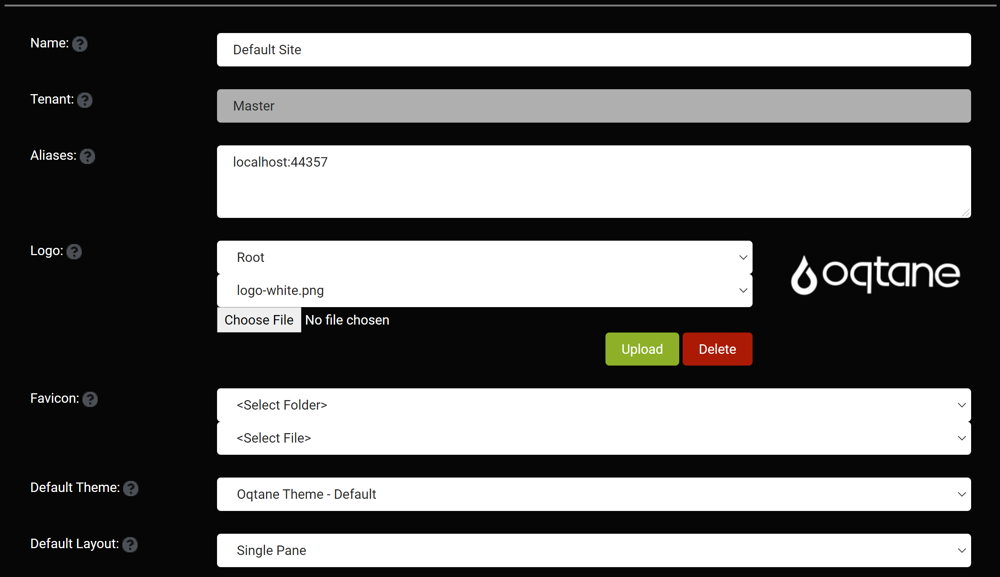

# Site Settings

The Site Settings feature contains a large number of settings that you canuse to perform high-level administrative configuration for your site. The Settings mostly contains set-it-and-forget it options that should be managed once when you build your site. Some of these settings include the default look and feel for new pages created on your site, your site logo, and default metadata for pages.The main parts of the settings are basic settings, SMTP configuration, and progressive web app configuration.

### Basic Settings
Basic Settings mostly contains set-it-and-forget it options that should be managed once when you build your site.
* Name: What you want to call the website.
* Tenant: The name of the database you wan the site to use.
* Aliases: The name that will appear for the sites URL.
* Logo: The logo that will appear in the navigation bar.
* Favicon: Enter a favicon address or another icon address to have a default icon to appear beside each page in the navigation bar.
* Default Theme: Choose a default theme tht will give a different color scheme and structure.
* Default Layout: Choose how many columns a page has by default.

* Default Container: Choose if you want titles to appear about each module by default.
* Allow User Registration: Should users be able to create their own accounts or should only administrators be able to create accounts.
* Is Deleted: Select whether you want to delete this site.

### SMTP Server (Secure Mail Transfer Protocol)
The Oqtane instance sends outbound email for a variety of reasons, from the host or site admin or in the form of password reminders, event notifications, newsletters, or other business-specific use cases. A valid SMTP server is required for this to work; you should consult your network administrator for the appropriate credentials to use in a production configuration. Most non-Exchange Server SMTP hosts will require “Basic” authentication and a valid username/password combination. Some will also require that SSL be enabled.
* Host: Enter the host name for the server.
* Port: Enter the port number that the server is on.
* SSL Enabled: Specify yes or no if the SMTP server has an SSL certificate.
* Username: Enter the username for the SMTP server you are accessing.
* Password: Enter the password for the SMTP server you are accessing.

### Progressive Web Application Settings
* Is Enabled: Choose whether or not you want the site to be set up as a progressive web application.
* App Icon: Select a PNG image that is 192 X 192 pixels which will be the app icon for your application.
* Splash Icon: Select a PNG image that is 512 X 512 pixels which will appear on the screen while the application is loading.
