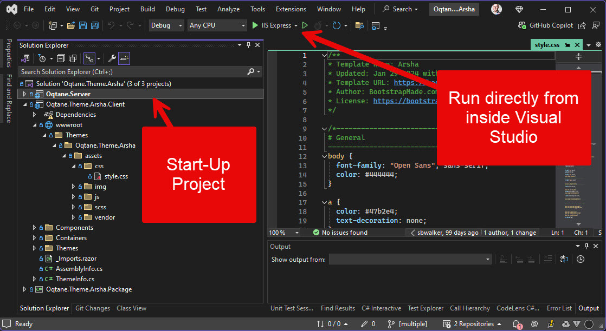

# Oqtane Dev Best Practices: Separate Solutions for Each Extension

To create custom themes and modules,
you will typically create them in a separate solution.
This has benefits such as:

- Your code base and the git-repos are small and focused.
- It helps keep your code organized and makes it easier to share your work with others.
- It allows you to more easily update the Oqtane runtime without affecting your custom code.
- It ensures your extensions actually work in a vanilla Oqtane.

Typically these projects and solutions will have the following folder structure:

```text
/parent
  /oqtane.framework
  /SomeTheme
  /SomeModule
  /SomeOtherExtension
```

This structure allows the modules to easily deploy the build output to the `oqtane.framework` folder,
so it can be run in the Oqtane after every build.



> [!TIP]
> Oqtane has built in assistants to generate template modules and themes.
> These will follow the above convention and also generate
> build-projects which will deploy the output to the `oqtane.framework` folder.

> [!TIP]
> As you get more experienced, you can then adjust these automatic mechanisms
> to better suit your own workflow.

In this setup, most Oqtane Modules/Themes will also reference
the Oqtane framework project - but only to make it easier to run and debug directly from Visual Studio.

---

[!include[](~/shared/authors/iJungleboy/_main-author.md)]
