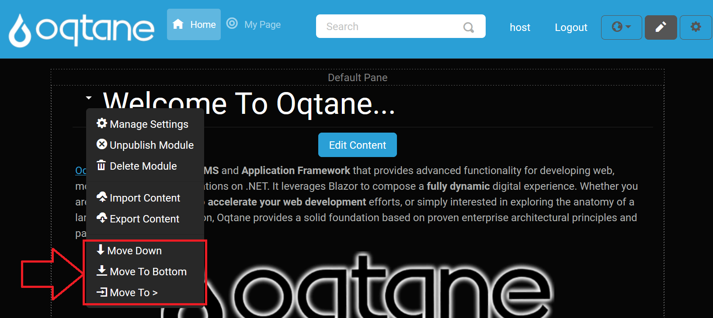

# Content Editor

The **Content Editor** allows you to edit the modules on the page in various ways. You can access the Content Editor by clicking on the pencil icon located at the top right side of the page. This action will display the borders of the content panes where the modules are placed and a small downward-pointing arrow next to each module, enabling you to open a menu for module interaction.

  
*Click on this icon button to enable the Content Editor.*

  
*Click on this button again to disable the Content Editor. Notice how the appearance of the pencil icon changes between enabled and disabled states.*

When the Content Editor is enabled, borders around each content pane are displayed, indicating the layout of the theme.

  
*The visible borders help you understand the layout of the page when in edit mode.*

---

## Pane Header

When the Content Editor is activated, the top header of the pane is displayed, showing the name of the pane:

---

## Module Menu Options

When you click the downward-pointing "caret-bottom" arrow next to a module, you have access to the following options:

  

---

## Manage Settings

When you select **Manage Settings** from a module’s caret menu, the following configuration modal appears:

Within this modal, you can adjust the module’s core properties. Hover over each help icon for additional guidance.

- **Module** (read‑only): Displays the internal name of the module.
  *(Tooltip: “The name of the module”)*
- **Title**: Enter the text displayed above the module.
  *(Tooltip: “Enter the title of the module”)*
- **Pane**: Choose the content pane where the module will render (e.g., Default Pane, Top Full Width Pane, Left 50% Pane, etc.).
  *(Tooltip: “The pane where the module will be displayed”)*
- **Container**: Select the container wrapper for the module’s styling.
  *(Tooltip: “Select the module's container”)*
- **Effective Date**: Set the date when this module becomes active.
  *(Tooltip: “The date that this module is active”)*
- **Expiry Date**: Set the date when this module is deactivated.
  *(Tooltip: “The date that this module expires”)*
- **Display On All Pages?**: Toggle to show this module on every page.
  *(Tooltip: “Indicate if this module should be displayed on all pages”)*
- **Page**: Assign the module to a specific page within the site.
  *(Tooltip: “The page that the module is located on”)*

Use **Save** to apply your changes or **Cancel** to exit without saving.

---

### Permissions Tab

In the permissions grid, toggle the **View** and **Edit** checkboxes for each role or user:

| Role                    | View | Edit |
|-------------------------|:----:|:----:|
| Administrators          | ✔    | ✔    |
| All Users               | ✔    |      |
| Registered Users        |      |      |
| Unauthenticated Users   |      |      |

Use **Save** to apply permission changes or **Cancel** to exit without saving.

### Module Settings

Select the **Module Settings** tab to access module-specific options:

- **Dynamic Tokens?**: Allow placeholder tokens (e.g., `{UserName}`) to be dynamically replaced at render time. Enabling this option may impact site performance.  
  *(Tooltip: "Do you wish to allow tokens to be dynamically replaced? Please note that this will affect the performance of your site.")*
  
Use **Save** to apply changes or **Cancel** to exit without saving.

---

### Container Settings Tab

Select the **Container** tab to customize the module container’s appearance:

- **Display Title?**: Toggle **Yes** or **No** to show or hide the module title above the content.  
  *(Tooltip: "Specify If The Module Title Should Be Displayed")*
- **Background Color**: Choose a background CSS class for the container (e.g., `bg-primary`, `bg-secondary`, etc.).  
  *(Tooltip: "Optionally Specify A Background Color For The Container")*
- **Text Color**: Choose a text color CSS class (e.g., `text-success`, `text-danger`, etc.).  
  *(Tooltip: "Optionally Specify A Text Color For The Container")*
- **Border Color**: Choose a border CSS class (e.g., `border border-primary`, `border border-light`, etc.).  
  *(Tooltip: "Optionally Specify A Border For The Container")*

Use **Save** to apply changes or **Cancel** to exit without saving.

---

## Other Options

- **Unpublish Module**: Hides the module from all users except site administrators, useful for when you want to make edits without public visibility.

  

- **Delete Module**: Removes the module from the page and moves it to the [Recycle Bin](./site/recycle-bin.md) for possible recovery.

- **Import Content**: Opens an **Import Content** modal where:

  

  - **Content**: A required text area to paste or type in the module content you wish to import.  
    *(Tooltip: “Enter The Module Content To Import”)*
  - **Import** button: Click to import the content into the module.  
  - **Cancel** button: Discard changes and close the modal.

- **Export Content**: Opens an **Export Content** modal where:

  

  - **Content**: A read-only text area displaying the current module data available for export.  
    *(Tooltip: “The Exported Module Content”)*
  - **Export** button: Click to export the module data to your chosen location.  
  - **Cancel** button: Close the modal without exporting.

- **Move to Top**: Moves the module to the top of the page, making it the first displayed module.

- **Move Up**: Moves the module up one position, placing it above the module currently above it.

- **Move Down**: Moves the module down one position, placing it below the module currently below it.

- **Move to Bottom**: Moves the module to the bottom of the page, below all other modules.

- **Move Options**: When you select "**Move to >**," additional options will be available, allowing you to choose a specific pane for the module.

  

If the page layout includes multiple panes (e.g., three center rows, a top row, and a bottom row), you can select from various options to reposition your module across these panes:

- **Move to Top Pane**: Moves the module to the content pane at the top of the page.
- **Move to Left Pane**: Moves the module to the left-most column.
- **Move to Right Pane**: Moves the module to the right-most column.
- **Move to Content Pane**: Moves the module to the central column.
- **Move to Bottom Pane**: Moves the module to the content pane at the bottom of the page.

The **Move to Pane** feature is adaptable to different themes, and the available panes vary depending on the layout provided by the theme. In the example shown in the image, you'll see a variety of pane options that a more complex theme might offer, giving administrators greater flexibility in organizing modules. 

For instance, the default Oqtane theme includes not only standard rows and columns but also numerous additional panes, which allow for a wide range of layout possibilities. While simpler themes may only display a few basic options, the default theme might provide over 20 panes, including:

- **Full-Width Panes**: These panes span the entire width of the page. Examples include:
    - **Top Full Width Pane**: A full-width pane at the top of the page.
    - **Bottom Full Width Pane**: A full-width pane at the bottom of the page.

- **100% Width Panes**: These also span the full width, but are distinct from other full-width panes in terms of placement:
    - **Top 100% Pane**: Positioned below the top full-width pane, occupying the full page width.
    - **Bottom 100% Pane**: Positioned above the bottom full-width pane, also spanning the entire page width.

- **50%/50% Split Panes**: Divide the page into two equal sections:
    - **Left 50% Pane** and **Right 50% Pane**.

- **33%/33%/33% Split Panes**: For a balanced three-column layout:
    - **Left 33% Pane**, **Center 33% Pane**, and **Right 33% Pane**.

- **25%/25%/25%/25% Split Panes**: For a four-column layout:
    - **Left Outer 25% Pane**, **Left Inner 25% Pane**, **Right Inner 25% Pane**, and **Right Outer 25% Pane**.

- **Asymmetrical Ratios**: Options like:
    - **Left 66% Pane** and **Right 33% Pane**.
    - **Left 33% Pane** and **Right 66% Pane**.

- **Footer Pane**: An additional pane often reserved for footer content.

These pane options let administrators place modules precisely within the layout structure, which is divided into sections adding up to 100% of the layout width. The image shows this range of options, giving a visual reference of the **Move To >** menu options when working with themes that support complex layouts. This flexibility enables customized content presentation to best suit each page's design.
