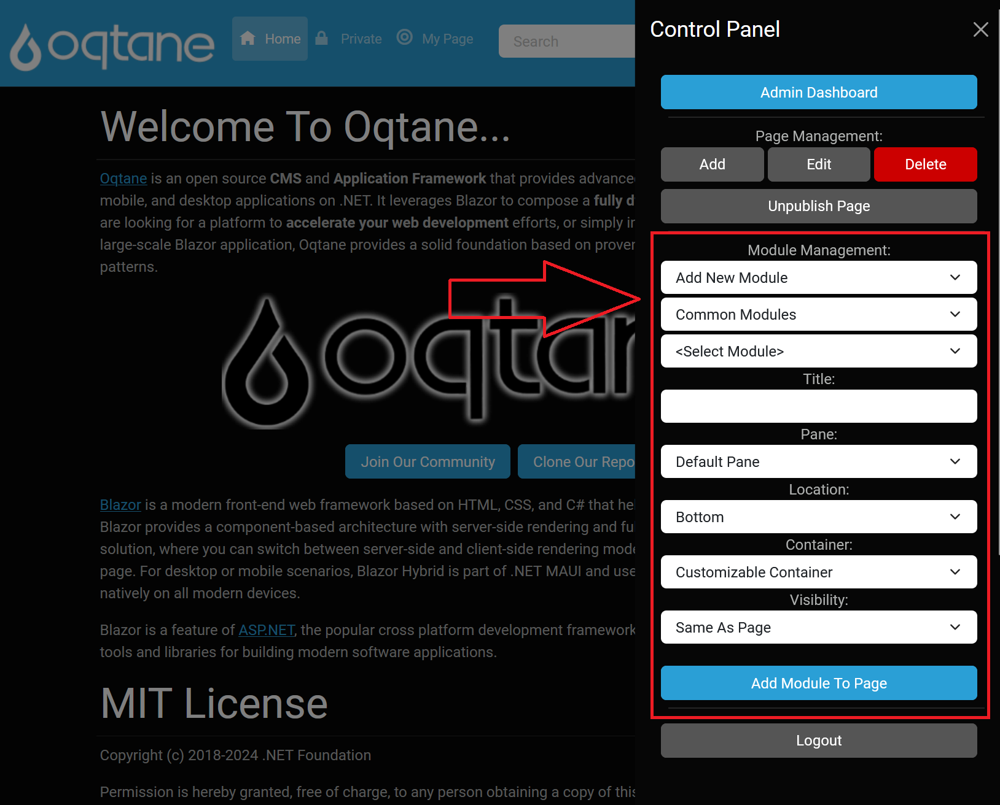

# Control Panel

## Overview

Site administration in Oqtane involves using features like managing users, security, settings, configurations, and content to effectively run a website. The Control Panel is a primary tool for handling these tasks, providing options to manage pages, modules, and access site settings.

Users with the **Administrators** role can access the Control Panel by logging in with an account that has the appropriate permissions for site administration. This guide provides instructions on accessing the Control Panel, adding and managing pages and modules, and includes logout instructions.

---

## Accessing the Control Panel

To open the Control Panel:
1. **Log in to Oqtane**: Ensure that you're logged in with a user account assigned to the Administrators role.
2. **Click the Control Panel Icon**: Once logged in, you'll see the Control Panel icon.
 
Click this icon to open the Control Panel menu. This will expand the menu and provide access to various management features within the Control Panel.

---

## Control Panel Options

Once the Control Panel is open, several administrative options become available:

1. **Page Management**: 
   - Allows users to add, edit, delete, and publish pages.
   - For more detailed information, visit this section's [Control Panel Page Management Documentation](./page-management.md).
   - 

2. **Module Management**: 
   - Provides tools for adding, editing, and deleting modules on a page.
   - For more detailed information, visit this section's [Control Panel Module Management Documentation](./module-management.md).
   - 

3. **Logout**: 
   - An option to securely log out of Oqtane. 
   - 

---

### Summary

The Control Panel is an essential component for site administration in Oqtane, enabling users to effectively manage their website's structure and content. By utilizing the Page Management and Module Management features, administrators can ensure their site operates smoothly and meets user needs.
