# HTML/Text Editor

The HTML/Text Editor module in Oqtane enables you to create, edit, and restore content using a rich text editor (WYSIWYG) and a raw HTML editor. This module is ideal for exploring Oqtane's editing and content management features, including moving modules between panes, configuring settings, and managing roles.

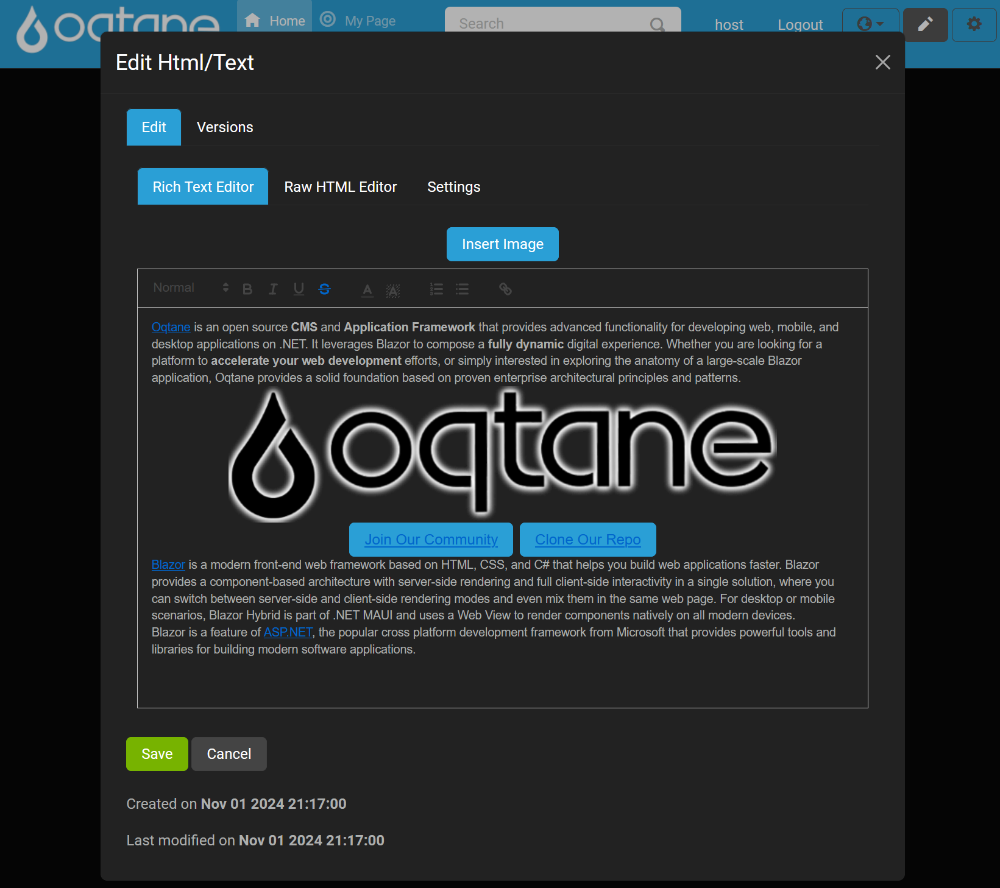

**To access the HTML/Text Editor:**  
1. Enter Content Editor mode by clicking the pencil icon.

   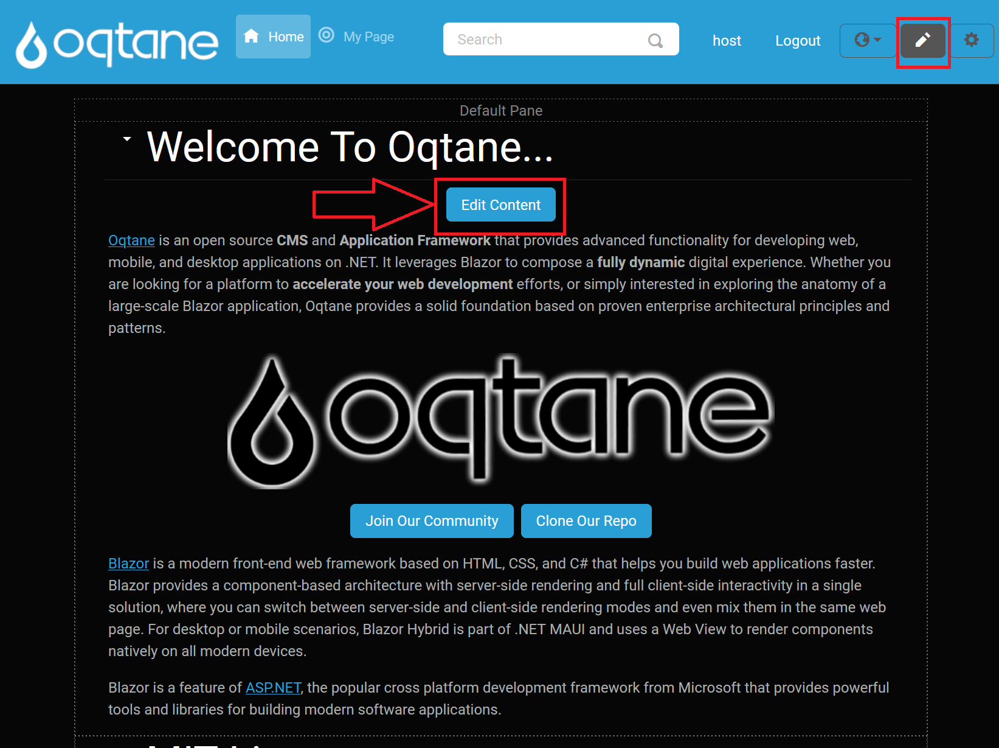

2. Click the **Edit Content** button on the module to open the HTML/Text Editor.

   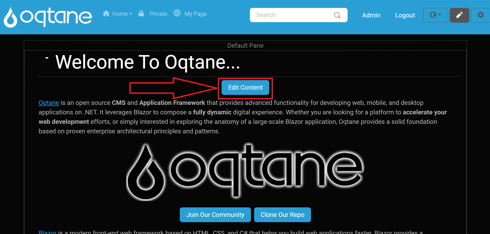

The editor has two main tabs:

1. **Edit** – Contains content editing tools.
2. **Versions** – Manages past content versions with options to view, restore, and delete.

### Edit Tab

The Edit tab provides three sub-tabs for different editing options:

* **Rich Text Editor** – A WYSIWYG editor powered by QuillJS (v1.3.7), providing an easy way to format content visually.

   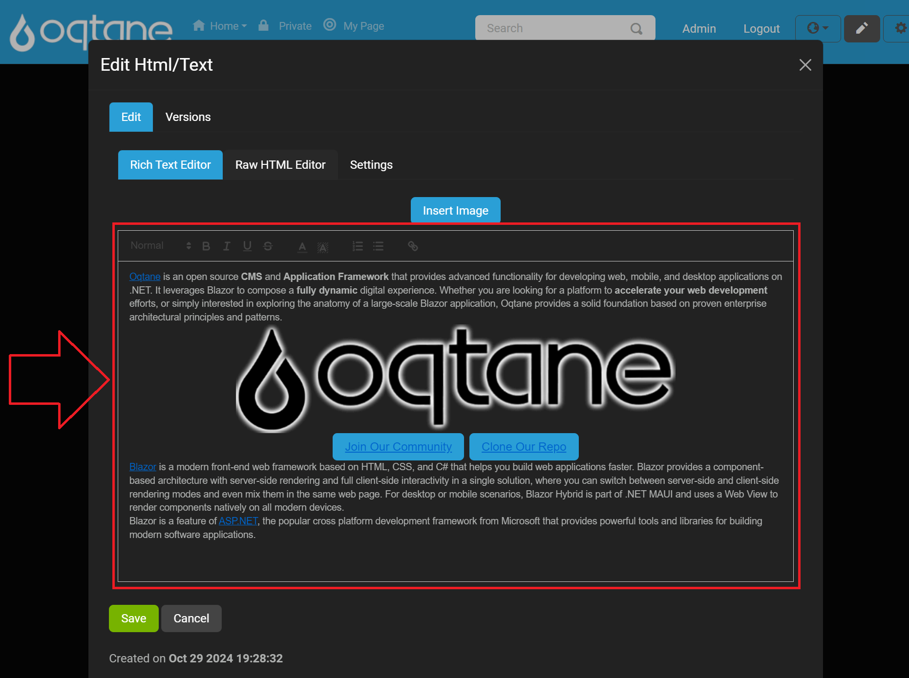

* **Raw HTML Editor** – Enables direct HTML editing for more control over the source code.

   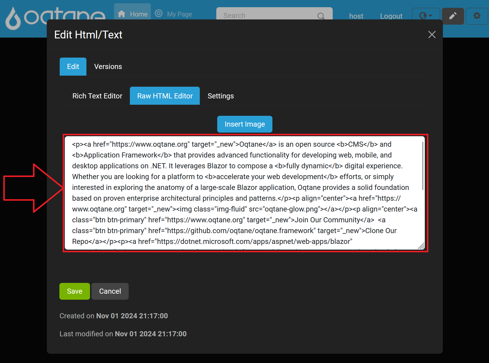

* **Settings** – Provides configuration options for the editor's features.

#### Rich Text Editor Settings

In the **Settings** sub-tab, you can customize the editor with the following options:

- **Enable Rich Text Editor?** - Yes
- **Enable Raw HTML Editor?** - Yes
- **Insert Images?** - Yes
- **Theme**: Options like "snow" theme
- **Debug Level**: Example setting "info"
- **Toolbar Content**: Define the editor's toolbar

   

Each editor (Rich Text and HTML) includes an **"Insert Image"** button that opens a dialog with the following options:

   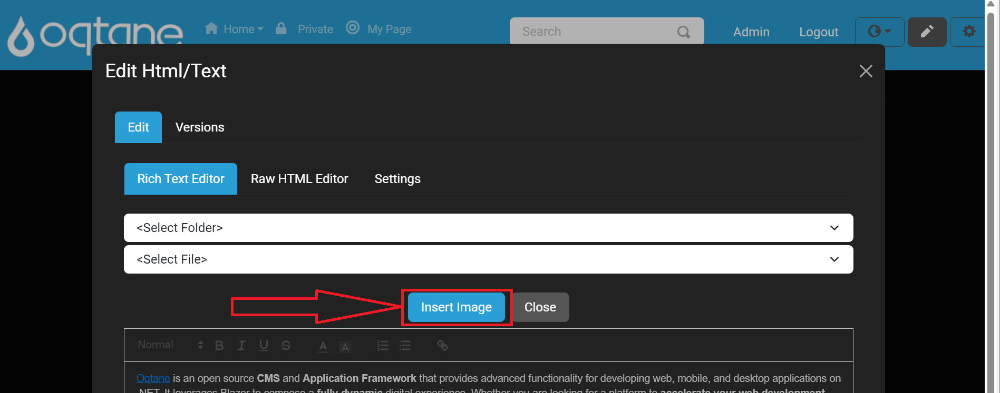

- **Select Folder** – Choose the folder where images are stored.
- **Select File** – Pick an image file from the selected folder.

   

Once an image file is selected, click the **Insert Image** button.

   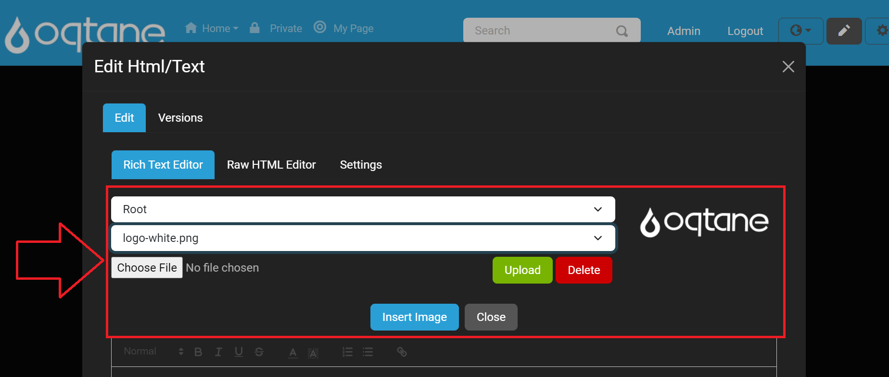

- **Upload File** – Upload new images to the selected folder by using **Choose File** and **Upload** buttons.

   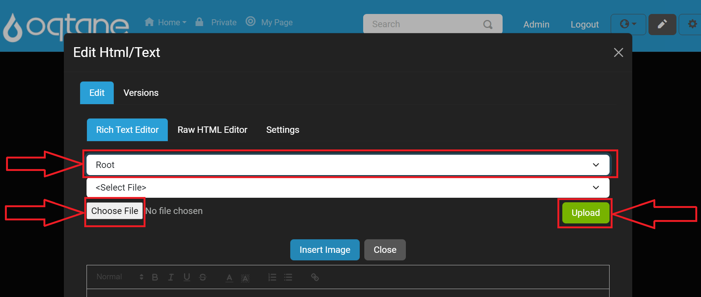

If you encounter issues with uploading files, see the [Troubleshooting File Manager](../../guides/troubleshooting/troubleshooting-file-manager.md) guide.

After uploading the image to the selected folder, click the **Insert Image** button.

#### Saving Edits

After making changes in the editor, click the **Save** button to confirm and save the settings and content updates.

   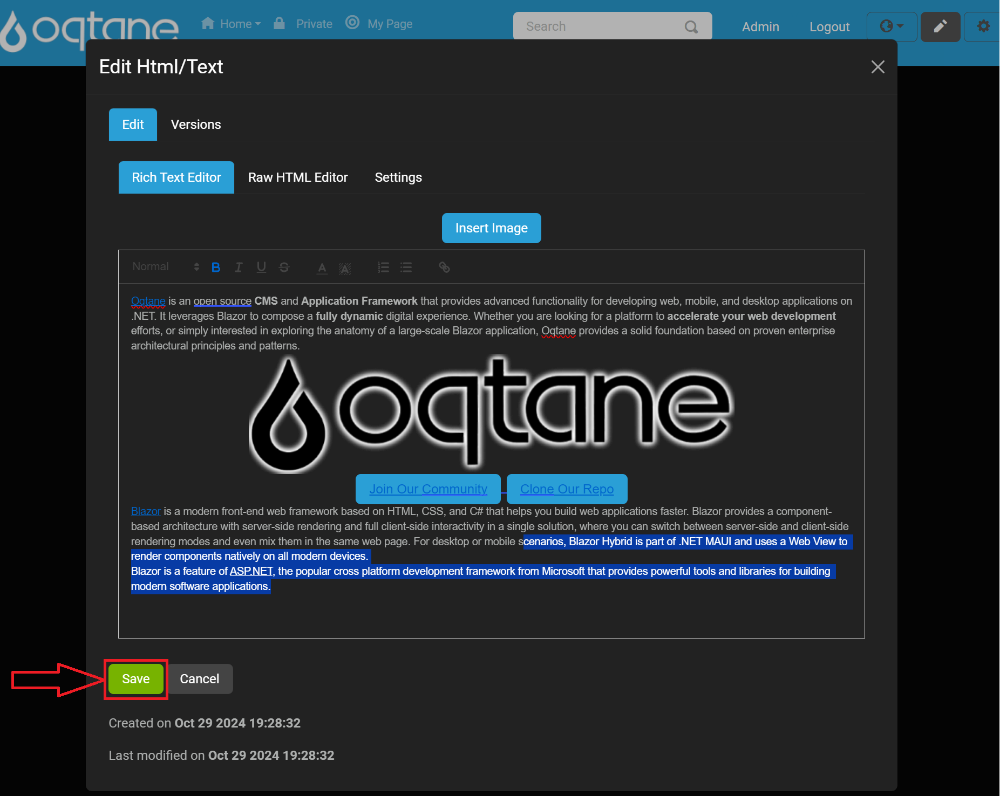

---

### Versions Tab

The Versions tab displays a list of previous content versions, along with:

* **CreatedOn** – The date each version was created.
* **CreatedBy** – The user who created the version.

   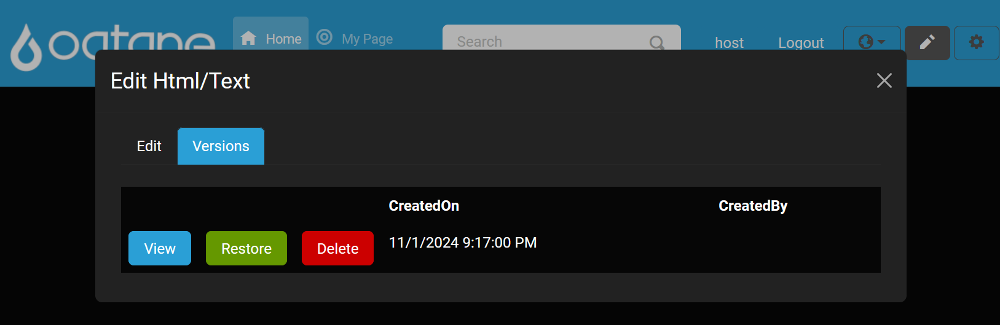

Each version offers the following actions:

- **View** – Shows the selected version's content.

   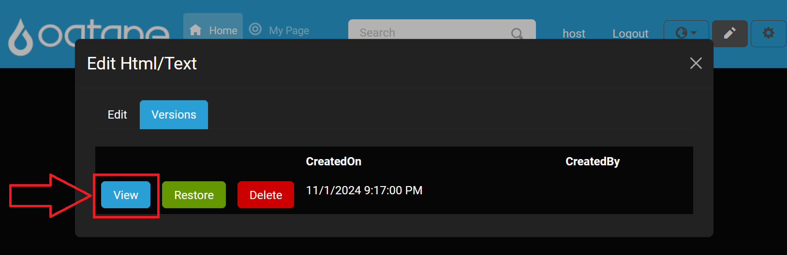

   Below is an example of what the **View** button will display at the bottom of the modal window.

   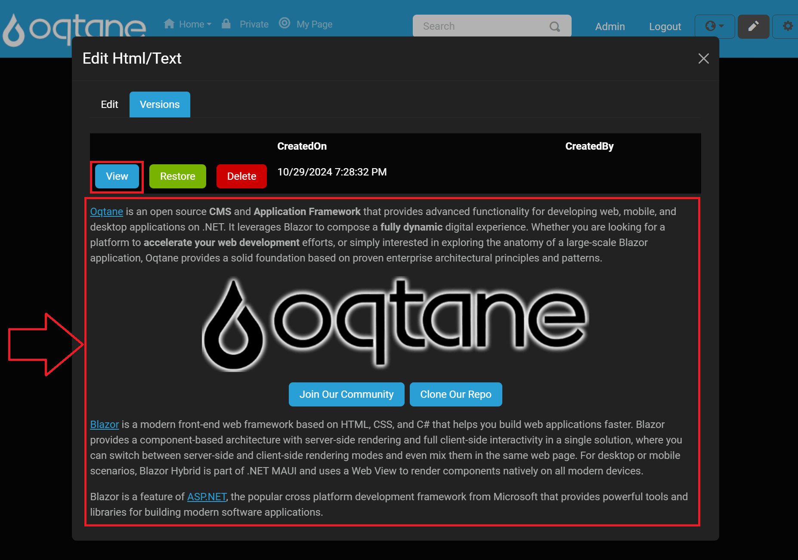

- **Restore** – Restores the module content to this version.

   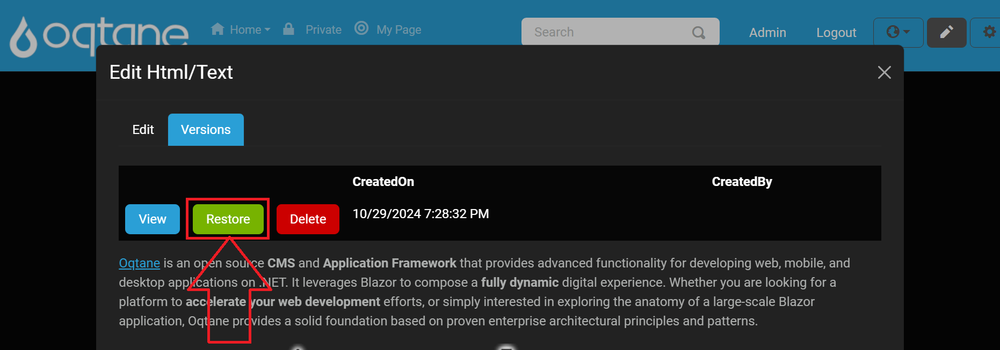

   After clicking **Restore**, you will be prompted to confirm. To proceed, click the **Restore** button in the confirmation window.

   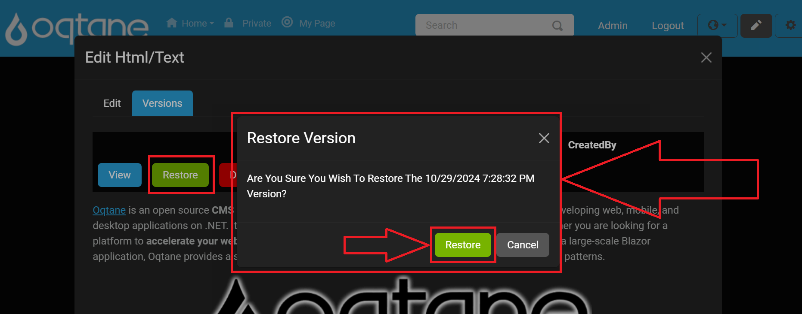

- **Delete** – Removes the selected version from the list.  

   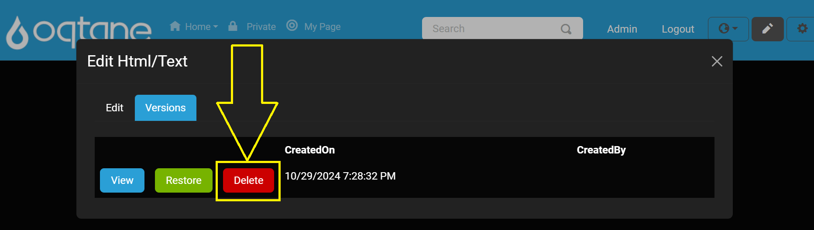

   After clicking **Delete**, you will be prompted to confirm. To proceed, click the **Delete** button in the confirmation window.

  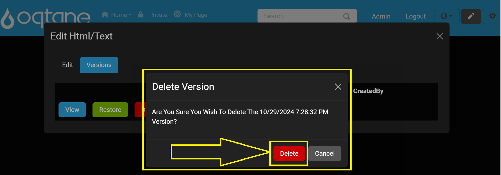
