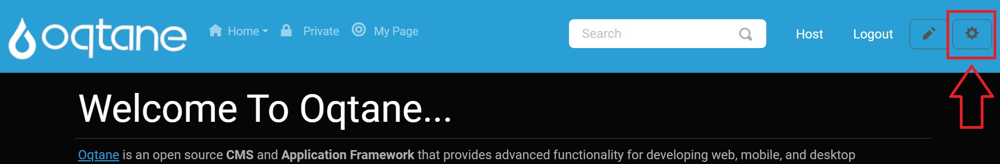

# File Management

## Overview

The **File Management** feature in Oqtane enables users to upload, organize, edit, and delete files and folders directly from the user interface. With fine-grained folder permissions and intuitive tools, site administrators can control access and maintain structured file systems.

Key features include:

- **Folder Hierarchy Management** – Create and nest folders to organize content.
- **Role-Based Permissions** – Assign browse, view, and edit rights to roles or specific users.
- **File Uploading** – Upload images, documents, and other supported formats to selected folders.
- **File Editing** – Rename files, update descriptions, or move files to different folders.
- **File Deletion** – Remove unwanted files with confirmation.
- **Custom Folder Settings** – Set folder type, allowed image sizes, and capacity limits.

---

## Control Panel Walkthrough

### Accessing the File Management Feature

1. Click the **Control Panel** icon to access additional settings.

   

2. In the control panel, click the **Admin Dashboard** button.

   

3. In the admin dashboard, select the **File Management** icon.

   

---

## Add/Edit Folder Feature

The **Add/Edit Folder** modal allows administrators to structure content and configure storage rules.

### Folder Settings Tab

- **Parent Folder**: Choose the location within the folder hierarchy.
- **Folder Name**: Name to be displayed in the file manager.
- **Folder Type**: Set visibility (Private or Public).
- **Image Sizes**: Define accepted dimensions for uploaded images.
- **Capacity**: Limit storage for this folder (in MB).

Controls: **Save** or **Cancel**.

### Permissions Tab

Configure access per role or user.

- **Role Permissions**: Assign Browse, View, Edit rights.
- **User Permissions**: Grant access to individual users.
- **Browse Folder**: Toggle folder listing access.
- **View Folder**: Toggle file viewing access.
- **Edit Folder**: Toggle file management rights.
- **Add User**: Search and add users to permission list.
- **Save**: Apply permission changes.

---

## Uploading Files

The **Upload Files** tool lets users import content from their local devices into the platform.

### Steps:

1. Click **Upload Files** in the toolbar.

   

2. Choose a destination folder.

   

3. Select files using **Choose Files**.

   

4. Click **Upload** to begin transfer.

   

A progress bar will show upload status.

   

Once complete, a notification confirms success.

   

To close the window, click the **X** icon.

---

## Editing and Deleting Files

### Editing a File

1. Select a folder from the dropdown.
2. In the file list, click **Edit File** next to the item.

   

3. Modify the file name, folder, or description.
4. Click **Save** to apply changes or **Cancel** to discard.

   

### Deleting a File

1. Click the **Delete File** button.

   

2. Confirm deletion in the popup.

   

---

## File Management Settings

Found in **Site Settings**:

- **Image Extensions**: Allowed image types (e.g., `jpg,png,gif`).
- **Uploadable File Extensions**: Permitted general file types (e.g., `pdf,docx,xlsx`).
- **Max Upload Chunk Size**: Limits upload chunk size for performance tuning.

   

---

By following this guide, administrators can fully leverage the File Management capabilities of Oqtane to maintain an organized, secure, and efficient content system.
