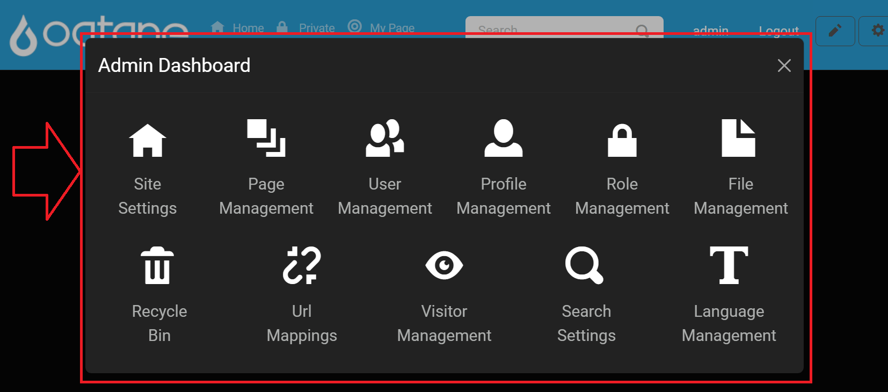

# Site Management (Admin)

## Introduction

The Admin Dashboard in Oqtane provides administrators with a powerful suite of tools to manage, customize, and control various aspects of the site. These tools enable efficient management of content, users, site settings, and other features, helping administrators maintain and personalize the site effectively.

Administrators can access the Admin Dashboard by logging in with an administrator account, clicking on the **gear icon** in the top-right corner to open the Control Panel, and selecting the **Admin Dashboard** option. This displays a menu of options that offer a variety of functionalities to manage the website.

## Control Panel Walkthrough

The Control Panel provides quick access to additional site settings and tools:

1. **Open the Control Panel**: Click the **gear icon** at the top right.
   
   

2. **Open Admin Dashboard**: Click the **Admin Dashboard** button.

   

3. **Navigate to Desired Feature**: In the Admin Dashboard, you'll find icons for each feature available. Select the feature you wish to manage.

---

## Access Permissions

To access the Admin Dashboard, users must be assigned to the **Administrator role**. This can be done within the **User Management** feature by selecting the user and assigning them to the Administrator role.

---

## Admin Dashboard Features

The following tools are available by default within the Admin Dashboard. Each link below will direct you to detailed documentation for that specific feature.

### Administrator Role Admin Dashboard Features

- **[Site Settings](site-settings.md)**: Configure site-wide settings, including site name, logo, language, and time zone.
- **[Page Management](page-management.md)**: Manage website pages—create, edit, arrange, and delete pages within the site hierarchy.
- **[User Management](user-management.md)**: Add, edit, and manage user accounts, including assigning roles and permissions.
- **[Profile Management](profile-management.md)**: Define profile fields for user accounts, ensuring necessary information is captured.
- **[Role Management](role-management.md)**: Create and manage security roles, defining user permissions across the site.
- **[File Management](file-management.md)**: Upload and manage files like images and documents for use throughout the website.
- **[Recycle Bin](recycle-bin.md)**: Restore or permanently delete items that have been removed from the site.
- **[URL Mappings](url-mappings.md)**: Manage URL redirects, handle broken links, and configure custom mappings.
- **[Visitor Management](visitor-management.md)**: Track visitor activity, manage session durations, and configure visitor tracking.
- **[Search Settings](search-settings.md)**: Configure the search index and parameters to improve search functionality.
- **[Language Management](language-management.md)**: Add and manage site languages, enabling multilingual support.

---

## Extending the Admin Dashboard

The Admin Dashboard in Oqtane is customizable, allowing administrators to add new pages or tools to extend site management capabilities. To add a custom page to the Admin Dashboard:

1. **Access the Control Panel**: Log in as an administrator and click the **gear icon** at the top right to open the Control Panel.
2. **Navigate to Page Management**: In the Control Panel, select the **Page Management** section to access page configuration options.
3. **Create a New Admin Page**:
   - Click on the **Add** button within the **Page Management** section.
   - In the page creation dialog, set the **Parent Page** to **Admin**. This action will designate the new page as part of the Admin Dashboard, making it accessible to administrators.
   - Customize additional settings for the new page as needed, such as specifying a page title and assigning permissions.

4. **Save and Verify**: Once saved, the new page will appear in the Admin Dashboard, providing additional functionality to administrators.

For further information on managing and organizing pages, visit the [Content Management - Page Management](../content/page-management.md) documentation.

With this process, administrators can extend the Admin Dashboard by adding custom management tools, offering enhanced control over site content, settings, and features.

---

## Quick Links to Additional Documentation

For more in-depth information on installation and troubleshooting, refer to the following resources:

- **[Installation Guides](../../guides/installation/index.md)**: Detailed instructions for initial setup, including environment-specific configurations.
- **[Troubleshooting Installation Issues](../../guides/troubleshooting/troubleshooting-installations.md)**: Solutions for common setup issues.
- **[GitHub Discussions](https://github.com/oqtane/oqtane.framework/discussions)**: Join the Oqtane community for support and to discuss ideas.
- **[GitHub Issues](https://github.com/oqtane/oqtane.framework/issues)**: Report and view issues, or search for existing solutions.

---

This updated **Admin Management Introduction** page consolidates all Admin Dashboard features, provides an overview for each tool, and directs users to specific guides for additional information. This setup ensures administrators can efficiently find and use the tools they need to manage their site.
