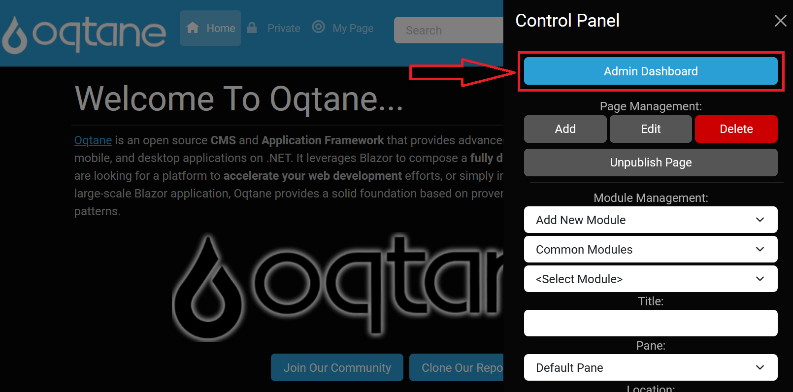
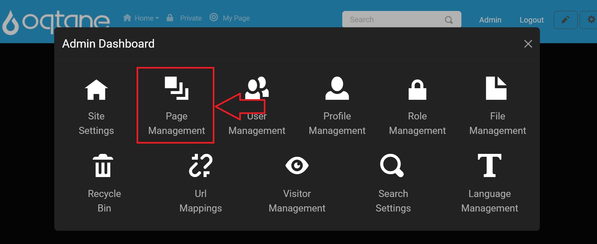
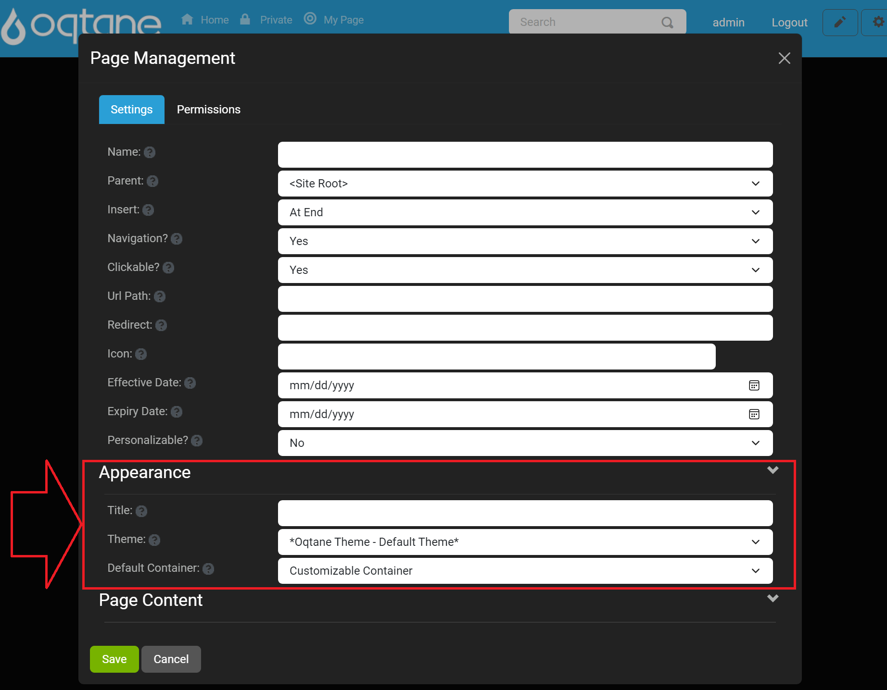
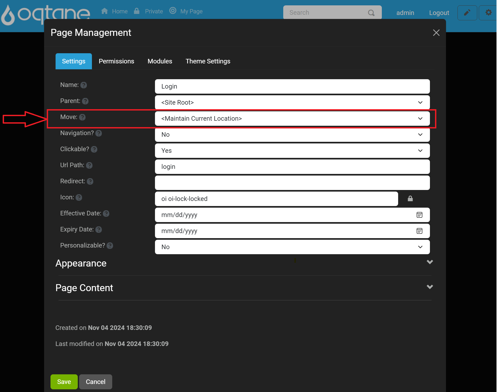
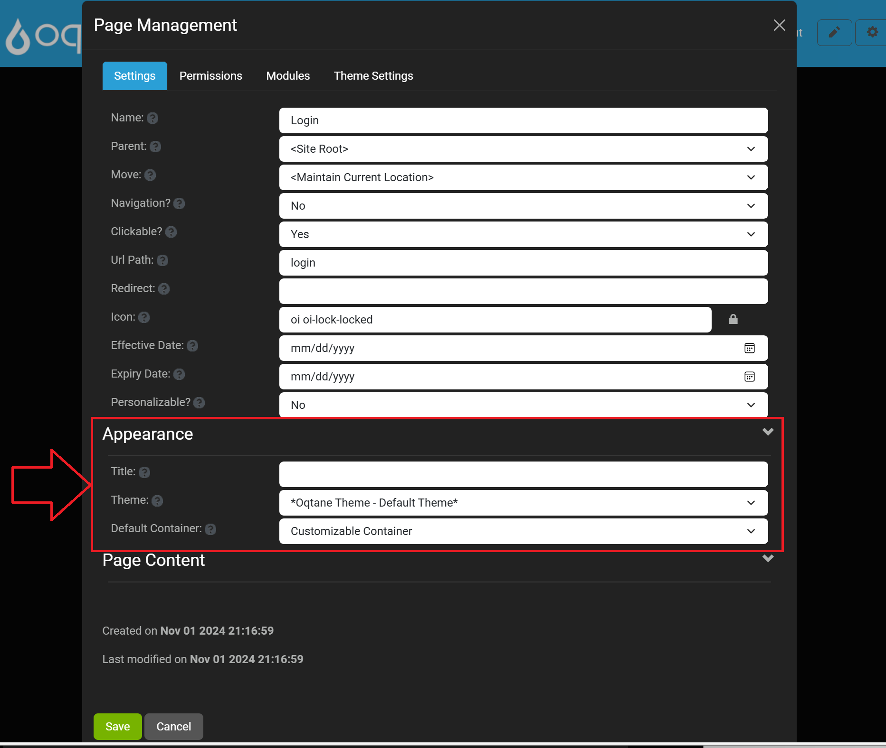
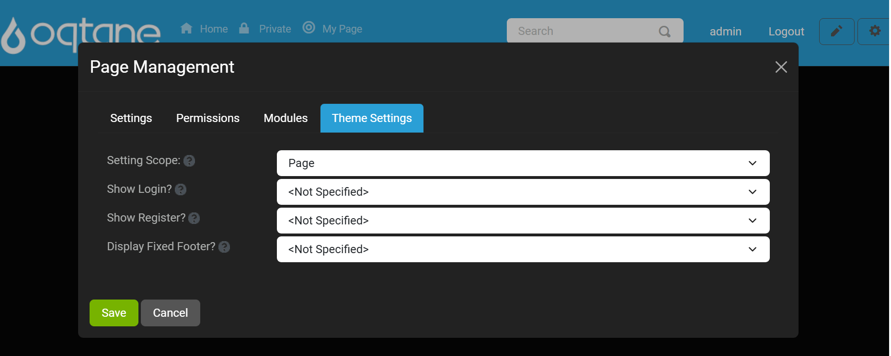
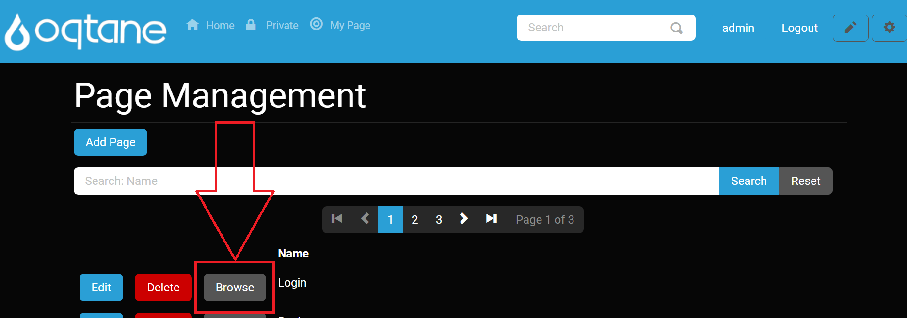

# Page Management

## Overview

Pretty much every website starts out as one thing first and foremost: a collection of pages that constitute a web presence. Each page will have a purpose (we hope) and serve it well. As you have seen after the default installation of Oqtane, you are even given a home page to work with on the first load of your new site. Your next step might be to create additional pages, such as About Us, Contact Us, and more. 

As your site continues to become successful and grows to meet the needs of your customers and other visitors, you will undoubtedly begin to have more and more pages on your site. You'll have so many that at some point you will need to manage them from a centralized location. In other cases, you might have pages that are hidden from the menu and are not easily accessible. This is where the Page Management feature comes in to allow for a larger overview of the pages on your website, with all pages on your website viewable in a list format. These pages can be manipulated in the page manager by being able to add, edit, and delete pages.

---

## Control Panel Walkthrough

### Accessing the Page Management Feature

1. Click the control panel icon to access additional settings.

   

2. In the control panel, select the button to open the admin dashboard.

   

3. In the admin dashboard, click on the **Page Management** icon to configure your pages.

   

---

## Adding a Page

The add page feature adds a new page to your website and brings up the page management window, which allows you to specify the settings, appearance, and permissions for the page you are adding. 

Page management has an "Add Page" button, and when clicked, you get the following:

A window will appear with two tabs: **Settings** and **Permissions**.

### Settings Tab
- **Name:** Enter a page name.
- **Parent:** Select the parent for the page in the site hierarchy (setting this to admin will create an admin dashboard page).
- **Insert:** Select the location where you would like the page to be inserted in relation to other pages (While in edit, this is changed to Move: Select the location where you would like the page to be moved in relation to other pages, so be sure to update this when talking about editing a page).
- **Navigation:** Select whether the page is part of the site navigation or hidden.
- **Clickable?:** Select whether the link in the site navigation is enabled or disabled.
- **URL Path:** Optionally enter a URL path for this page (i.e., home). If you do not provide a URL path, the page name will be used. If the page is intended to be the root path, specify '/'.
- **Redirect:** Optionally enter a URL which this page should redirect to when a user navigates to it.
- **Icon:** Optionally provide an icon class name for this page which will be displayed in the site navigation.
- **Effective Date:** The date that this page is active.
- **Expiry Date:** The date that this page expires.
- **Personalizable?:** Select whether you would like users to be able to personalize this page with their own content.

**Appearance**
- **Title:** Optionally enter the page title. If you do not provide a page title, the page name will be used.
- **Theme:** Select the theme for this page.
- **Default Container:** Select the default container for the page.

**Page Content**
- **Head Content:** Optionally enter content to be included in the page head (i.e., meta, link, or script tags).
- **Body Content:** Optionally enter content to be included in the page body (i.e., script tags).

### Permissions Tab

The permissions tab has the following:
- A list of roles with "View Page" and "Edit Page" checkbox permissions to the right.
- Below that is a way to search for a user's name via text input and click the "Add" button.
- When users are added, below the "Role" list section will be an added "User" list that displays users with the permissions they have been granted.

Use the **Save** button to save the page or **Cancel** button or use the **X** to close the window to escape it.

## Search Pages

Below the "Add Page" button on the main form:
- **Search by Name** input field to search for pages with a "Search" button to click to perform the search and a "Reset" button to reset the form.

After this, there is a paginated list of pages with 3 buttons: Edit, Delete, and Browse.

## Edit Page

The edit page feature shares all of the same features as the add feature, allowing you to change the settings, appearances, and permissions of any page, with the insert feature being replaced by the move feature. The edit feature also shows you when a page was created and when the page was last edited at the bottom of the page management window.

**Edit** button will pop up a window to edit the page features (tabs discussed while adding it). 

Editing page settings is as discussed in adding it with the exception of "Insert" option is now a"Move" option.

Edit Page Appearance and Page Content options are the same as add page as shown below:

In addition to these tabs are two more tabs: 

- **Modules:** Lists all the modules you can then "Edit" the modules on the page with an edit button to access that module's settings, or "Delete" to delete the module from the page. 

   

- **Theme Settings:** Includes the following settings you can set that are all dropdown selections.
  - **Settings Scope:** Specify if the settings are applicable to this page or the entire site.
  - **Show Login:** Specify if a Login option should be displayed. Note that this option does not prevent the login page from being accessible via a direct URL.
  - **Show Register:** Specify if a Register option should be displayed. Note that this option is also dependent on the Allow Registration option in Site Settings.
  - **Display Fixed Footer?:** Specify if a Footer pane should always be displayed in a fixed location at the bottom of the page.

     

## Delete Page

You can **Delete** a page in the list of pages with a confirmation window popping up. The delete feature will delete the page that you are currently on and you can recover the page or fully delete the page in the admin dashboard's [Recycle Bin](recycle-bin.md).

## Browse Page

A **Browse** button allows you to navigate to that page to view it on the site.

## Conclusion

Page Management provides a robust interface to control your website's pages effectively. With options to add, edit, delete, and manage permissions, you can ensure that your site grows and evolves as needed while maintaining a user-friendly experience. 
