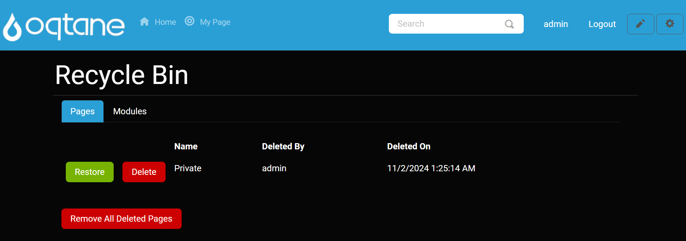
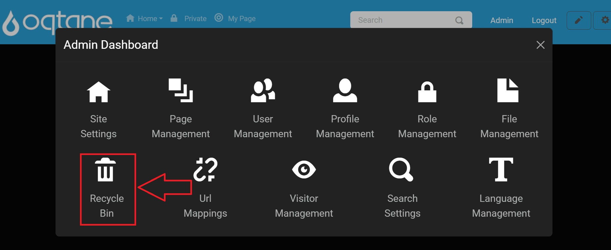
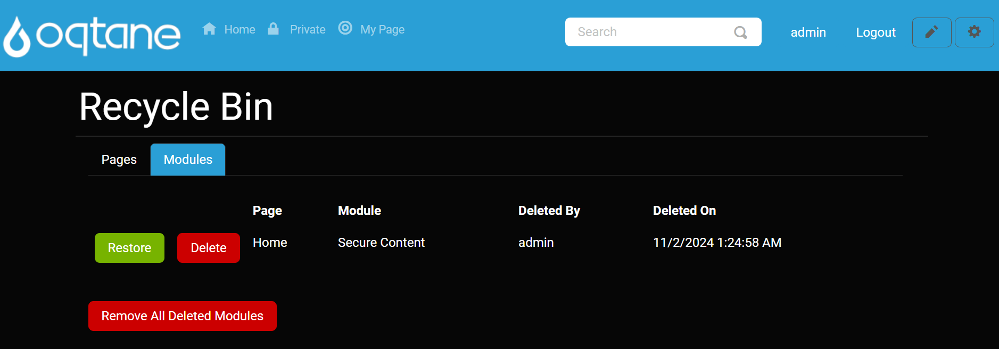
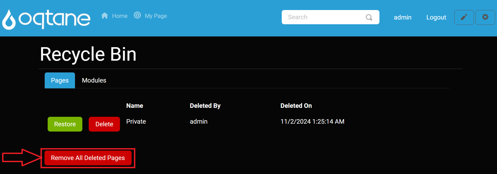
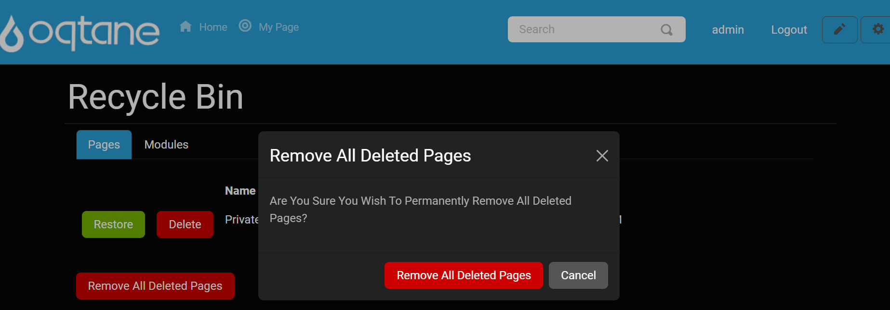
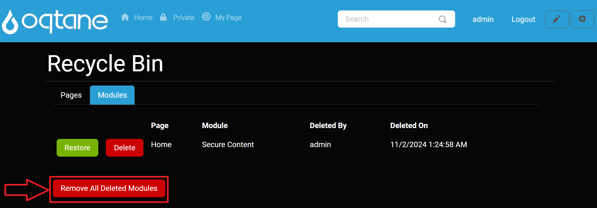

# Recycle Bin

## Overview

The Recycle Bin is a valuable feature of Oqtane, especially for new users and administrators who might assume that deleted content is permanently gone. Instead of recreating deleted items, the Recycle Bin allows you to restore content, saving time and reducing frustration.

The Recycle Bin manages two types of objects that can be restored: **Pages** and **Modules**. When you delete a page or a module, it appears in the corresponding list. You can switch between these lists by clicking the tabs at the top of the page.

## Control Panel Walkthrough

### Accessing the Recycle Bin Feature

1. Click the control panel icon to access additional settings.

   

2. In the control panel, select the button to open the admin dashboard.

   

3. In the admin dashboard, click on the **Recycle Bin** icon to configure visitor tracking.

   

---

## Features

- **Restore**: Clicking the restore button for a selected page or module will return it to its original location on your site.
- **Delete**: The delete button permanently removes the selected page or module from your website, ensuring it cannot be restored.

## Tabs

The Recycle Bin includes two tabs:

### Pages Tab

In the Pages tab, you can view a list of deleted pages with the following information:

- **Name**: The title of the deleted page.
- **Deleted By**: The user who deleted the page.
- **Deleted On**: The date and time when the page was deleted.

Each entry includes two buttons:

- **Restore**: Restores the selected page to its original location.
- **Delete**: Permanently deletes the page from the Recycle Bin.

### Modules Tab

Similar to the Pages tab, the Modules tab displays a list of deleted modules with the same information as above. It also includes the same restore and delete functionality.

## Manage Deleted Items

At the bottom of each tab, there are additional buttons:

- **Remove All Deleted Pages**: This button allows you to permanently delete all pages listed in the Recycle Bin. A confirmation window will appear before finalizing this action.

- **Delete All Deleted Modules**: This button serves the same purpose for modules, allowing you to permanently delete all modules from the Recycle Bin, accompanied by a confirmation window.

## Conclusion

The Recycle Bin in Oqtane is an essential feature for content management, providing an easy way to recover deleted pages and modules. By using the restore functionality, administrators can efficiently manage their site's content without the hassle of recreating items. Familiarize yourself with this feature to maximize the efficiency and usability of your Oqtane site.
