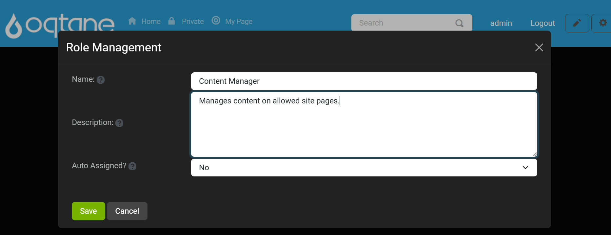

# Role Management

## Overview

The **Role Management** feature in Oqtane allows you to create and manage security roles, which are groupings of users assigned specific permissions or access. Roles can be used for content targeting, granting editing rights, or restricting access to certain areas of your site.

Security roles operate similarly to permission-based systems: first, you create a role to group users, then add users to the group, and finally, assign the group permissions on pages or modules.

---

## Control Panel Walkthrough

### Accessing the Role Management Feature

1. Click the **Control Panel** icon to access additional settings.

   

2. In the control panel, select the button to open the **Admin Dashboard**.

   

3. In the admin dashboard, click on the **Role Management** icon to manage user roles.

   

---

## Role Management Features

### 1. **Add Role**

The **Add Role** feature enables you to create a new user role with specific settings.

#### **Add Role Settings**
When you click **Add Role**, a window opens with the following fields:

- **Name:** The name of the role, as it will appear in the role list.
- **Description:** A brief description explaining the role's purpose.
- **Auto Assigned?**: Select **Yes** or **No** to determine whether new users are automatically assigned to this role.

After filling out the settings, use the **Save** button to create the role, or **Cancel** to discard changes. You can also use the **X** button in the top-right corner to close the window without saving.

---

### 2. **Search Roles**

The **Search Roles** function allows you to quickly find roles by name. Enter the name in the **Search** field and click **Search** to filter results, or **Reset** to clear the search.

---

### 3. **Role List**

The **Role List** displays all existing roles, including default roles such as **Administrators** and **Registered Users**. For each role, you can perform the following actions:

| **Action** | **Description**                                                                                         |
|------------|---------------------------------------------------------------------------------------------------------|
| **Edit**   | Modify the role's name, description, and auto-assign settings (disabled for Administrators and Registered Users). |
| **Delete** | Permanently removes the role from the system (disabled for Administrators and Registered Users).        |
| **Users**  | Manage users within the role, including adding or removing users.                                       |

---

### 4. **Edit Role**

Clicking the **Edit** button for a role opens the same window as the **Add Role** feature, where you can modify the role's **Name**, **Description**, and **Auto Assigned** settings.

Note: The **Edit** button is disabled for system roles like **Administrators** and **Registered Users**.

---

### 5. **Delete Role**

Clicking the **Delete** button will delete a role. Deleting a role removes its permissions and cannot be undone. System roles like **Administrators** and **Registered Users** cannot be deleted.

---

### 6. **Manage Users in a Role**

The **Users** button allows you to add or remove users from a specific role. Clicking **Users** for a role opens a window where you can:

- **User:** Enter the user's name to add them to the role.
- **Effective Date:** Set the date when the role assignment starts.
- **Expiry Date:** Set the date when the role assignment ends (optional).
  
At the bottom of this window, you can view a list of all users currently assigned to the role.

Use **Save** to apply changes, **Cancel** to discard changes, or **X** to close the window.

---

## Summary

The **Role Management** feature in Oqtane allows you to organize users by roles, granting or restricting access based on the assigned role. With options to add, edit, delete, and manage users in roles, you have flexibility in setting up and controlling permissions for your site.

