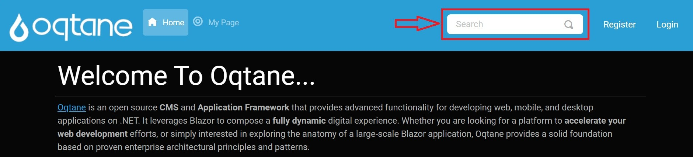

# Search Manual


## Overview

The **Search** feature allows users to locate relevant content quickly across the site. Through scheduled indexing, the Search service keeps the content index updated. The following sections cover search settings, scheduling, and customization options for the administrator.  This document describes the Search module, settings, and configuration for administrators to set up effective search functionality across their Oqtane site.

---

## Search Settings

Administrators can configure the Search module through **Host > Search Settings**. Below are explanations for each setting:

| **Setting**                | **Description**                                                                                                                                                                |
|----------------------------|--------------------------------------------------------------------------------------------------------------------------------------------------------------------------------|
| **Search Provider**        | Specifies the provider responsible for indexing and retrieving search results. Example: `DatabaseSearchProvider`.                                                              |
| **Enabled**                | Toggles the search feature on or off. When set to `Yes`, the site content is regularly indexed, and search queries return up-to-date results.                                  |
| **Last Indexed**           | Displays the last date and time the site was indexed. This helps administrators know the freshness of indexed data in search results.                                          |
| **Ignore Pages**           | A list of pages excluded from indexing. Prevents certain content from appearing in search results, e.g., pages with sensitive or irrelevant content.                           |
| **Ignore Entities**        | Specifies types of entities to exclude from indexing, such as `Modules` or `Users`.                                                                                            |
| **Word Length**            | Defines the minimum character length for words indexed in search results. Only words meeting or exceeding this length will be indexed.                                         |
| **Ignore Words**           | Commonly ignored words in search queries (e.g., "and," "the"). This list helps refine search results by avoiding indexing or returning results for these words.                |

---

## Search Components

### Search.resx File

The `.resx` file includes localization data for search terms and placeholders in the search UI. Examples include:

```xml
<data name="Search" xml:space="preserve">
    <value>Search</value>
</data>
<data name="SearchPlaceHolder" xml:space="preserve">
    <value>Search</value>
</data>
```
---

# Configuring Search in Oqtane

This guide provides a step-by-step walkthrough for configuring the search functionality in Oqtane.

---

## 1. Accessing the Search Feature in the Default Theme

To get started, locate the search feature in the navigation bar of the default theme.



---

## 2. Opening the Control Panel

Next, click the control panel icon to access additional settings.


---

## 3. Navigating to the Admin Dashboard

In the control panel, select the button to open the admin dashboard, where you can manage various site settings.


---

## 4. Accessing Search Settings

Finally, in the admin dashboard, click on the search settings icon to configure your search options.


---

## Configuring Search Settings

Once in the search settings, you can adjust various parameters to customize how the search operates on your site.


## Using the Reindex Button

After configuring your search settings, you may need to reindex your content to ensure that the latest changes take effect. 

### Reindex Button Description

The **Reindex** button initiates the process of scanning your site's content and updating the search index accordingly. This is essential after making changes to your site's content, structure, or search settings.


### How to Use the Reindex Button

1. Navigate to the search settings page as described in the previous sections.
2. Locate the **Reindex** button on the settings page.
3. Click the **Reindex** button to start the indexing process.

**Note:** Depending on the amount of content on your site, the reindexing process may take some time. You will receive a notification once the process is complete.

---
