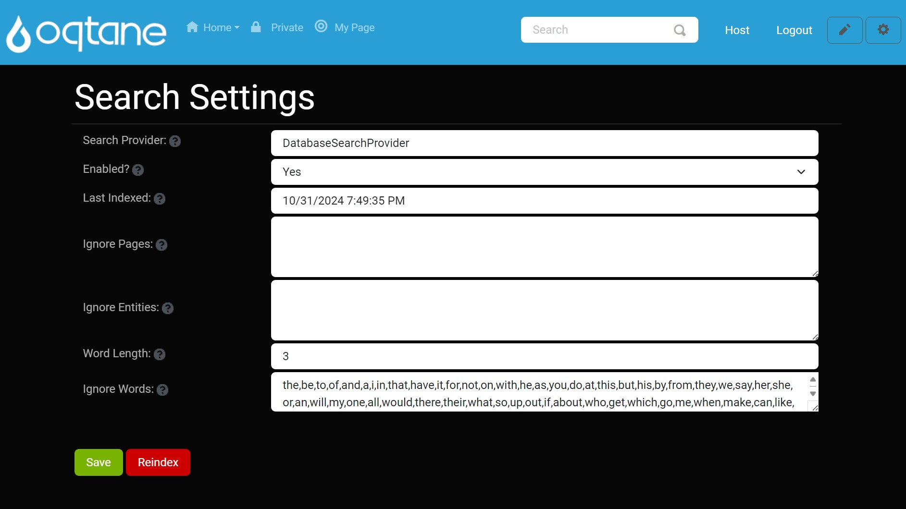
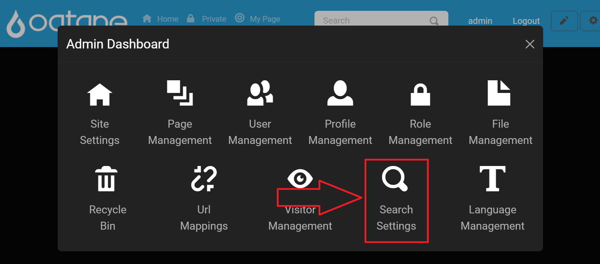
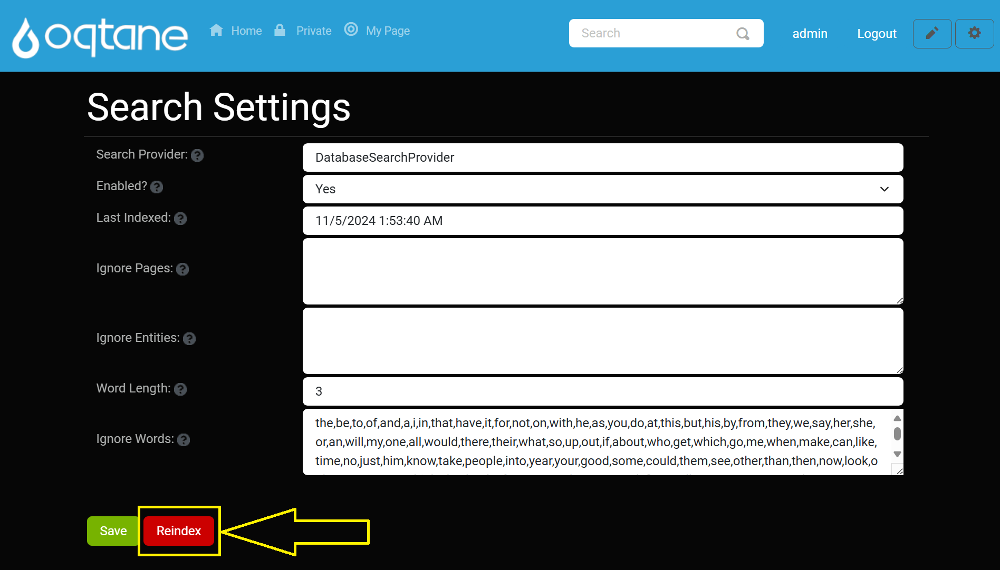

# Search



## Overview

The **Search** feature in Oqtane allows users to quickly locate content across the site. Through scheduled indexing and configurable settings, site administrators can fine-tune what content is included in search results. This guide explains how to access, configure, and maintain search capabilities through the control panel and host settings.

---

## Control Panel Walkthrough

### Accessing the Search Settings Feature

1. Click the **Control Panel** icon to access additional settings.

   

2. In the control panel, click the **Admin Dashboard** button.

   

3. In the admin dashboard, select the **Search Settings** icon.

   

---

## Search Settings

Administrators can configure the search behavior under **Host > Search Settings**. Below is a breakdown of each available setting:

| **Setting**                | **Description**                                                                                                                                                                |
|----------------------------|--------------------------------------------------------------------------------------------------------------------------------------------------------------------------------|
| **Search Provider**        | Specifies the provider responsible for indexing and retrieving search results. Example: `DatabaseSearchProvider`.                                                              |
| **Enabled**                | Toggles the search feature on or off. When set to `Yes`, the site content is regularly indexed, and search queries return up-to-date results.                                  |
| **Last Indexed**           | Displays the last date and time the site was indexed. This helps administrators know the freshness of indexed data in search results.                                          |
| **Ignore Pages**           | A list of pages excluded from indexing. Prevents certain content from appearing in search results, e.g., pages with sensitive or irrelevant content.                           |
| **Ignore Entities**        | Specifies types of entities to exclude from indexing, such as `Modules` or `Users`.                                                                                            |
| **Word Length**            | Defines the minimum character length for words indexed in search results. Only words meeting or exceeding this length will be indexed.                                         |
| **Ignore Words**           | Commonly ignored words in search queries (e.g., "and," "the"). This list helps refine search results by avoiding indexing or returning results for these words.                |

---

## Reindexing the Site

After updating your search settings or changing significant site content, you should manually reindex the site to refresh the search index.

### Using the Reindex Button

The **Reindex** button initiates a full scan and update of the site's searchable content.



#### Steps:
1. Navigate to the **Search Settings** page as shown in the walkthrough.
2. Click the **Reindex** button.
3. Wait for the process to complete (duration depends on content volume).

You will receive a notification when reindexing is complete.

---

## Localization (Search.resx File)

The `Search.resx` file supports localization of search UI elements. You can customize search-related labels using this resource file.

```xml
<data name="Search" xml:space="preserve">
    <value>Search</value>
</data>
<data name="SearchPlaceHolder" xml:space="preserve">
    <value>Search</value>
</data>
