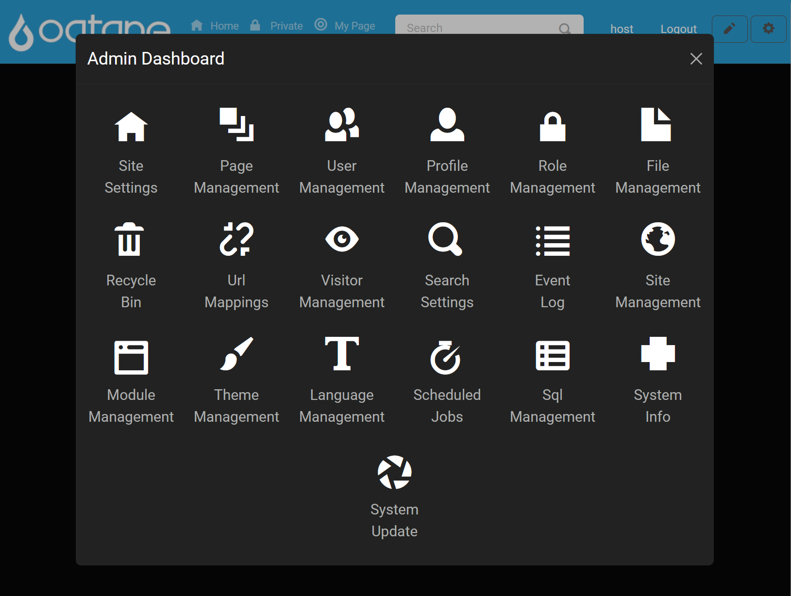

# Host Management

## Introduction

The **Host Dashboard** in Oqtane provides hosts with an extensive set of tools to oversee, configure, and support the entire Oqtane instance. Host users possess the highest level of permissions, allowing them to manage global settings, monitor system performance, and maintain the instance across all sites. 

Hosts log in just as other users do, using the designated host account created during the initial launch of Oqtane. However, hosts have access to exclusive features within the **Admin Dashboard** that provide additional control over Oqtane's configuration and functionality.

## Control Panel **Admin Dashboard** Feature Walk-through

The Control Panel offers streamlined access to host settings and features:

1. **Open the Control Panel**: Click the **gear icon** in the top-right corner of the page.

   

2. **Open Admin Dashboard**: Select the **Admin Dashboard** button to access host tools.

   

3. **Navigate to Desired Feature**: Within the **Admin Dashboard**, you'll find icons for each available feature. Click on the desired feature to begin management.

   

---

## Host-Exclusive **Admin Dashboard** Features

The following tools are available only to host users and provide advanced control and oversight of the Oqtane instance. Each link below directs to detailed documentation for that feature.

### Host Dashboard Features

- **[Event Log](event-log.md)**: Review records of all events within the Oqtane instance, including errors, updates, and deletions, aiding in troubleshooting and system monitoring.
- **[Site Management](site-management.md)**: Create and manage multiple sites within the Oqtane instance, setting defaults for new site creation.
- **[Module Management](module-management.md)**: Install, edit, and manage modules across all sites, ensuring modular control of site functionality.
- **[Theme Management](theme-management.md)**: Install and manage themes to maintain a consistent visual style across sites.
- **[Scheduled Jobs](scheduled-jobs.md)**: Configure jobs to run at specified intervals, automating recurring tasks and maintenance actions.
- **[SQL Management](sql-management.md)**: Execute SQL queries directly in the Oqtane database for advanced data manipulation and reporting.
- **[System Info](system-info.md)**: Access detailed information on the Oqtane instance, including framework versions, environment details, and API methods.
- **[System Update](system-update.md)**: Update the Oqtane framework to the latest version, integrating new features and security patches from NuGet packages.

---

## Extending Host Capabilities

The Host Dashboard is customizable, allowing hosts to add new tools or features to support site-wide administration. To add custom pages for host use:

1. **Access the Control Panel**: Log in as the host, click the **gear icon**, and navigate to **Page Management**.
2. **Create a New Host Page**:
   - Click **Add** in the Page Management section.
   - Set the **Parent Page** to **Admin** to make the new page accessible in the Host Dashboard.
   - Configure other page settings, such as title and permissions, to tailor the page to host needs.

3. **Save and Confirm**: Once saved, the new page will be available in the Host Dashboard.

For more details on page configuration, see the [Content Management - Page Management](../content/page-management.md) documentation.

---

## Additional Resources

- **[Installation Guides](../../guides/installation/index.md)**: Step-by-step instructions for initial Oqtane setup, including configuration specifics.
- **[Troubleshooting Issues](../../guides/troubleshooting/index.md)**: Solutions for common issues encountered during setup and maintenance.

For community discussions, support, and feature requests, visit:

- **[GitHub Discussions](https://github.com/oqtane/oqtane.framework/discussions)**
- **[GitHub Issues](https://github.com/oqtane/oqtane.framework/issues)**
