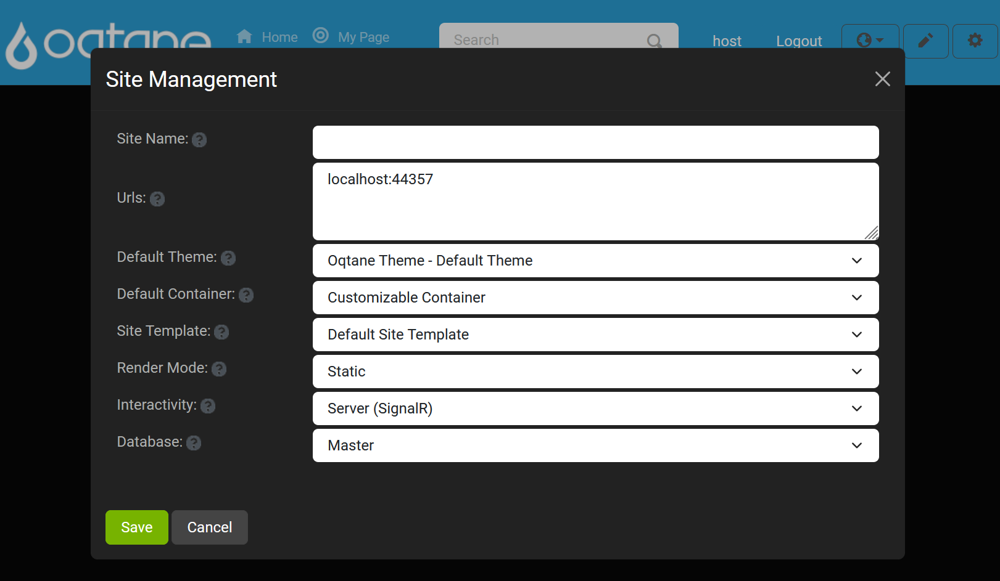
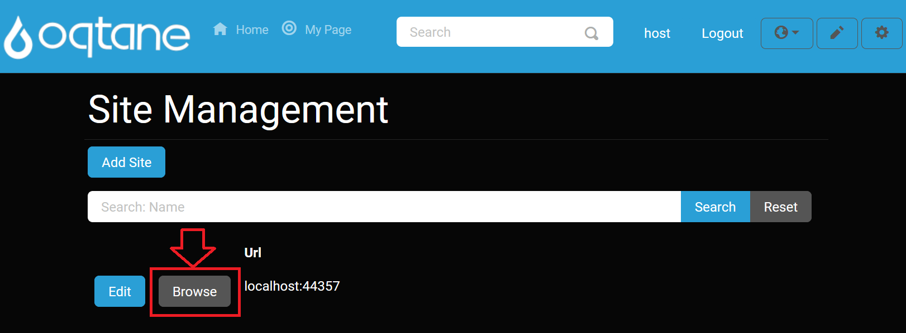

# Site Management

## Overview

Oqtane allows you to manage multiple sites within a single instance of the application. The **Site Management** page provides an overview of all sites, with quick access to the site settings for each one. Be cautious when deleting a site, as it is a permanent action and cannot be undone unless you are absolutely certain.

---

## Control Panel Walkthrough

### Accessing the Site Management Feature

1. **Open the Control Panel**: Click the **control panel icon** to access additional settings.

   

2. **Open the Admin Dashboard**: In the control panel, click the **Admin Dashboard** button.

   

3. **Select Site Management**: In the Admin Dashboard, click the **Site Management** icon to open the site configuration options.

   

---

## Site Management Options

The **Site Management** page includes options to add and edit sites. The available settings are as follows:

### Site Details

1. **Site Name**: Enter the name for your site.
2. **Aliases**: Define the address of the site. You can create sub-websites under the main site by using a forward slash ("/") followed by the desired name (e.g., `/subsite`).
3. **Default Theme**: Choose the theme that will be applied to pages on this site, determining the color scheme and style.
4. **Default Layout**: Select the default layout, which defines how many content panes (columns) will be available on each page.
5. **Default Container**: Choose whether to include a title header for modules on the site.
6. **Site Template**: Select a template to use for the site, or choose to have no template.
7. **Tenant**: Choose the tenant (database) for the site.
    - If you need to create a new tenant, select **Create a new tenant**. This will open additional options:
      - **Name**: Enter the name for the new tenant.
      - **Database Type**: Choose between a local database or an SQL Server database.
      - **Server**: Specify the location of the server where the database will be stored (default is the local database).
      - **Database**: Enter the database name to initialize on the server (default value for local database).
      - **Integrated Security**: Choose whether the host superuser credentials should match the database's root account.
      - **Host Username**: Enter the username for the superuser host account. This will also be the database root username if integrated security is enabled.
      - **Host Password**: Set the password for the superuser host account. This will also be the database root password if integrated security is enabled.

---

## Add Site

To add a new site:

1. Click on the **Add Site** button.

   

2. Fill out the site details in the form that appears.

   

---

## Search Feature

You can search for a specific site by name using the search bar.

---

## Edit Site

To modify the details of an existing site, click the **Edit** button.

---

## Browse Site

Click the **Browse** button to view the site.

---
## Deleting a Site

Be very careful when deleting a site, as this action is permanent and cannot be undone. Once a site is deleted, all data associated with it, including pages, content, and settings, will be permanently removed.

To delete a site, follow these steps:

1. **Access Site Settings**: Navigate to the **Site Management** page from the Admin Dashboard by clicking the **Edit** button next to the site you wish to delete.

   

2. **Delete the Site**: In the **Site Settings** page, scroll down to the bottom and find the **Delete** option. Confirm your decision to delete the site when prompted.

> **Warning**: Deleting a site is irreversible. Ensure that you have backed up any important data before proceeding.

Once the site is deleted, the action cannot be undone. The site and all of its content will be permanently erased from the system.

---
