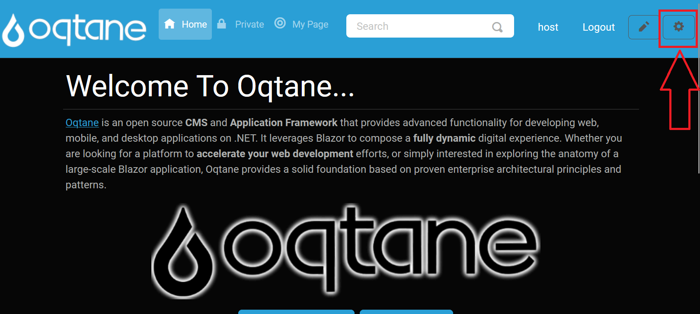
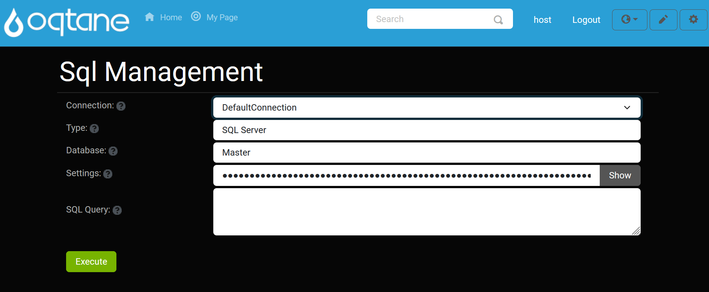

# SQL Management


## Overview

The SQL Management feature provides direct access to the database through the Oqtane interface, allowing administrators to execute SQL queries on the tenant databases (also called sites). This feature enables quick database management and troubleshooting without requiring a separate SQL Server Management Studio instance. 

By using the SQL console, you can run SQL queries directly from the Oqtane application. The results of any executed SQL statements will be displayed below the execute button, providing immediate feedback. This feature is particularly useful for administrators who need to interact with the database quickly.

---

## Control Panel Walkthrough

### Accessing the SQL Management Feature

1. **Open the Control Panel**: Click the **Control Panel** icon to access additional settings.

   

2. **Navigate to Admin Dashboard**: In the Control Panel, select the button to open the **Admin Dashboard**.

   

3. **Open SQL Management**: In the Admin Dashboard, click on the **SQL Management** icon to access the SQL console.

   

---

## Adding a Connection

To add a new database connection:

1. Click the **Add Connection** button in the SQL Management interface.

   

2. The **Add Connection Settings** window will appear, where you can configure the connection settings such as the server name, credentials, and database name.

   

---

## Default Connection

Once you've set up your connection, the default connection will be displayed for easy reference.

   

---

## Executing Queries

After setting up the connection, you can begin writing your SQL queries. To execute a query, click the **Execute** button.

   

---

## Using the SQL Management Console

Once inside the SQL Management page, you can interact with the SQL console to execute queries on the tenant databases.

### SQL Console Interface

- **Query Input Field**: This is where you type your SQL query.
- **Execute Button**: After entering your SQL statement, click the **Execute** button to run the query on the selected tenant database.
- **Results Display**: The results of the executed query will be displayed directly below the **Execute** button, showing either the returned data or any error messages.

### SQL Query Example

```sql
SELECT * FROM Users WHERE IsActive = 1;
```

This example SQL query will return all active users from the Users table.

### Error Handling

If there is an issue with your SQL query, an error message will be shown in the results section, providing helpful feedback to correct the query. Common issues could include:

- **Syntax errors**: Ensure your SQL syntax is correct.
- **Incorrect table or column names**: Double-check your database schema to ensure the table and column names match.
- **Access permissions issues**: Verify that your user account has sufficient privileges to execute SQL queries on the selected tenant database.

> **Warning**: Running SQL queries directly on the database can modify data and schema. It is advised to back up your database before making significant changes.

### Best Practices

- **Avoid Deleting Data**: Be cautious when running `DELETE` statements or performing operations that alter the database schema. Always double-check the `WHERE` clause before executing a `DELETE` query.
- **Test Queries**: Test queries in a development or staging environment before running them on a production database to prevent unintended consequences.
- **Backup**: Always ensure that you have a recent backup of your database before executing potentially destructive queries, such as `DELETE` or `UPDATE` operations that affect large sets of data.

### Common SQL Queries

#### Retrieving All Records

```sql
SELECT * FROM [TableName];
```

### Retrieving All Records

```sql
SELECT * FROM [TableName];
```

This query retrieves all records from the specified table. It is useful for getting an overview of the data in any table.

### Updating Records

```sql
UPDATE [TableName] 
SET [ColumnName] = 'NewValue'
WHERE [Condition];
```

This query updates existing records in the specified table based on the given condition. Use this to modify data for specific records in a table.

### Deleting Records

```sql
DELETE FROM [TableName]
WHERE [Condition];
```

### Deleting Records

Be cautious when using the `DELETE` statement, as it permanently removes records from the database. Make sure your `WHERE` clause is accurate before executing the query.

### Troubleshooting

- **Query Doesn't Execute**: If your query doesn't run, verify that the syntax is correct. Ensure that you are connected to the right tenant database.
- **No Results Displayed**: If your query returns no data, check the conditions in your SQL query, or verify that the data exists in the database. Ensure the table and columns are properly named and populated.
- **Permissions Issues**: If you encounter permission-related errors, verify that your user account has the appropriate access rights for executing SQL queries.

### Conclusion

The SQL Management console is a powerful tool for managing your tenant databases directly from within Oqtane. While it simplifies database interactions for administrators, it should be used with caution, especially when modifying or deleting data. Always double-check your queries and test them in a safe environment to avoid unintentional changes to your databases.
