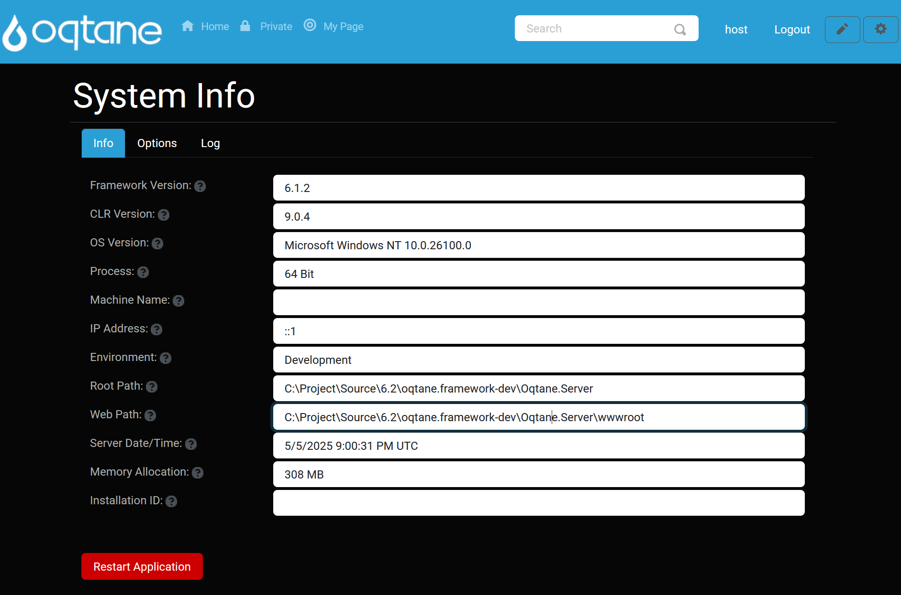

# System Info

## Overview

The **Info** tab displays critical environment and framework details for your Oqtane installation.

- **Framework Version**: The current Oqtane framework version.  
  *(Tooltip: "Framework Version")*  
- **CLR Version**: The .NET Common Language Runtime version in use.  
  *(Tooltip: "Common Language Runtime Version")*  
- **OS Version**: The operating system version of the hosting server.  
  *(Tooltip: "Operating System Version")*  
- **Process**: Indicates if the application is running in a 32-bit or 64-bit process.  
  *(Tooltip: "Indicates if the current process is 32 bit or 64 bit")*  
- **Machine Name**: The server machine’s host name.  
  *(Tooltip: "Server Machine Name")*  
- **IP Address**: The server’s network IP address.  
  *(Tooltip: "Server IP Address")*  
- **Environment**: The ASPNETCORE environment name (e.g., Development, Production).  
  *(Tooltip: "Environment Name")*  
- **Root Path**: The application’s content root path on disk.  
  *(Tooltip: "Server Root Path")*  
- **Web Path**: The application’s web root path on disk.  
  *(Tooltip: "Server Web Root Path")*  
- **Server Date/Time**: Current server UTC date and time.  
  *(Tooltip: "Server Date/Time (in UTC)")*  
- **Memory Allocation**: Current memory usage of the process (MB).  
  *(Tooltip: "Memory Allocation Of Service (in MB)")*  
- **Installation ID**: A unique identifier for this Oqtane installation.  
  *(Tooltip: "The Unique Identifier For Your Installation")*  

**Restart Application**: Restarts the application domain to apply configuration changes or clear state.  

---

## Options

The **Options** tab lets you configure runtime behaviors and diagnostics:

- **Detailed Errors?**: Enable detailed Blazor error messages (do not use in Production).  
  *(Tooltip: "Specify If Detailed Errors Are Enabled For Blazor. This Option Should Not Be Enabled In Production.")*  
- **Logging Level**: Set the minimum severity for writing to the event log.  
  *(Tooltip: "The Minimum Logging Level For The Event Log. This Option Can Be Used To Control The Volume Of Items Stored In Your Event Log.")*  
- **Notification Level**: Set the minimum severity for sending notifications to Host users.  
  *(Tooltip: "The Minimum Logging Level For Which Notifications Should Be Sent To Host Users.")*  
- **Swagger Enabled?**: Toggle the built-in Swagger UI for the server API.  
  *(Tooltip: "Specify If Swagger Is Enabled For Your Server API")*  
- **Static Asset Caching**: Provide a Cache-Control directive for static files (e.g., `public, max-age=60`).  
  *(Tooltip: "Provide a Cache-Control directive for static assets. A blank value disables caching.")*  
- **Package Manager Url**: URL for the package registry service used by the Package Manager.  
  *(Tooltip: "Specify The Url Of The Package Manager Service For Installing Modules, Themes, And Translations.")*  
- **Package Manager Email**: Email account used for authenticating with the package registry.  
  *(Tooltip: "Specify The Email Address Of The User Account Used For Interacting With The Package Manager Service.")*  

After adjusting options, click **Save** or **Restart Application**. You can also quickly launch the API tools:  

---

## Log

The **Log** tab shows today’s system log entries for diagnostics:

- **Log**: A read-only textarea displaying real-time system events.  
  *(Tooltip: "System log information for current day")*  

**Clear**: Purges the log content.  

After clearing, confirm the action:  

