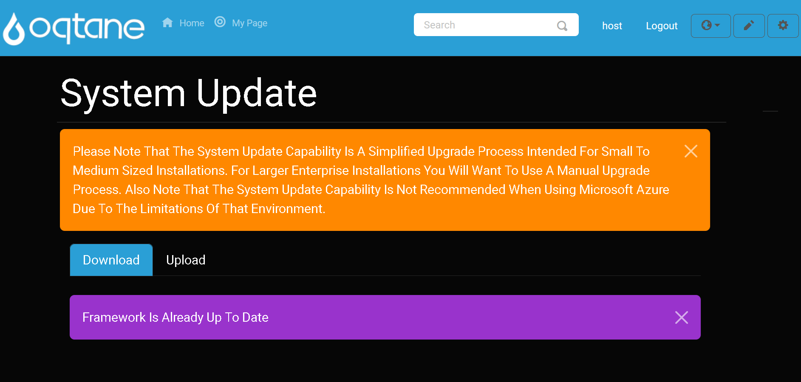
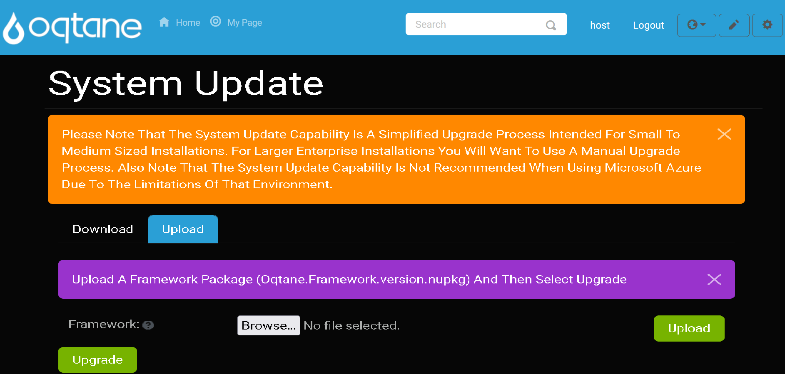
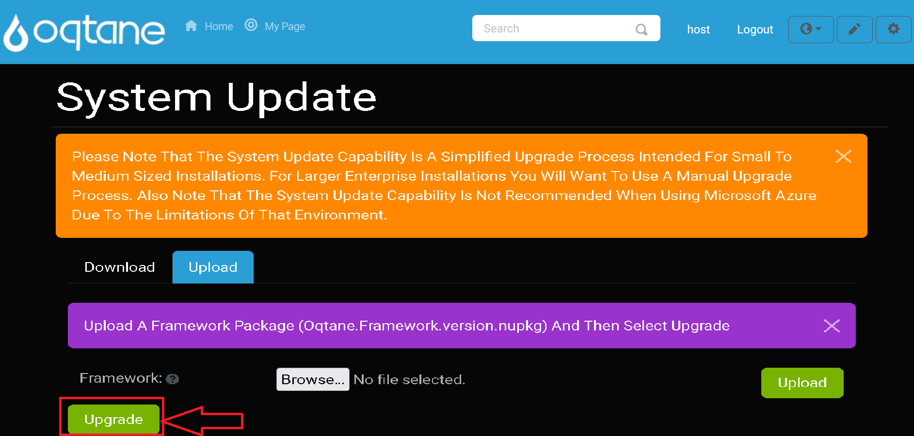
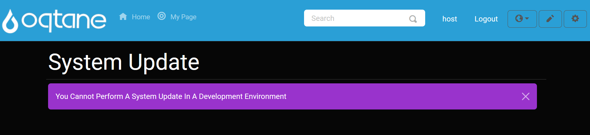

# System Update

## Overview

The **System Update** feature in Oqtane allows administrators to keep the framework up to date, ensuring access to the latest capabilities and features. It also enables you to upload a NuGet package to include specific features or updates that are part of newer versions of Oqtane. This is particularly useful when you are unable to update to the latest Oqtane version but want to incorporate certain features or fixes from that newer release.

When updating, you can select a NuGet file from your local system, upload it to the framework, and then install it to integrate the package into your current Oqtane installation. This process is helpful for applying partial updates or integrating features without a full framework update.

---

## Accessing the System Update Feature

To access the **System Update** feature, follow these steps:

1. **Open the Control Panel**: Click the **Control Panel** icon to access additional settings.

   

2. **Navigate to Admin Dashboard**: In the Control Panel, click the button to open the **Admin Dashboard**.

   

3. **Select System Update**: In the Admin Dashboard, click on the **System Update** icon to access the update feature.

   

---

## Downloading An Update

To download and apply an update, follow these steps:

1. Click the **Download** button to initiate the update download.

2. After the download completes successfully, you will see a notification. At this point, click the **Upgrade** button to apply the update.

   > **Note**: Ensure that you are connected to the internet during this process to download the latest update package.

### System Up To Date Notification

If the Oqtane framework is already up to date, you will see the following notification:

This indicates that no update is required and you are already using the latest version of the framework.

---

## Uploading An Update

In some cases, you may want to upload a NuGet package that includes new features or fixes from a newer version of Oqtane. To upload an update, follow these steps:

1. Click the **Upload** button to browse and select the NuGet package file on your local system.

   

2. After selecting the file, click the **Upgrade** button to install the uploaded package into your current version of Oqtane.

   

   > **Tip**: This step is useful if you cannot upgrade to the latest version of Oqtane but still need to integrate newer features or updates provided in a NuGet package.

---

## Development Environment Notification

The **System Update** feature is only available in production environments. If you are working in a development environment, you will see a notification message indicating that updates cannot be performed.

This is a safeguard to prevent accidental updates in environments where it may not be appropriate. The message will appear as shown in the image below:

> **Note**: If you need to perform updates in a development environment, consider switching to a production environment or testing updates locally before applying them to the live system.

---

## Conclusion

The **System Update** feature in Oqtane ensures that your system is running the latest framework version, incorporating important features, bug fixes, and updates. You can either download updates directly from the Oqtane servers or upload NuGet packages to install specific updates. Always verify your environment type (production vs development) and follow the steps carefully to maintain system integrity.

If you encounter any issues or have questions about updating, consult the logs or seek assistance from the community or support channels.
