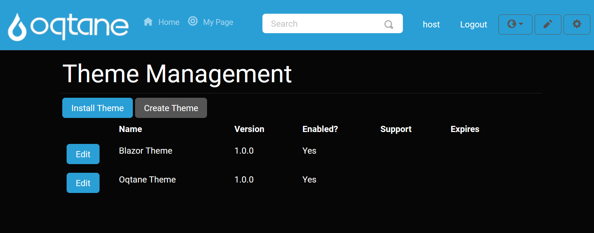
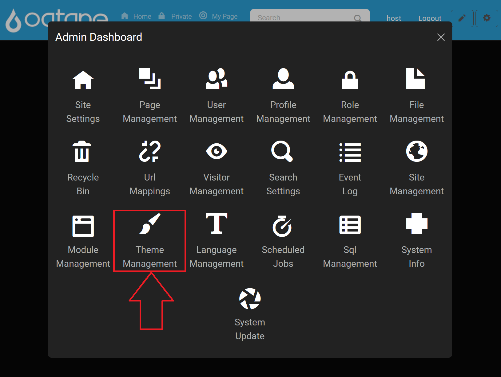
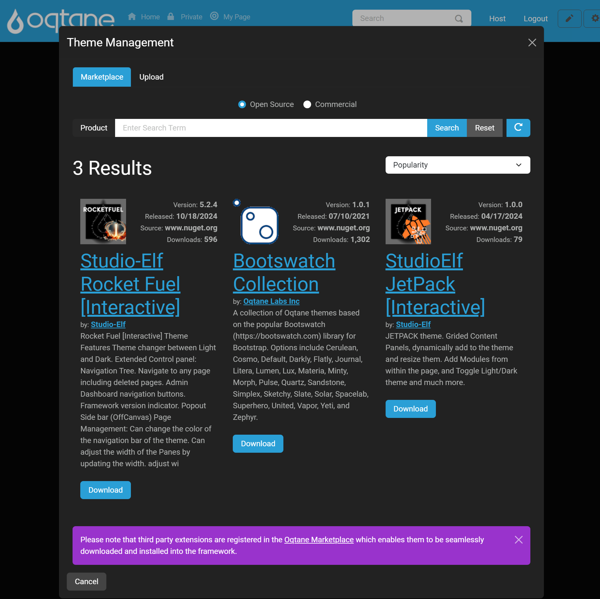
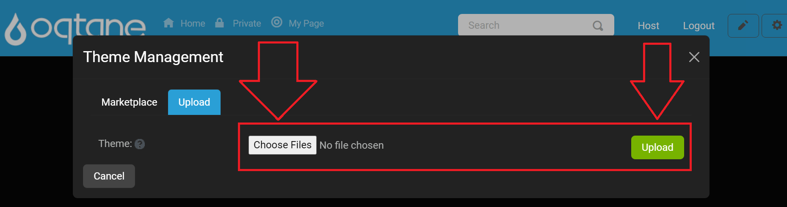
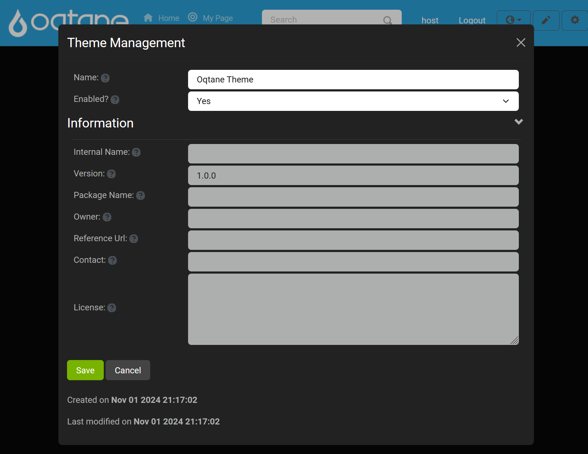
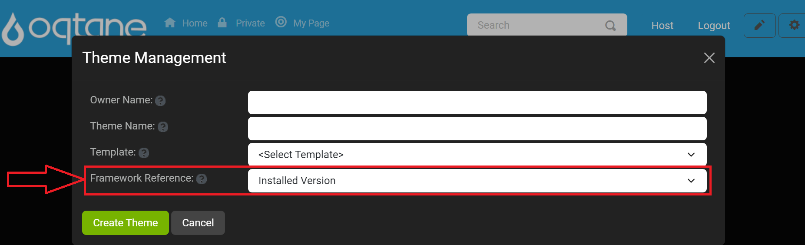
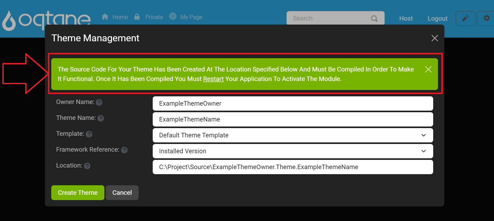

# Theme Management

## Overview

The **Theme Management** feature in Oqtane is primarily used during the development phase of a site or when launching a new site brand. It allows you to manage the themes and containers installed on your site and set the default theme for pages and modules. Themes define the overall look and feel of your site, including colors, styles, and layouts.

Oqtane provides two default themes:

- **Blazor Theme**: A minimalistic theme ideal for simple pages.
- **Oqtane Theme**: A more advanced theme offering a variety of styling options.

Additionally, you can download new themes from the marketplace or upload custom themes via NuGet packages.

---

## Control Panel Walkthrough

###  Accessing the Theme Management Feature

To access **Theme Management** in the Oqtane admin dashboard, follow these steps:

1. **Open the Control Panel**: Click the **Control Panel** icon to access additional settings.

   

2. **Navigate to Admin Dashboard**: In the control panel, click the button to open the **Admin Dashboard**.

   

3. **Select Theme Management**: In the Admin Dashboard, click on the **Theme Management** icon to manage your themes.

   

---

## Installing Themes

To install a new theme:

1. Click the **Install Theme** button.

   

2. You can install themes from two tabs:
   - **Marketplace**: Choose between **Open Source** or **Commercial** themes available for download.

     

   - **Upload**: If you have a custom theme as a NuGet package, you can upload it here.
     1. Click the **Choose Files** button to select the theme file to upload.
     2. Click the **Upload** button to install the theme.

     

---

## Editing Themes

You can edit existing themes to customize their properties.

1. Click the **Edit** button next to the theme you want to modify.

   

2. In the edit window, you can change the theme settings, such as color schemes, fonts, and other design elements.

   

---

## Creating Themes

If you want to create a completely new theme, Oqtane allows you to do so from the **Create Theme** option.

1. Click the **Create Theme** button to begin.

   

2. In the create theme window, provide the following details:

   - **Owner Name**: Enter the owner or creator of the theme.

     

   - **Theme Name**: Give your theme a name.

     

   - **Template**: Select a theme template. Templates are located in the `wwwroot/Themes/Templates` folder on the server.

     

   - **Framework Reference**: Choose a framework version to ensure compatibility with your environment.

     

   - After setting the above settings **Location** will appear showing the location of where the theme files will be created.

     

3. Once all settings are configured, click the **Create Theme** button to save the new theme.  To exit without creating a theme click the **Cancel** button next to the **Create Theme** button or by clicking the **X** in the top right corner.

   

4. After successfully creating the theme, you will see a notification confirming the creation and instructing you to compile the new theme project and restart the application.

   

### **Warning**: Theme Creation in Production Environments

**Theme creation** is recommended for **development environments** only. It is not advisable to develop or create themes directly in a **production environment** as it can lead to performance issues, security concerns, or disruptions to the live user experience. For production sites, it is best to pre-build and test themes in a controlled environment before deploying them to your live site.

   

---

## Conclusion

The **Theme Management** feature provides a straightforward way to manage, install, and create themes for your Oqtane site. Whether you're installing themes from the marketplace, uploading custom themes, or creating your own, this feature allows you to customize the look and feel of your site easily. Use the editing tools to fine-tune existing themes or start from scratch with a new theme to match your site's branding.

If you encounter any issues during theme installation or customization, refer to the logs or consult the support channels for assistance.
