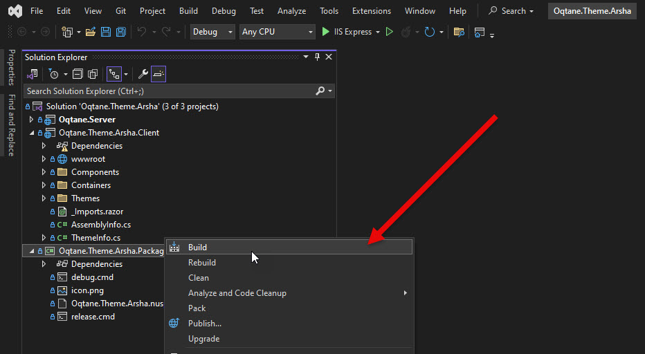

# Oqtane Extension - Build and Distribution (WIP)

> These guides will help you understand how
> Oqtane Extensions (Themes and Modules) are packaged and distributed.
>
> This is _not_ about building/distributing Oqtane itself,
> but about building and distributing your own Themes and Modules.

## Background

Oqtane is a .net 8.0 Blazor application that is designed to be modular and extensible.
This means that you can create your own modules, themes, and other extensions
to customize your Oqtane solution.

To get comfortable with Oqtane, you will need to understand how to package and distribute
your themes and modules.

We want to cover the following topics:

1. What is a Build and What's Inside it?
1. How does the Build Process Work?
1. What is a package?
1. What is a deployment?
1. Build and deploy during development
1. Build and deploy for distribution
1. Distribute through Nuget, Github and the Oqtane Marketplace

## Basics: What is a Build and What's Inside it?

A build is the process of taking _your work_ preparing it to run.
When we say _your work_ this usually means:

1. Your C# code
1. Your Blazor code
1. Your HTML, CSS, JavaScript
1. Any additional images, fonts, etc.

The build is usually done by Visual Studio and typically involves 3 steps:

1. Compiling any JavaScript, SASS etc. using Webpack
1. Compiling your C# and Razor code into one .net assembly
1. Deploying the results, together with any other files (eg. supporting DLLs)  
    _deployment can be into other folders, or into a Nuget package_

## How does the Build Process Work?

The build process is usually done by Visual Studio.
If you follow the current conventions, you will have a dedicated project
called `Oqtane...Package` which is only responsible for the building process.


> [!TIP]
> If you only build the main project, the result will just sit around and do nothing.
> You must build the package project to see anything useful.



### What is Triggered by the Build Process?

The build process is configured in the `Oqtane...Package.csproj` file, explained here:

```xml
<Project Sdk="Microsoft.NET.Sdk">
  <!-- some parts skipped for brevity -->

  <!-- This is where the distribution / package steps are configured, "PostBuild" -->
  <Target Name="PostBuild" AfterTargets="PostBuildEvent">
    <!-- If Windows and creating a Dev-Build, Run "debug.cmd" -->
    <Exec Condition="'$(OS)' == 'Windows_NT' And '$(Configuration)' == 'Debug'" Command="debug.cmd" />
    <!-- If Mac/Linux and creating a Dev-Build, Run "debug.sh" using bash -->
    <Exec Condition="'$(OS)' != 'Windows_NT' And '$(Configuration)' == 'Debug'" Command="bash $(ProjectDir)debug.sh" />
    <!-- If Windows and creating a Release-Build, Run "release.cmd" -->
    <Exec Condition="'$(OS)' == 'Windows_NT' And '$(Configuration)' == 'Release'" Command="release.cmd" />
    <!-- If Mac/Linux and creating a Release-Build, Run "release.sh" using bash -->
    <Exec Condition="'$(OS)' != 'Windows_NT' And '$(Configuration)' == 'Release'" Command="bash $(ProjectDir)release.sh" />
  </Target>
</Project>
```

## What Happens in a Dev-Build?

➡️ [Read more about the Dev-Build](xref:Dev.Extensions.Build.Dev)

## What Happens in a Release-Build?

➡️ [Read more about the Release-Build](xref:Dev.Extensions.Build.Release)

## What's missing here?

The previous example shows a default setup for a Theme.
As you may have noticed, it doesn't have a **WebPack** or other **JavaScript** build steps.

> [!TIP]
> As of now, the default templates/modules don't include examples for TypeScript or SASS.

