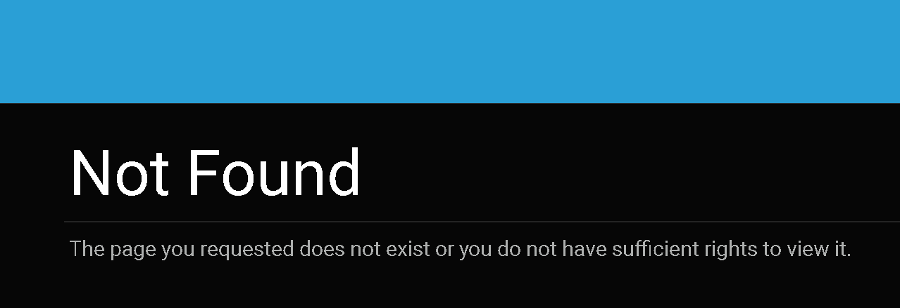

# 404 Page Behavior

## Issue Description

This document aims to provide clarity on the behavior of the 404 page in the Oqtane Framework. It includes information on various scenarios where the 404 page is encountered and how it is handled within the framework.

## Use Cases

The 404 page is utilized in multiple scenarios within the Oqtane Framework:

1. **Page Not Found**: When a user requests a URL that does not correspond to any existing page in the site, and it has not been mapped using URL Mapping, the user is redirected to the 404 page.

2. **Unauthorized Access**: If a user attempts to access a page for which they do not have permission, they are redirected to the 404 page instead of revealing the existence of the page.

3. **Effective Date and Expiry Date**: If a page exists but the current date is outside the range specified by the Effective Date and Expiry Date, the user is directed to the 404 page.

## Framework Behavior

In the Oqtane Framework, the term "404" refers to the friendly page that users are redirected to when the framework is unable to navigate them to the requested URL. This page has a path of "/404".

Regarding permissions, there has been debate about whether to strictly adhere to HTTP status codes or to prioritize security by not revealing the existence of pages to unauthorized users. As of now, Oqtane has opted for a single "friendly" page for handling these scenarios.

## Reference

For more details and discussions on this topic, refer to [issue #4088](https://github.com/oqtane/oqtane.framework/issues/4088) in the Oqtane Framework repository.

## Conclusion

By understanding the behavior of the 404 page in the Oqtane Framework, administrators can better manage and customize the user experience when encountering non-existent or unauthorized URLs.
