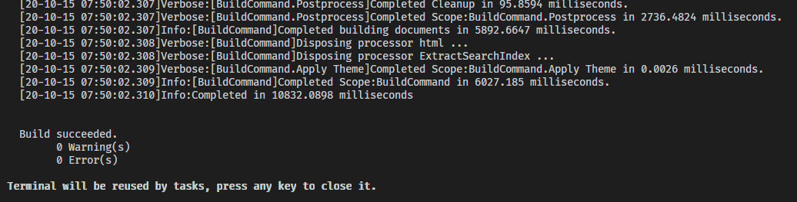


# Build and Deploy the Documentation

## Setup

You must have a folder containing both the `oqtane.docs` and the `oqtane.framework` subfolders - like this:

## Build with VS Code (recommended)

1. Open the subfolder `Oqtane.Docs` in VS Code (so not the top-level folder, but in the example above `Oqtane/octane.docs/Oqtane.Docs/`).
1. Hit Ctrl + Shift + P and select "Run Task"...  
  
1. ...and then "Build"

1. In the output you should then see a bunch of stuff - ending with `Build Succeeded`  

## Build with Visual Studio 2019

1. Open the docs solution in Visual Studio
1. Hit Ctrl+Shift+B to run build

## Deploy

Push back the docs to the git-repo, Github will automatically deploy it for you.