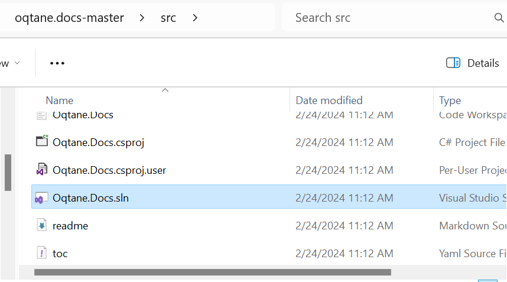
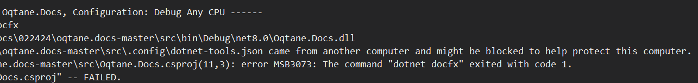
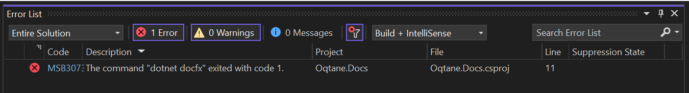
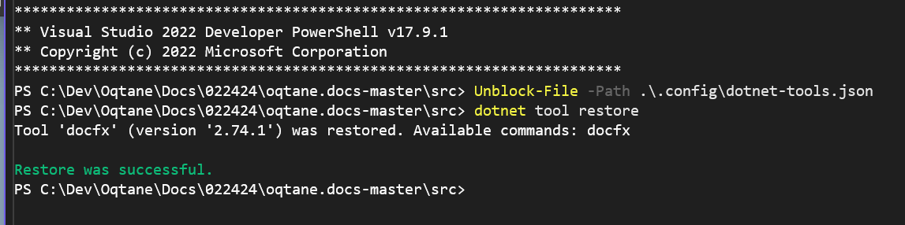
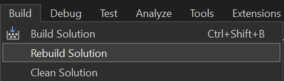

# Build and Deploy the Documentation

## Setup

To set everything up, clone the thi repository and the oqtane.framework repository
in the same parent folder (e.g., `c:\projects\oqtane`), creating a structure like:

* `c:\projects\oqtane` (example)
  * `oqtane.docs` cloned from [oqtane.docs](https://github.com/oqtane/oqtane.docs)
  * `oqtane.framework` cloned from [oqtane.framework](https://github.com/oqtane/oqtane.framework)

```text
some-root\
├── oqtane.docs
├── oqtane.framework
```

That will look like this:


## Build and Test Locally

Depending on your preferred toolchain, you can use

1. [VS Code](#build-and-test-locally-using-vs-code)  (recommended🌟)
2. [Visual Studio 2022](#build-and-test-locally-using-visual-studio-2022)

### Build and Test Locally using VS Code

1. Run with VS Code:

    * Open the `Oqtane.Docs.code-workspace` workspace located in the `/src` folder.

    * Rebuild the entire solution
        * Either using `Ctrl+Shift+B`.

        * Or by hitting `Ctrl + Shift + P` and selecting "Run Task"  
            
          ...and then "Build".  
          

    * In the output you should then see a bunch of stuff - ending with `Build Succeeded`  
      

    * It is generated into the root `/docs` folder.

2. Test Locally - three options:

    * _Recommended 🌟:_ Use the [Live Server](https://marketplace.visualstudio.com/items?itemName=ritwickdey.LiveServer)
      extension to serve the `/docs` folder on <http://localhost:5500`> using `Alt + L, Alt + O`.

    * _Or:_ Use [IIS Express Extension](https://marketplace.visualstudio.com/items?itemName=warren-buckley.iis-express)
      to serve the `/docs` folder on <http://localhost:27629`> using `Ctrl+F5`.

    * _Or:_ [Set up IIS](./run-in-iis.md) to publish the `/docs` folder on a domain
      such as `docs.oqtane.me`.


### Build and Test Locally using Visual Studio 2022

1. Run with Visual Studio:

   * Open the `Oqtane.Docs.sln` solution located in the `/src` folder.
   

   * Rebuild the entire solution. It is generated into the root `/docs` folder.
   

2. Test Locally

   * _Or:_ [Set up IIS](./run-in-iis.md) to publish the `/docs` folder on a domain
      such as `docs.oqtane.me`.

> [!NOTE] 
> If you experience build errors like shown below:
> 
>
> 
>
> You may also need to run the following commands in terminal:
> * `Unblock-File -Path .\.config\dotnet-tools.json`
> * `dotnet tool restore`
>
> Results should be shown as follows after running these commands:
>
> 

> [!TIP]
> Be sure to use the `Rebuild Solution` option to see your updates in the locally hosted IIS website.
>
> 

## Publish / Deploy to GitHub

Push the result back to the repository.
GitHub will automatically publish the updated documentation to <https://docs.oqtane.org>.

## Questions

For further discussions, feedback, or questions, head over
to [GitHub Discussions](https://github.com/oqtane/oqtane.docs/discussions)
or [GitHub Issues](https://github.com/oqtane/oqtane.docs/issues).
