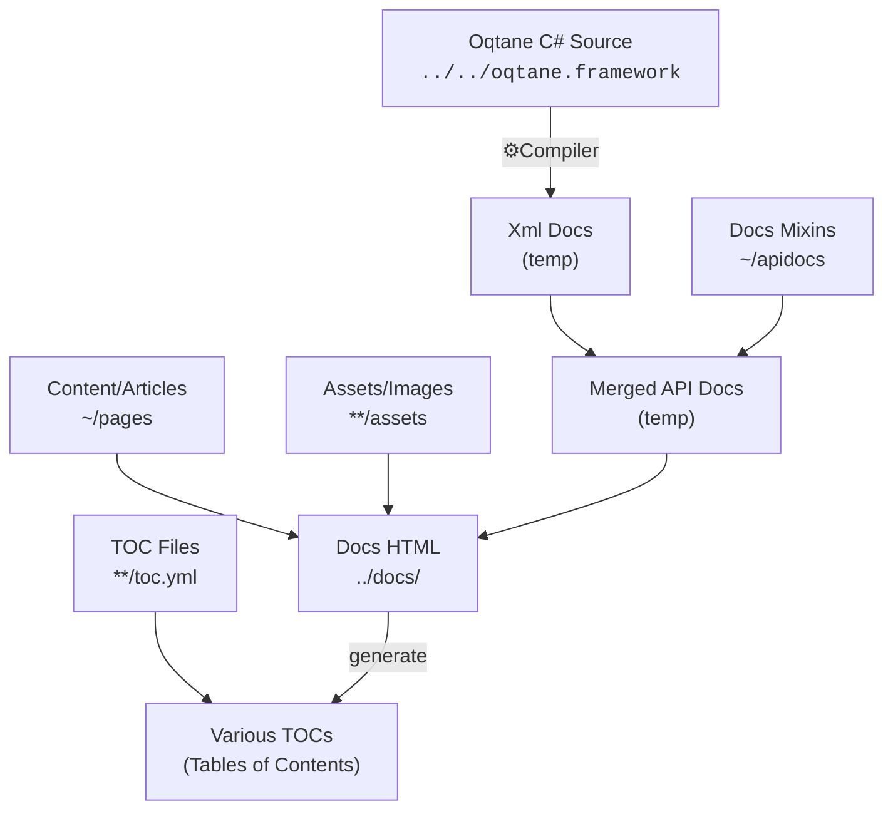

# Oqtane Documentation

Here we'll explain how the documentation works, with all the magic in it.

## The Basics

> [!TIP]
> The `Oqtane.Docs` project generates the documentation for Oqtane using [docfx](https://dotnet.github.io/docfx/).
> So for the most part, you'll want to read the docfx documentation
> to understand how it works.

### The Source Code

This project has a `src` folder containing...

1. markdown files in `/pages` for standalone docs pages
1. markdown files in `/apidoc` for merging with XML-docs in the source of Oqtane
1. various YAML files (`.yml`) which describe the navigation structure
1. Solution (`.sln`) and project (`.csproj`) files to build the documentation
1. docfx configurations (`docfx.json` and `filterConfig.yml`)
1. various json configs so it also works in VS-Code

It also requires the `Oqtane.Framework` project to be in a sibling folder (see [setup](./build.md))

### The Build Process

When you build this project, it will

1. Compile Oqtane
1. Extract the XML documentation from Oqtane and generate YAML and markdown files
1. Merge the generated files with the ones in this project
1. Generate a `../docs` folder with static HTML files that can be hosted anywhere

> [!NOTE]
> To test the generated docs locally,
> you'll need to host the `../docs` folder on a web server.
> This is because there are some absolute paths used in some JavaScripts
> for the TOC (table of contents) and search functionality.
> The setup is explained below.

### Deployment

When pushed back to Github, Github will automatically build and deploy to <https://docs.oqtane.org>

## Setup

👉 continue with [Setup, Build, Test and Deploy](./build.md)

---

[!include]
