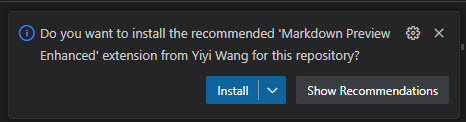
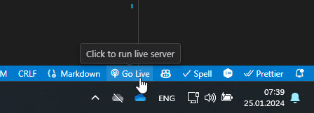

# Oqtane Documentation Tips

The following tips should help you be more productive when working on the docs.

## Use VS Code instead of Visual Studio

VS Code is much lighter and faster than visual studio.
It also has some neat features which will help, like:

* Markdown preview
* Markdown linting
* Live Server to see the built docs without having to setup IIS

## Install Recommended Extensions

The VS Code docs project has recommended extensions which will help you be more productive.
If you open the project the first time, it will ask you to install them.



To install them later, go to the extensions tab
and find the "Show Recommended Extensions".


## Use VS Code Preview

VS-Code has a nice preview built in:


But the improved [Markdown Preview Enhanced](https://marketplace.visualstudio.com/items?itemName=shd101wyy.markdown-preview-enhanced)
extension is even better, as it even supports [Mermaid](https://mermaid.js.org/).

## Learn Keyboard Shortcuts

Build the docs using `Ctrl + Alt + B`.

## Use Live Server for Preview

The [Live Server](https://marketplace.visualstudio.com/items?itemName=ritwickdey.LiveServer) extension
lets you see the built docs without having to setup IIS.

It also automatically refreshes the browser on every change, making it super-comfy.

1. Install the extension
1. run it using `Alt + L, Alt + O`...  
   
1. ...or by clicking the "Go Live" button in the status bar  
   


## Use Markdown Linting

Install the [Markdown Lint](https://marketplace.visualstudio.com/items?itemName=DavidAnson.vscode-markdownlint) extension.

## Disable Xml-Docs While Editing Content

Rebuilding everything incl. the XML-docs from the Oqtane source code takes
much longer than just building the docs from the markdown files.
On my PC (iJungleboy) it takes about 32 seconds vs. 10 seconds.

You want fast rebuilds while editing content
(eg. not updating docs from the Oqtane source code).

To "temporarily" disable the Xml-Docs, change the `/docfx.json` file from:

```json
{
  "metadata": [
    {
      // Blank src sample
      // This should be used when making changes to the theme and wanting to see changes quickly, as it skips parsing the source code
      // To use, rename this to "src" and rename the real src to "dummy-src" while developing, then revert when done
      "dummy-src": [],
      // Oqtane Source Code - where it will extract the API docs from
      "src": [
```
to

```json
{
  "metadata": [
    {
      // Blank src sample
      // This should be used when making changes to the theme and wanting to see changes quickly, as it skips parsing the source code
      // To use, rename this to "src" and rename the real src to "dummy-src" while developing, then revert when done
      "src": [],
      // Oqtane Source Code - where it will extract the API docs from
      "-src": [
```

> [!TIP]
> Don't forget to undo this change before committing your changes.
