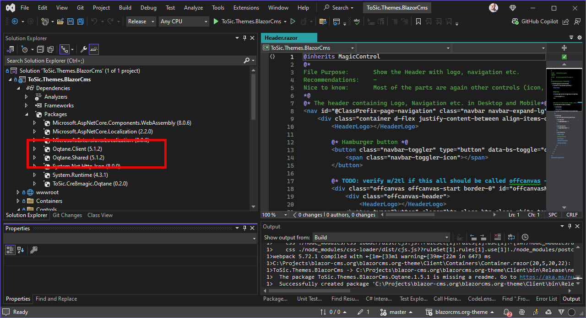

# Oqtane Dev Best Practices: Use NuGet for Oqtane Dependencies

> [!IMPORTANT]
> The [recommended structure](create-solutions-for-each-extension.md)
> may imply that the add-on solutions such as the themes
> should reference the `oqtane.framework` project or output DLLs.
> This is not recommended, as it will make your add-ons less portable and harder to maintain.

Instead, you should use NuGet packages to reference
the Oqtane framework in the version you currently target.

