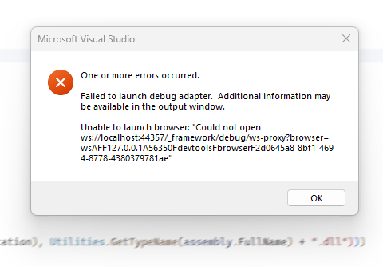

# Debug Blazor/Oqtane with IIS Express

_This is copied from [Leigh Pointers LinkedIn Post](https://www.linkedin.com/pulse/debugging-blazor-iis-express-overcoming-timeout-tango-leigh-gdzxe/)_

## Intro

Ever found yourself staring at a stubborn "Failed to launch debug adapter"
error when all you wanted was a clean debugging session?
If you're a Blazor developer using Visual Studio with IIS Express,
you've likely encountered this frustrating dance with timeout issues.



Let's waltz through some solutions that will get you back in step with your debugging rhythm.

## Understanding the Challenge

Debugging Blazor applications can sometimes feel like trying to catch a fleeting melody.
The default timeout settings often don't provide enough time for the debug adapter to warm up,
leaving you with error messages that halt your progress.
But don't worry – we've got some moves to help you lead this debugging dance.

Strategies to Extend Debugging Timeout

## 1. Extend Debug Timeout with a Quick Registry Edit

Think of this as adjusting the tempo of your debugging dance:

* Open Registry Editor (`regedit.exe`) as an administrator.
* Navigate to `HKEY_CURRENT_USER\SOFTWARE\Microsoft\VisualStudio\<version>\Debugger`.
* Create a new `DWORD` value named `BlazorTimeoutInMilliseconds`.
* Set its value to **120000** (that's 2 minutes in milliseconds).

This tweak gives your debug adapter more time to find its footing before the music stops.

## 2. Try Component Initialization Delays for Extra Buffer Time

Add a little pause to your component's initialization routine:

```csharp
protected override async Task OnInitializedAsync()
{
    #if DEBUG
    await Task.Delay(10000); // A 10-second breather
    #endif

    // Your initialization code here
}
```

This delay acts like a brief intermission, only present during debug performances.

## 3. Fine-tune IIS Express for Smoother Performance

Adjust your IIS Express settings to handle more requests:

* Find the `applicationhost.config` file in your project's `.vs\config` folder.
* In the `<system.webServer>` section, add or modify:

```xml
<serverRuntime enabled="true" appConcurrentRequestLimit="5000" />
```

Think of this as expanding the dance floor to accommodate more dancers (requests).


## 4. Switch Partners: Try Kestrel Instead of IIS Express

Sometimes, changing dance partners can make all the difference:

* Right-click your project in Solution Explorer.
* Select "Properties" and navigate to the "Debug" tab.
* Change the profile from "IIS Express" to your project name.

Kestrel often leads to a smoother debugging experience.

## 5. Clear the Floor: Restart and Refresh

When in doubt, start with a clean slate:

* Close all browser windows and clear your cache.
* Restart Visual Studio and delete the .vs folder in your project directory.
* Launch your project again with a fresh perspective.

## 6. Check for Antivirus Interference

Your antivirus might be stepping on your toes.
Try temporarily disabling it to see if it improves your debugging dance.

## 7. Keep Your Dance Shoes Polished: Update Your Tools

Ensure you're using the latest versions of Visual Studio and the .NET SDK.
These updates often include important bug fixes that can enhance your development experience.

## Conclusion: Keep the Debugging Dance Going

Debugging Blazor applications doesn't have to be a solo performance.
By implementing these strategies,
you can overcome timeout issues and enjoy a more harmonious development workflow.
Whether it's adjusting settings, introducing clever delays,
or switching up your debugging environment,
these techniques will help you glide through common pitfalls.
Remember, our developer community thrives on shared knowledge.
These insights come from real-world challenges,
and sharing our solutions helps us all debug smarter.
What tips have helped you overcome similar issues in your Blazor projects?
Share your experiences in the comments – let's keep this debugging dance party going!
Happy coding, and may your breakpoints always hit on time!


---

[!include[](~/shared/authors/leigh-pointer/_main-author.md)]

---

[← Back to Installation Home](../index.md)
