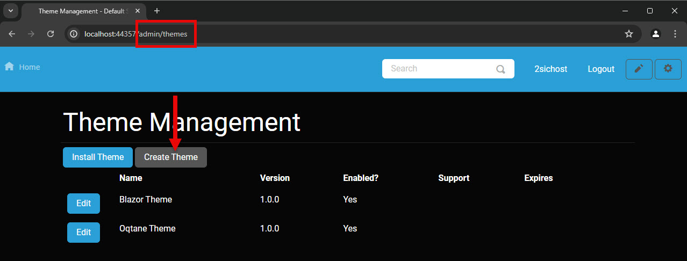
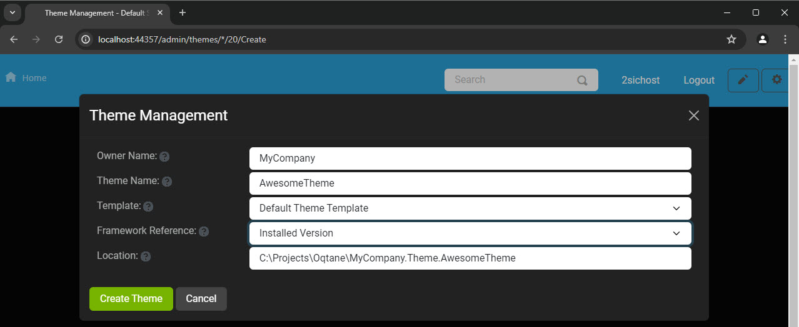
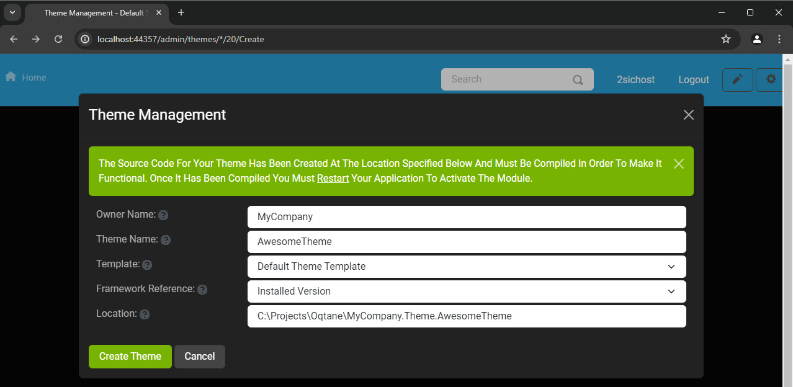
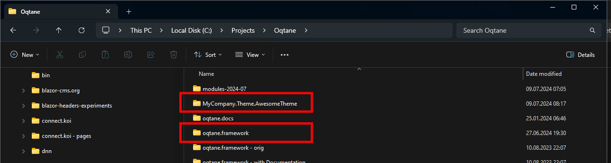
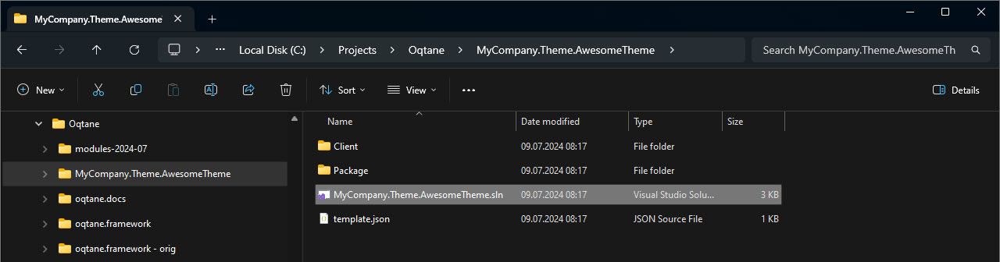

# Oqtane Themes Generator

> Brief tutorial how to use the built-in Themes Generator.

Oqtane helps you get started with themes by providing a built-in
Themes generator. It will create a Visual Studio solution for you,
containing all the necessary parts to start customizing your own theme.

## Start the Generator

In your Oqtane site, go to `/admin/themes` to see the Themes management:

Click on "Create Theme" and fill in the wizard as follows:

* **Owner Name** should be your company name or similar.
    It will be used in the Namespace of the generated code.
* **Theme Name** will be the technical name of the theme.
    It too will be used in the Namespace of your generated code.
* **Template** is meant to select from various templates,
    but as of now there is only one.
* **Framework Reference** is to decide what Oqtane (_not_ .net Framework) your
    Theme will target, but as of now you can always only select the
    current framework running on your Oqtane.
* **Location** is where the generated code will be placed.
    It is best practice to put this
    [side-by side to your Oqtane solution](xref:Guides.Extensions.BestPractice.SeparateSolutions.Index).

Once you click on **Create Theme** you will see:

## Continue in Visual Studio

The generator created this folder with a visual studio solution
beside your Oqtane Framework folder:

Next, open the solution file in that folder:

&nbsp;
