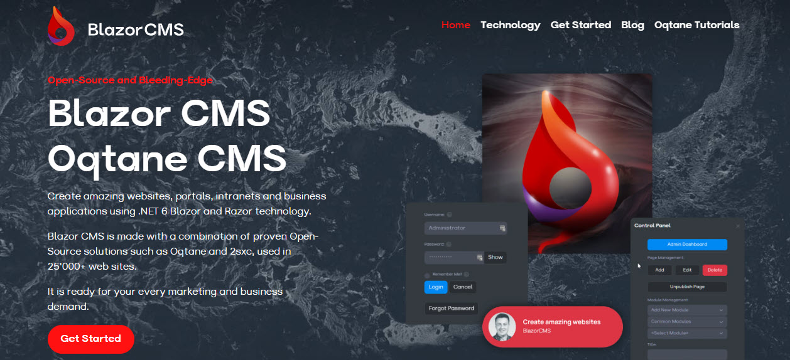

# Oqtane Themes Guide

> Oqtane Themes are extensions to customize the look and feel of your Oqtane website.
> This guide will help you get started with creating and using themes in Oqtane.

A theme is a collection of files that define the look and feel of your website.
Themes can include CSS, JavaScript, images, and other assets that are used to style your website.
Here's an example:

## Next Steps

1. Learn to [Install a theme](xref:Manuals.System.ThemeManagement)
1. Set the theme to use [on a site](xref:Manuals.Site.SiteSettings) or [on a specific page](xref:Manuals.Content.PageManagement)
1. Configure theme settings (not documented yet)
1. [Develop your own Oqtane Theme](xref:Dev.Themes.Index)

---

[!include]
