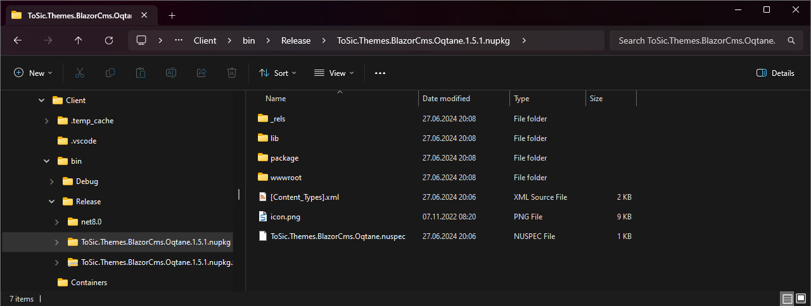

# Themes Guide (WIP)

> Oqtane Themes are a way to customize the look and feel of your Oqtane website.
> This guide will help you get started with creating and using themes in Oqtane.

## What is a Theme?

A theme is a collection of files that define the look and feel of your website.
Themes can include CSS, JavaScript, images, and other assets that are used to style your website.

Since Oqtane is based on .net and Blazor, themes are built using Blazor components
and these are compiled into a DLL that is loaded by the Oqtane framework.
Here's an example:

In this example, the theme controls:

1. Placement, size and styling of the logo - as well as how it changes in responsive scenarios.
2. The layout of the main menu, including the dropdowns.
3. The layout of the footer, including the social media links.
4. Font sizes and colors for various headings and normal text.

## Parts of a Theme

Oqtane themes - when installed - consist of the following parts:

1. A DLL file that contains the compiled Blazor components.
2. JS and CSS files in `wwwroot/Themes/[your-theme-name]`.

## Theme Distribution and Installation

Themes are usually distributed as nuget packages.
Internally such a nuget package is actually just a ZIP file.

It contains:

1. a `.nuspec` file containing information about it's contents
2. a `lib` folder containing the DLL file(s)
3. a `wwwroot` folder containing the JS and CSS files
4. an `icon.png` file
5. and some other files which are not important to us

Theme installation works like any other module installation in Oqtane.
You can install a theme by either...

1. uploading the nuget package in the Modules section of the admin area
2. by auto-downloading it from the Oqtane marketplace
3. by placing it in the `Packages` folder of your Oqtane installation
4. manually copying the files to your Oqtane installation

...and then restarting Oqtane.

## Code Structure of a Theme

Internally a theme only needs the following 4 things:

1. An own namespace such as `YourCompany.Themes.YourTheme`.
1. A `ThemeInfo.cs` file in that namespace which implements `Oqtane.Themes.ITheme`.  
   This file contains information about the theme like name, author, version, etc.
1. A theme file like `MyTheme.razor` which is the main thing shown to the user.
1. A container file like `Container.razor` which is the main wrapper around a module.

> [!TIP]
> It is crucial that the namespace of the theme is unique,
> and that all these core elements (ThemeInfo, Theme, Container)
> are in _exactly_ this namespace.

