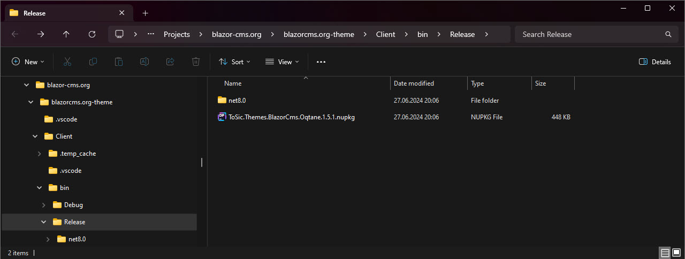

# Themes - Distribution and Installation

Themes are usually distributed as nuget packages.
Internally such a nuget package is actually just a ZIP file.

It contains:

1. a `.nuspec` file containing information about it's contents
2. a `lib` folder containing the DLL file(s)
3. a `wwwroot` folder containing the JS and CSS files
4. an `icon.png` file
5. and some other files which are not important to us

&nbsp;

## Installation

Theme installation works like any other module installation in Oqtane.
You can install a theme by either...

1. uploading the nuget package in the Modules section of the admin area
2. by auto-downloading it from the Oqtane marketplace
3. by placing it in the `Packages` folder of your Oqtane installation
4. manually copying the files to your Oqtane installation

...and then restarting Oqtane.
