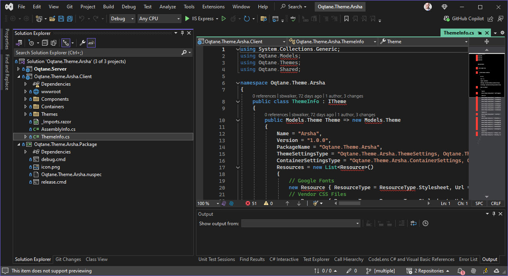

# Themes - Theme Solution Explained

A Oqtane Theme Solution is a Visual Studio project which is the basis for building a theme.

It will typically contain the following in one or more projects:

1. The basics such as the `ThemeInfo.cs`, the theme files and the container files.
1. A `wwwroot` folder with the CSS and JS files.
1. A `.nuspec` file to package the theme into a nuget package.
1. Code and specs to build / compile the result - such as `package.json` and `webpack.config.json`.
1. Code and specs to deploy the result - such as a `.nuspec` file.
1. An icon file, copyright information and more.

In the example of the [Arsha theme]()
you can see that the theme solution contains two projects:

&nbsp;

1. The first one is the theme and everything it consists of
1. The second one is the packaging project which separates nuget-creation into a separate project.

> [!TIP]
> This separation of projects makes work easier, so we recommend you do the same.
>
> See also .
