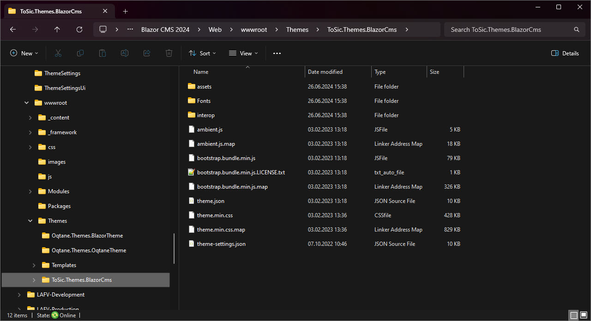

# Themes Guide - Parts of a Theme

Oqtane themes - when installed - consist of the following core parts:

1. A DLL file that contains the compiled Blazor components.
2. JS and CSS files in `wwwroot/Themes/[your-theme-name]`.

