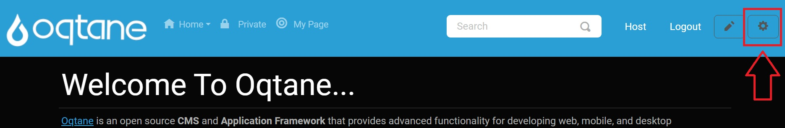
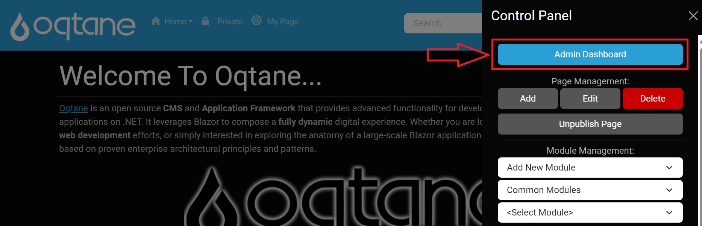

# Language Management Manual

This document describes the Language Management module, settings, and configuration for administrators to manage language resources effectively across their Oqtane site.

## Overview

The **Language Management** feature allows administrators to manage translations for their site, ensuring that the site content is available in multiple languages, enhancing accessibility and user experience.

---

## Control Panel Walkthrough

### Accessing the Language Management Feature

1. Click the control panel icon to access additional settings.

   

2. In the control panel, select the button to open the admin dashboard.

   

3. In the admin dashboard, click on the Language Management icon to configure your language resources.

   

---

## Configuring Language Management

Once in the Language Management settings, administrators can view and manage language resources.

### Main Index Page

The **Language Management** main index page displays all installed languages.

1. The list includes the name of each language, along with options to edit or delete (except for the default English language).

   

### Adding a Language

1. Use the **Add Language** button to open a popup modal for adding a new language.

   

   - In the popup, select the language by name and set it as default using the Yes/No dropdown options.

   

### Searching Languages

The search feature allows administrators to filter through installed languages, which is particularly helpful when many languages are available.

### Reviewing and Editing Languages

1. To edit an existing language, click the **Edit** button next to the desired language.

   

2. This will open the edit popup, where you can modify the language settings.

   

   - You can set the language as default using the Yes/No dropdown option.

3. To delete a language, click the **Delete** button next to the language. Note that the default English language cannot be deleted.

---

## Conclusion

The Language Management module in Oqtane provides an effective way for administrators to manage language resources and translations. By leveraging the features outlined in this manual, site administrators can enhance user experience and ensure their content is accessible in multiple languages.
