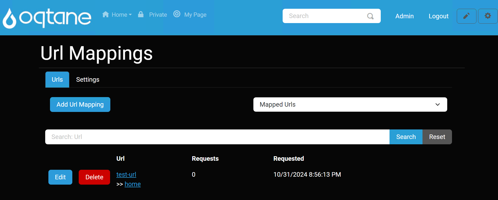
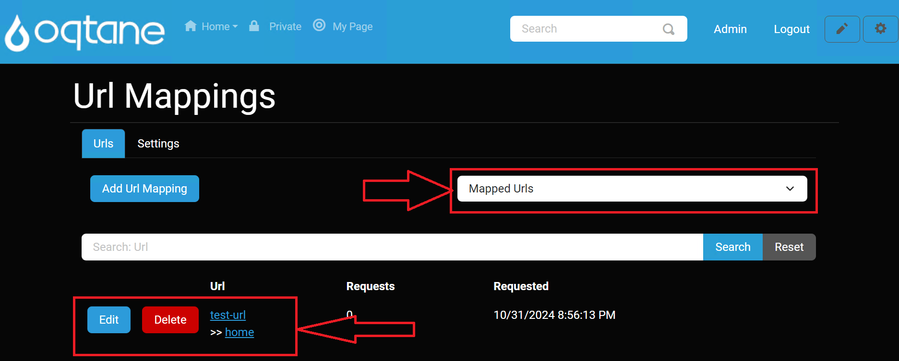

# URL Mappings Manual

This document describes the URL Mappings module, settings, and configuration for administrators to manage URL redirections effectively across their Oqtane site.

## Overview

The **URL Mappings** feature allows administrators to define mappings from one URL to another, enabling effective redirection strategies. This feature is useful for managing broken links, ensuring users are directed to the correct resources.

---

## Control Panel Walkthrough

### Accessing the URL Mappings Feature

1. Click the control panel icon to access additional settings.

   

1. In the control panel, select the button to open the admin dashboard.

   

1. In the admin dashboard, click on the URL Mappings icon to configure your URL mappings.

   

---

## Configuring URL Mappings

Once in the URL Mappings settings, administrators can view and manage URL mappings.

### Managing Mapped URLs

1. The **Mapped URLs** tab displays all existing URL mappings, including the original URL, the mapped destination, the number of requests, and the last requested date. You can choose to view either mapped URLs or broken URLs using the dropdown select menu.

   

2. Use the **Add URL Mapping** button to create a new mapping. This will open a popup modal for adding a mapped URL.

   

### Reviewing and Editing URL Mappings

1. After adding a URL mapping, it will appear in the list below the search feature. You can select an existing URL mapping to edit or delete it if it is no longer needed.

   

2. In the case of broken URLs, you can also edit or delete them as necessary to redirect them as needed.

### URL Mapping Settings

Administrators can configure the URL Mappings module through **Host > URL Mappings**. The primary setting available is:

| **Setting**                   | **Description**                                                                                                                                                                     |
|-------------------------------|-------------------------------------------------------------------------------------------------------------------------------------------------------------------------------------|
| **Capture Broken URLs?**      | Toggles the feature to automatically capture and save broken URLs in the URL Mappings. When set to `Yes`, any broken link encountered will be recorded for further management.      |

In the **Settings** tab, administrators can toggle the **Capture Broken URLs** setting.

1. Set this option to `Yes` to automatically capture broken URLs when they are accessed.
2. Click the **Save** button to apply changes.

   

---

## Conclusion

The URL Mappings module in Oqtane provides an effective way for administrators to manage URL redirection strategies. By leveraging the features outlined in this manual, site administrators can enhance user experience and maintain the integrity of web links across their sites.
