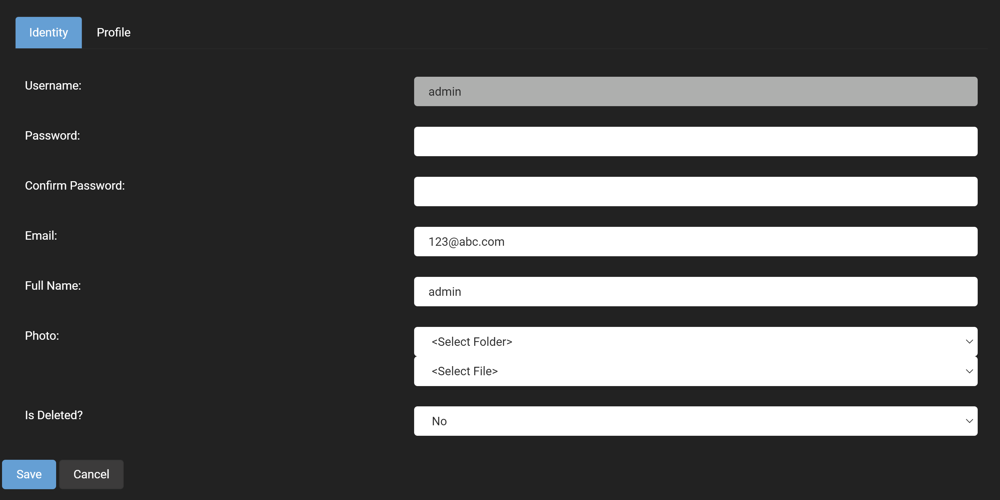

# User Management

One of your primary responsibilities as the site administrator will likely be to manage users on your site. You might need to create, edit, or delete users. You might also be required to add and remove abilities from users on your site. Everything that you need to do in these examples can be done from this one menu.

The options that are provided on this user manager includes:
* Add User: The add new user button is exactly what it sounds like it allows you to add a new user to your site and upon being clicked, it brings up a window that asks for all of the essential information for an account with a username, password, email, and full name. There is also the profile tab which allows for more extensive information to be provided for a user account and may have some fields that are required to be input in order to create an account, which is specified in the required field of the [profile manager](profile-management.md).
* Find User: Provides a text field to input a user's account name that will search through all of the site's users and return the account below this ield with the following options:
    * Edit User: This allows for basic fields in the identity field such as password, email, and full name to be modified as well as the ability to give the user a profile image and the profile tab to specify more information about a user. 
    
    There is also the profile tab which goes into more detail about a user allowing for the specification of things like postal code, phone number and address.
    
    * Delete User: This is exactly as it sounds, it will delete the user's account.
    * User Roles: This allows for a user account to placed into a security role that has been previously defined in the [role manager](role-management.md), and requires a date that this security role will take effect and will expire for the user account.