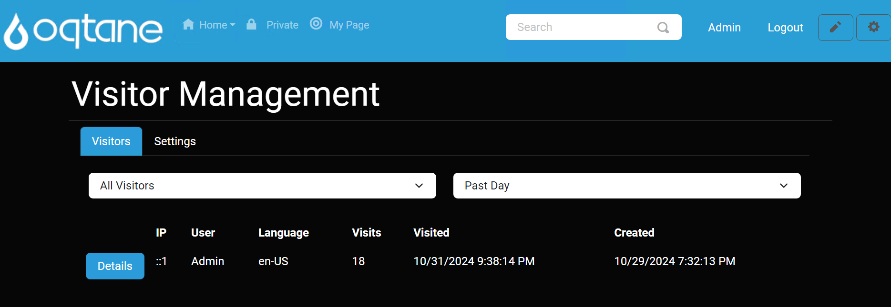
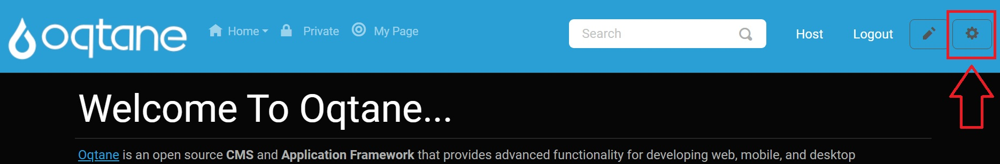
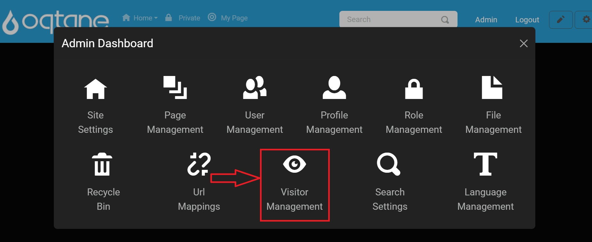
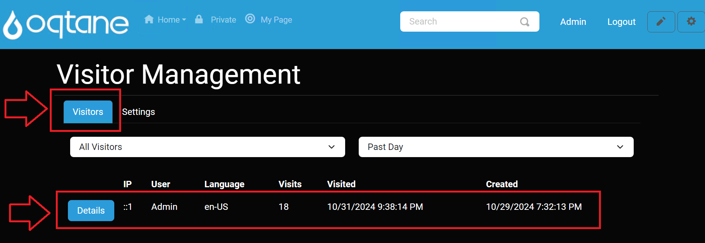
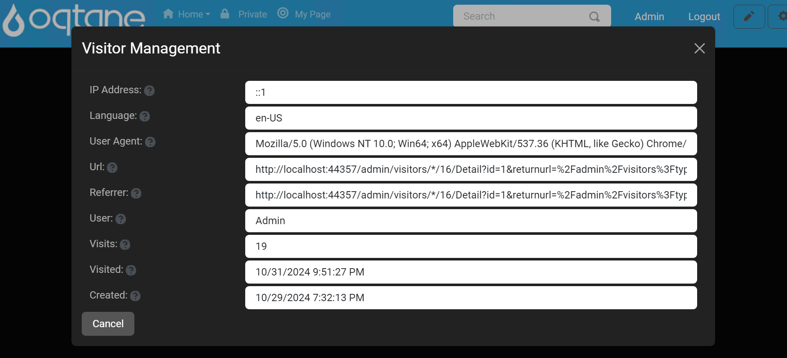
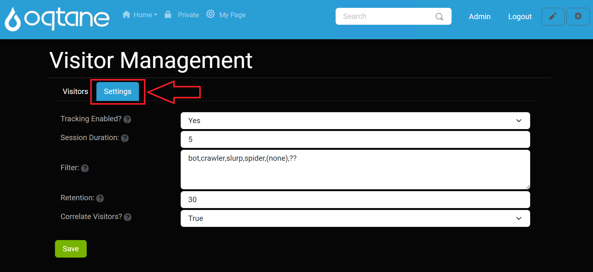

# Visitor Management

The Visitor Management feature in the Oqtane admin dashboard allows administrators to track and manage site visitors effectively. This feature is accessible via the admin dashboard under **Admin > Visitor Management**.

## Overview

The **Visitor Management** feature provides tools for monitoring and managing visitor data on your site, helping administrators understand user interactions and enhance site performance.

---

## Control Panel Walkthrough

### Accessing the Visitor Management Feature

1. Click the control panel icon to access additional settings.

   

2. In the control panel, select the button to open the admin dashboard.

   

3. In the admin dashboard, click on the **Visitor Management** icon to configure visitor tracking.

   

---

## Tabs Overview

The Visitor Management module consists of two main tabs: **Visitors** and **Settings**.

### 1. Visitors Tab

The Visitors tab displays a list of site visitors and provides options to filter the displayed visitors based on type and time period.

#### Dropdown Selections

- **Visitor Type**: Select the type of visitors to display.
  - **All Visitors**: Shows all visitors to the site.
  - **Users Only**: Filters to show only registered users.

- **Period**: Choose the time period for which visitors are displayed.
  - **Past Day**: Shows visitors from the last 24 hours.
  - **Past Week**: Shows visitors from the last week.
  - **Past Month**: Shows visitors from the last month.

#### Visitor List

Below the dropdown selections, a list of visitors is displayed, showing the following details:

| Detail | IP Address | User | Language | Visits | Visited | Created |
|--------|------------|------|----------|--------|---------|---------|
| [Details](#) | Example IP | Example User | Example Language | Number of Visits | Last Visited Date | Created Date |

Each entry includes a **Details** button that opens a detailed view of the selected visitor's information.

### 2. Settings Tab

The Settings tab allows administrators to configure visitor tracking settings.

#### Settings Fields

- **Tracking Enabled**: Specify if visitor tracking is enabled (Yes/No).
- **Session Duration**: Set the duration (in minutes) that is considered a distinct visit.
- **Filter**: Provide a comma-separated list of terms that should not be tracked in visitor data (e.g., specific IP addresses or user agents).
- **Retention**: Define the number of days to retain visitor activity data.
- **Correlate Visitors**: Specify whether new visitors should be correlated based on their IP address (Yes/No).

#### Save Changes

A **Save** button is provided at the bottom of the Settings tab to apply any changes made to the visitor tracking settings.

## Conclusion

The Visitor Management feature provides essential tools for monitoring and managing visitor data on your site, helping administrators to understand user interactions and enhance site performance.
