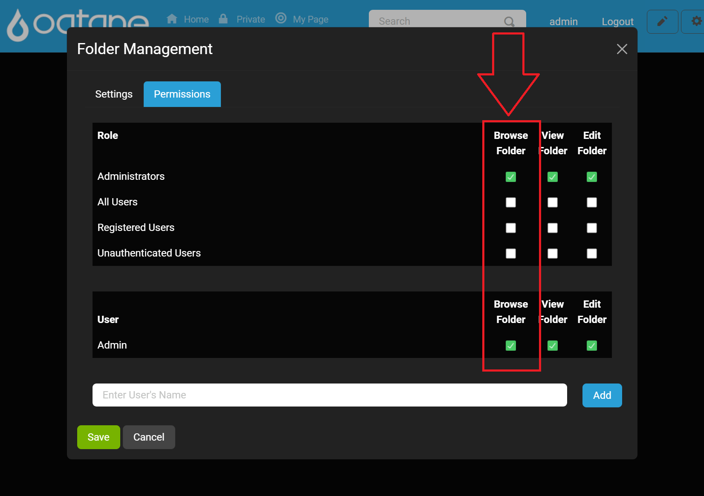
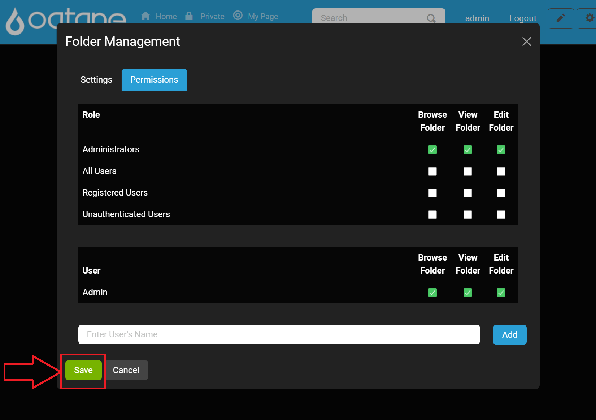
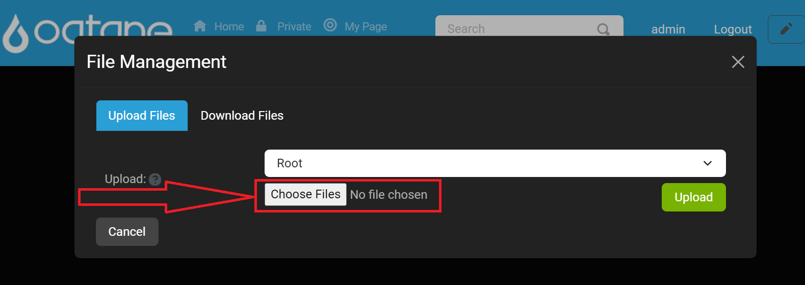
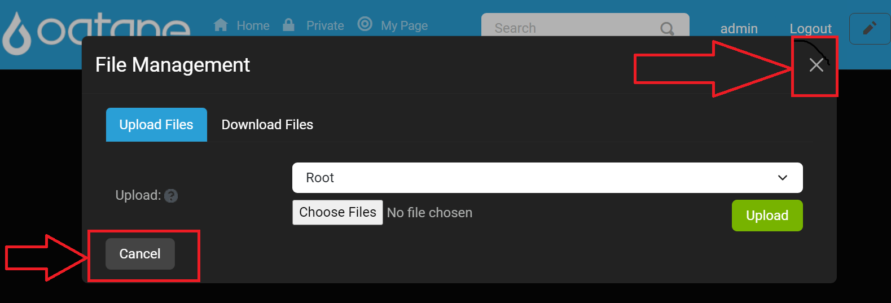
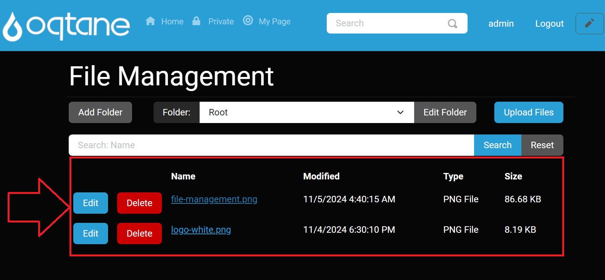
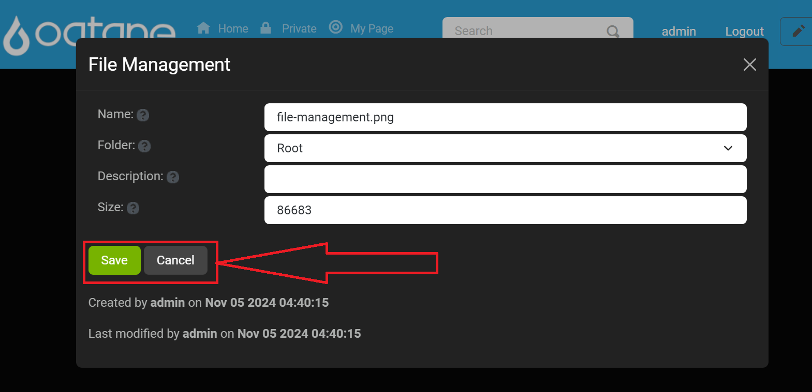
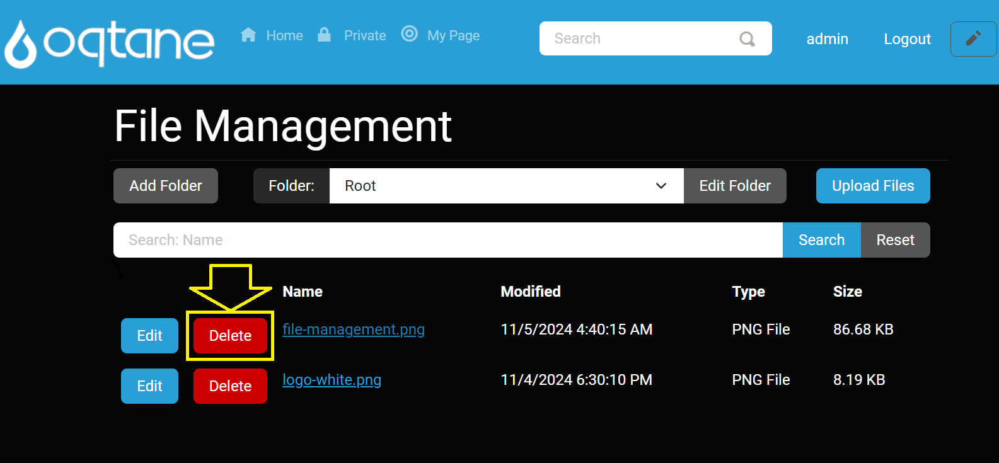

# File Management

Nearly everything you could need to do with files and folders in Oqtane can be done from this view. You have the ability to upload, edit, and delete files and folders. You can also control where files are stored and what permissions should be applied to which folders. Folder permissions specified by roles allow you to determine who can see folders and files and who is allowed to modify the contents of a folder.
The options provided by the file manager are:
* A drop down menu to select the file in which you what your view to placed in.
* Edit Folder: Lets you change the parent of the folder, the name of the folder, and the permissions for what roles are able to see and access the folder and its files.
* Add Folder: Allows you to create a new folder with the ability to choose a name, parent folder, and permissions to access.
* Upload Files: This is the feature that allows for user to upload files like images from their local system to a folder in Oqtane and allows for files to downloaded from Oqtane to their local system.

# Add/Edit Folder Feature Overview

The **Add/Edit Folder** features allows users to organize content within the application efficiently. By creating folders, users can categorize and manage their files according to their needs. This feature provides options for setting various parameters, such as folder type, image sizes, and capacity, ensuring flexibility in how users store and access their content.

## Accessing the Add/Edit Folder Feature

To add a folder, follow these steps:

1. **Locate the Add or Edit Folder Button**: In the main user interface, find the **Add Folder**

or **Edit Folder** button.

2. **Open the Modal Window**: Click on the **Add Folder** or **Edit Folder** button to open the modal window where you can configure the new folder's settings and permissions.

## Folder Settings Tab

When the modal window opens, you will see the following fields:

1. **Parent Folder**:
   - **Description**: Select the parent folder under which this new folder will be created. This helps maintain a clear hierarchy within your content organization.

2. **Folder Name**:
   - **Description**: Enter a name for the new folder. This name will be displayed in the folder list.

3. **Folder Type**:
   - **Description**: Choose the visibility of the folder. You can set the folder as either:
     - **Private**: Accessible only to the user who created it.
     - **Public**: Accessible to all users within the application.

4. **Image Sizes**:
   - **Description**: Specify the allowed image sizes for files that will be uploaded to this folder. This helps maintain consistency in file dimensions.

5. **Capacity**:
   - **Description**: Define the maximum storage capacity for the folder. This ensures that users do not exceed their allotted storage.

6. **Buttons**:
   - **Save**: Save the new folder configuration.
   - **Cancel**: Close the modal window without saving changes.

## Permissions Tab

The **Permissions** tab allows users to manage access to the newly created folder based on defined roles within the application. By setting permissions, users can control who can view, edit, or manage the contents of the folder.

### Accessing the Permissions Tab

After opening the **Add Folder** modal window, navigate to the **Permissions** tab. 

### Permissions Configuration Options

The following options are available in the Permissions tab:

1. **Role Permissions**:
   - **Description**: A list of roles for which you want to set permissions.

    

1. **User Permissions**:
   - **Description**: A list of users for which you want to set permissions.  (This is only displayed if at least one user has been added to be granted permissions.)
    

2. **Browse Folder Permission**:
   - **Description**: Check or uncheck this option to allow or deny the selected role or user the ability to browse the folder and its contents.
   - **Control**: Checkbox labeled **Browse Folder**.

   

3. **View Folder Permission**:
   - **Description**: Check or uncheck this option to allow or deny the selected role the ability to view the folder and its contents (e.g., add, delete, or rename files).
   - **Control**: Checkbox labeled **View Folder**.

   

4. **Edit Folder Permission**:
   - **Description**: Check or uncheck this option to allow or deny the selected role or user the ability to modify the folder and its contents (e.g., add, delete, or rename files). This is typically reserved for higher-level roles.
   - **Control**: Checkbox labeled **Edit Folder**.

    

5. **Add Users**:
   - **Description**: Users can add permissions for multiple users by clicking the **Add** button after selecting a user from the search field below the roles permissions.  This will make a section for **Users** appear which allows for easy management of permissions of one or many users.
   - **Control**: Input field and button to add another role with permissions.

    

6. **Save**:
   - **Description**: After setting the desired settings and permissions for each click the **Save** button to apply the changes.
   - **Control**: Save button at the bottom of the Permissions tab.

   

---

By effectively managing folder permissions, users can ensure that sensitive content is only accessible to authorized roles, thus enhancing the security and organization of files within Oqtane.

## Uploading a File

The **Upload Files** feature allows users to easily transfer files from their local system to a designated folder within Oqtane. This functionality is essential for managing content effectively and ensures that users can access the necessary files whenever required.

### Accessing the Upload Files Feature

To upload a file, follow these steps:

1. **Locate the Upload Files Button**: In the main file management interface, find the **Upload Files** button.

   

2. **Open the Upload Files Window**: Click on the **Upload Files** button to open the file selection window.

   

### Uploading a File

Once the file selection window is open, you can upload your file by following these steps:

1. **Choose Destination Folder**:
   - **Description**: In the upload window, select the destination folder where the file(s) will be stored. This can be done from a dropdown menu or by navigating through your folder structure.
   - **Control**: Dropdown menu to select the destination folder.

      

2. **Select File(s) to Upload**:
   - **Description**: Click the **Choose Files** button to open your file explorer. Navigate to the desired file(s) on your local system and select them.
   - **Control**: Browse button to choose file(s) from your system.

   

   Select a file with an extension type that is allowed in the **Allowed Extentions** configuration setting located in **Site Settings** to upload.

   

3. **Confirm Upload**:
   - **Description**: After selecting the files and destination, click the **Upload** button to begin the upload process.
   - **Control**: Upload button to start uploading the selected file(s).

   

   > Note: You should see the file name next to the Choose Files

### Upload Progress

Once you initiate the upload, a progress bar will appear, showing the status of the upload. This allows you to monitor the upload process.

### Successful Upload Notification

After the upload is complete, a notification will confirm that your files have been successfully uploaded to the designated folder.

When done uploading files click the X on the top right to close the window.

---

By following these steps, users can efficiently upload files to Oqtane, enhancing their ability to manage and organize content within the application. Ensure that the files you are uploading meet any specified requirements (such as file types and sizes) set by the folder configuration.

If you experience an error please review our troubleshooting guides or start a github issue or discussion to get help.

## Editing Files

The **Edit Files** feature allows users to modify the properties of existing files within Oqtane. This functionality is essential for keeping file details up to date and ensuring that users can manage their content effectively.

### Accessing the Edit Files Feature

To edit a file, follow these steps:

1. **Select a Folder**:
   - **Description**: Choose the folder from which you want to edit a file. This can be done from a dropdown menu or by navigating through your folder structure.
   - **Control**: Dropdown menu to select the folder.

   

2. **View Files**:
   - **Description**: After selecting a folder, you will see a list of files within that folder. The file list includes the following columns:
     - **Name**: The name of the file (hyperlinked to view the file).
     - **Modified**: The date the file was last modified.
     - **Type**: The file type (e.g., image, document).
     - **Size**: The file size.

   

3. **Locate the Edit File Button**:
   - **Description**: Find the **Edit File** button next to the file you wish to edit.
   - **Control**: Edit File button associated with the specific file.

   

4. **Open the Edit File Window**: Click on the **Edit File** button to open the editing window.

   

### Edit File Window Components

When the edit file window opens, you will see the following fields:

1. **File Name**:
   - **Description**: The current name of the file. You can edit this name as needed.

2. **Select Folder**:
   - **Description**: Choose a different folder for the file if required. This helps in organizing files into appropriate categories.

3. **Description**:
   - **Description**: Enter a description for the file to provide additional context or information about its content.

4. **File Size**:
   - **Description**: Displays the current size of the file, which is read-only and helps users understand the file's storage requirements.

5. **Buttons**:
   - **Save**: Click to save the changes made to the file properties.
   - **Cancel**: Close the editing window without saving changes.

   

### Deleting a File

If you need to remove a file, you can do so by following these steps:

1. **Locate the Delete File Button**: Next to the file you want to delete, find the **Delete File** button.
   - **Control**: Delete File button associated with the specific file.

   

2. **Confirm Deletion**: Click on the **Delete File** button, and confirm the action when prompted. This action will permanently remove the file from the system.

   

---

By utilizing the **Edit Files** feature, users can ensure that their file details remain accurate and relevant, enhancing the organization and management of content within Oqtane.

