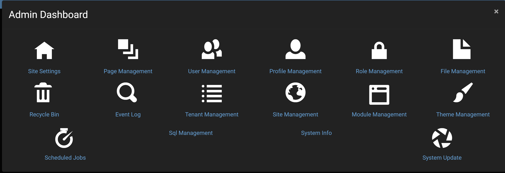

# Admin Management Introduction

The admin dashboard has a variety of different tools for administrators to use in order to better manage their website and to add a great amount of functionality to the website. By selecting the gear icon in the top right of a page while being on an administrator account, then selecting the admin dashboard option at the top of the control panel, which will bring up a menu with a variety of options that can be selected.

The default options in the dashboard that Oqtane offers for an administrator to use are:
* Site Settings: Which provides a variety of settings to be able to modify and personalize your website with more information in the [site settings](site-settings.md).
* Page Management: Which provides a list of all pages on your website and provides the ability to to manipulate them in a variety of ways with more info on [page management](page-management.md).
* User Management: Which allows for the additional and modification of user accounts with more info on [user management](user-management.md).
* Profile Management: Which lets you specify what informational fields are available for a user to both optionally have and must have on their account with more info on [profile management](profile-management.md).
* Role Management: Which specifies what type of security group the user's account belongs in like giving an account administrative rights, with more info on [role management](role-management.md).
* File Management: Which allows the uploading of files like images to be inserted into pages with more info on [file management](file-management.md).
* Recycle Bin: Which allows for the restoration or full deletion of pages that were previously deleted with more info on [recycle bin](recycle-bin.md).
If you want to add new options to the admin dashboard, then that can be done by creating a new page either in the [control panel](../control-panel/page-management.md) or in the admin dashboard's [page management](page-management.md) and specifying that you want "Admin" as the parent of the new page.
