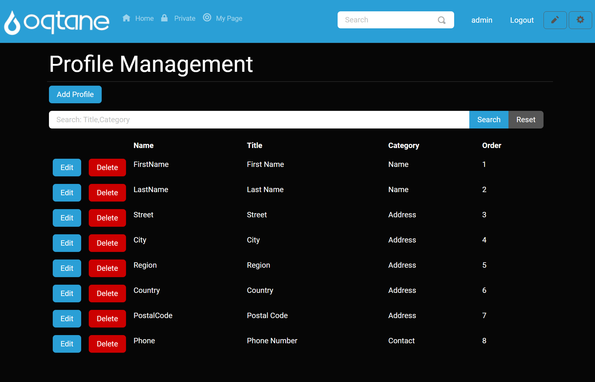
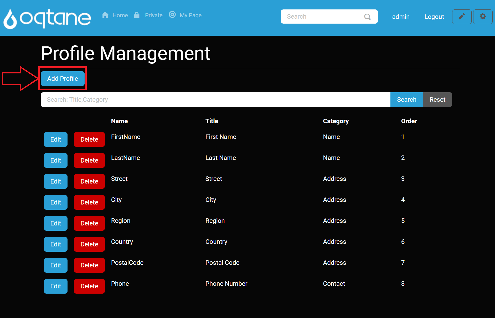
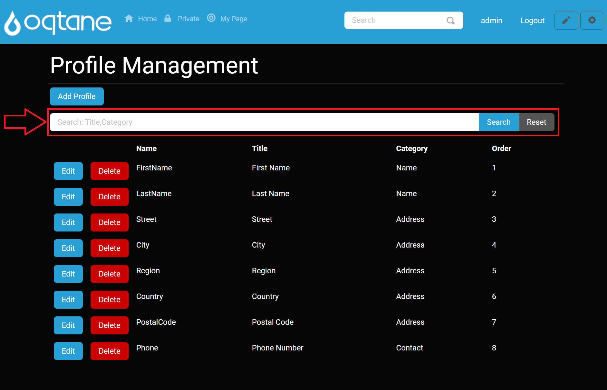

# Profile Management

# Overview

Profile Management in Oqtane provides a flexible and powerful way to customize user profiles. This feature is often underappreciated but is essential for creating tailored user experiences. The Profile Manager enables you to customize the fields of user accounts, from the name and address to custom fields with specific validation, required settings, and more.

In Oqtane, the Profile Manager is primarily used to define profile fields, set field properties, and organize them into categories. Administrators can configure profile fields that users will interact with during account creation or editing.

## Control Panel Walk-through

### Accessing the Profile Management Feature

1. Click the control panel icon to access additional settings.

   

2. In the control panel, select the button to open the admin dashboard.

   

3. In the admin dashboard, click on the **Profile Management** icon to configure visitor tracking.

   

---

## Adding a Profile Item

At the top of the Profile Management page, you will see an **Add Profile** button. Clicking this button brings up the settings for adding a new profile item.

### Profile Item Settings

When adding a profile, the following settings are available:

1. **Name**: The internal name of the profile item, used for database access.
2. **Title**: The label displayed to users for this profile item (e.g., "Full Name").
3. **Description**: Help text displayed next to the field for user guidance.
4. **Category**: The grouping name for the profile item (e.g., "Personal Information").
5. **Order**: The index position where this item will appear in the profile form. `0` is the first position.
6. **Length**: The maximum number of characters allowed for this profile field. Set to `0` for unlimited length.
7. **Rows**: The number of rows for text input. If set to more than one row, the input changes from a single-line text field to a multi-line text area.
8. **Default Value**: The pre-filled value for the profile item if the user does not provide one.
9. **Options**: A comma-separated list of selectable options (e.g., "Male,Female,Other").
10. **Required?**: Whether this field is required for the user to complete when creating their account.
11. **Validation**: Optionally, provide a regular expression (RegEx) for validating the entered value (e.g., for email addresses).
12. **Autocomplete**: The HTML `autocomplete` attribute for browser assistance with autofilling the field. Options include blank (default), 'on', 'off', or any value from the standardized taxonomy.
13. **Private?**: Whether this profile field is visible to all users or only administrators.

Once these settings are configured, click **Save** to create the profile item. You can also cancel the action or close the window by clicking the **X** in the top-right corner.

## Searching Profiles

Below the **Add Profile** button, there is a **Search** input field. This allows you to search for profile items based on their **Title** or **Category**. You can enter a search term and click **Search** to filter the list of profile items. To reset the search results, click the **Reset** button.

## Profile List

Below the search field, a list of existing profile items is displayed. For each profile item, the following properties are shown:

- **Name**: The internal name.
- **Title**: The displayed label for the profile item.
- **Category**: The group/category the profile item belongs to.
- **Order**: The position of the profile item in the list.

Each profile item has two buttons:

- **Edit**: Clicking this button opens the profile settings in an editable form where you can change any of the properties. After editing, click **Save** to apply changes, or **Cancel** to discard them. You can also close the settings window by clicking the **X** at the top-right.
- **Delete**: Clicking the delete button opens a confirmation window asking you to confirm the deletion of the profile item. Once confirmed, the profile item is permanently deleted.

## Conclusion

The Profile Management feature in Oqtane provides administrators with powerful tools to customize and manage user profiles. Whether you're creating new profile fields or setting validation rules, this feature is essential for tailoring the user experience on your site. Be sure to explore all options to make the most of your site’s profile management capabilities.
