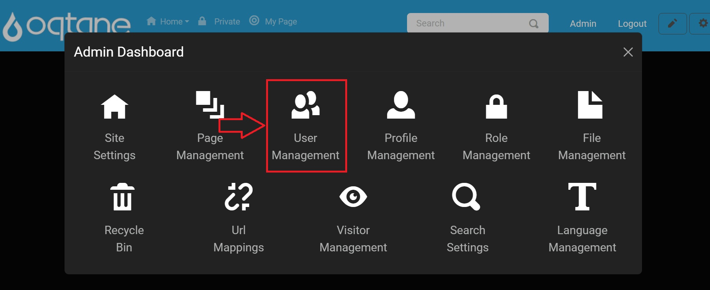
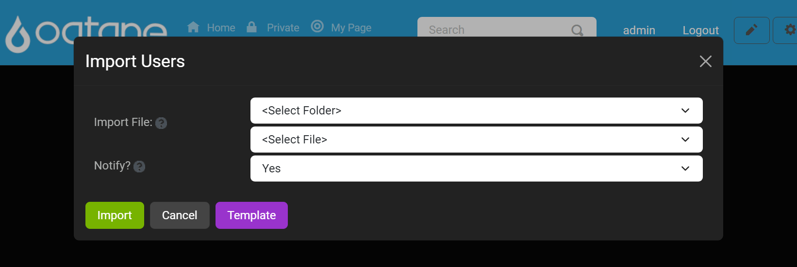
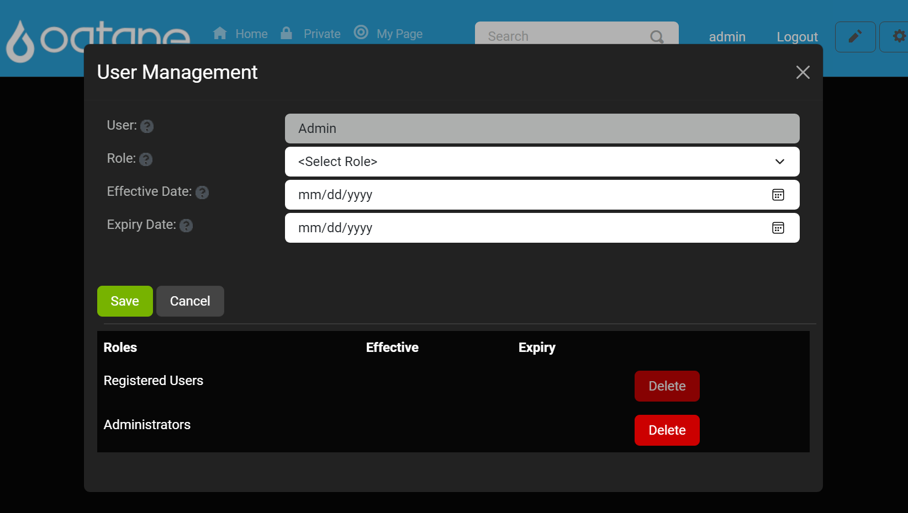

# User Management

## Overview

The **User Management** feature in Oqtane provides administrators with a centralized interface to manage site users. Here, you can add new users, edit profiles, assign roles, and delete accounts. The User Management feature is organized into two primary tabs:

1. **Users Tab** - Manage individual users by adding, editing, deleting, and assigning roles.
2. **Settings Tab** - Configure global settings related to user profiles and management options.

This guide will walk you through each section, detailing how to utilize the User Management feature fully.

---

## Control Panel Walk-through

### Accessing the User Management Feature

1. Click the control panel icon to access additional settings.

   

2. In the control panel, select the button to open the admin dashboard.

   

3. In the admin dashboard, click on the **User Management** icon to configure user settings and manage site users.

   

---

## Users Tab

### Adding a New User

1. Click the **Add User** button to open a new window.

   

2. In the **Identity** tab, fill in the following information:
   - **Username**
   - **Email**
   - **Full Name**
   - **Notify**: Select **Yes** or **No** to notify the user upon account creation.

   

3. Switch to the **Profile** tab to input additional details, such as address, phone number, and other optional information.
   
   

4. After entering the necessary information, click **Save** to create the user, or **Cancel** to discard the changes.

---

### Importing Users

1. Click the **Import Users** button to add multiple users from a file.

   

2. In the import window, specify the file source and file name.
   - **Folder**: Choose the folder where the file is located.
   - **File**: Select the file to import users.
   - **Notify**: Choose **Yes** or **No** to send notifications to the users being imported.

   

3. Click **Upload** to load the file, then click **Import** to add users in bulk.
4. If you don’t have a template, you can download one by clicking the **Template** button.

   

   Below is an example of what the text file will look like:

      

---

### Searching for Users

1. Use the search field to locate a user by **Username**, **Email**, or **DisplayName**.
2. Click **Search** to filter results or **Reset** to clear the search input.

   

---

### Editing Users

1. To modify a user’s information, locate the user in the list and click **Edit**.
   
   

2. The **Edit User** window includes:
   - **Identity** tab: Edit username, password, email, and name.
   - **Profile** tab: Update profile details such as address, phone number, and other custom fields.

   
   

3. Click **Save** to apply the changes or **Cancel** to discard them.

---

### Deleting Users

1. Click **Delete** next to a user in the list to remove their account.
2. Confirm the deletion in the pop-up confirmation window.

---

### Assigning User Roles

1. Click the **Roles** button next to a user to manage their assigned roles.

   

2. In the **User Roles** window:
   - **User**: Displays the user’s name.
   - **Role**: Select a role to assign from a dropdown list.
   - **Effective Date**: Choose a start date for the role.
   - **Expiry Date**: Set an expiration date for the role (optional).

   

3. Roles currently assigned to the user are listed below with their effective and expiry dates. You can remove roles from this list if needed.
4. Click **Save** to confirm the role assignment or **Cancel** to exit without changes.

---

## Settings Tab

The **Settings Tab** within the User Management feature allows administrators to configure site-wide user settings. The following options are available:

   

1. **Allow Registration**: 
   - **Description**: This setting determines whether anonymous visitors can register for an account on the site. 
   - **Options**: 
     - **Yes**: Visitors can create accounts.
     - **No**: Registration is disabled.

   > **Tip**: Allowing registration can help increase user engagement by letting visitors create personalized accounts.

2. **Allow Login**: 
   - **Description**: This option specifies if users are permitted to sign in using a username and password that is managed locally on the site. 
   - **Options**: 
     - **Yes**: Users can log in with their local account credentials.
     - **No**: Local login is disabled. Use this option with caution; only disable if you have successfully configured an external login provider, as it may lock you out of the site.

   > **Warning**: Ensure that an external login provider is properly set up before disabling local login to avoid losing access to the site.
