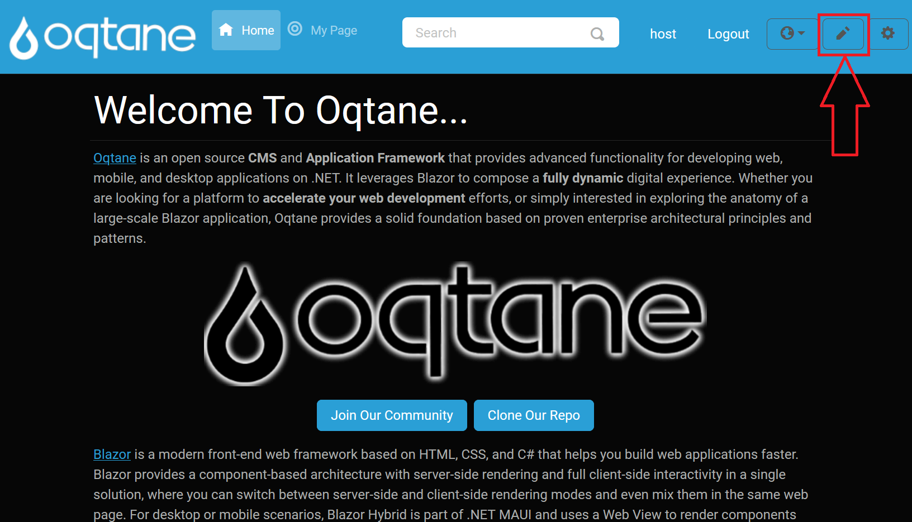
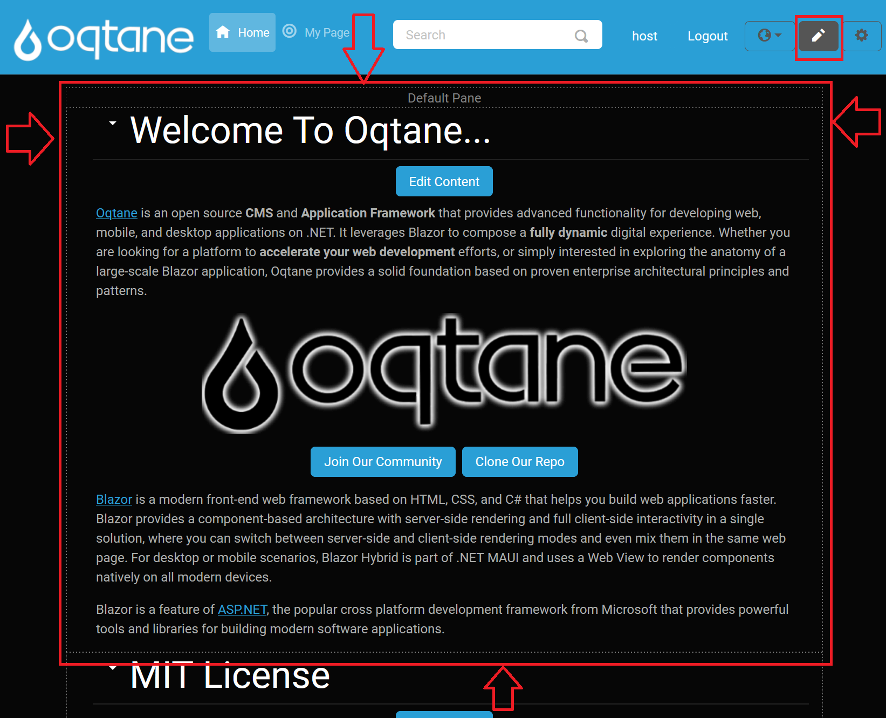
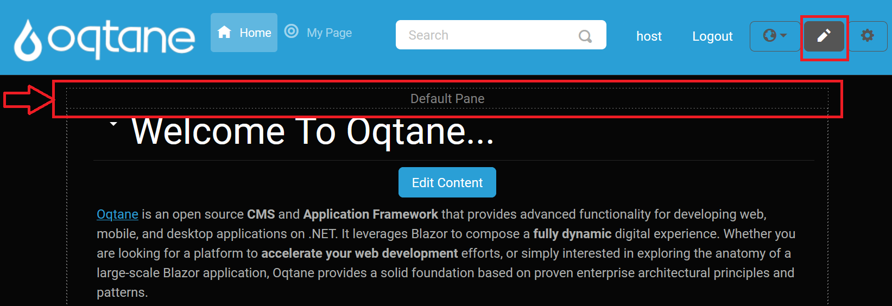
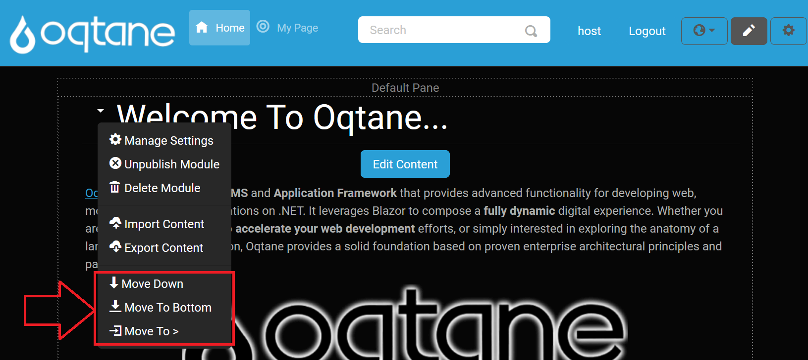
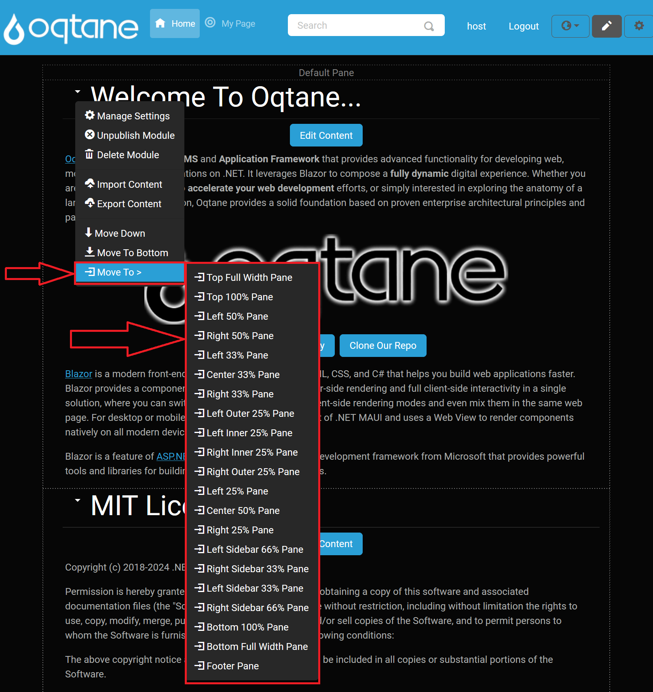

# Content Editor

The **Content Editor** allows you to edit the modules on the page in various ways. You can access the Content Editor by clicking on the pencil icon located at the top right side of the page. This action will display the borders of the content panes where the modules are placed and a small downward-pointing arrow next to each module, enabling you to open a menu for module interaction.

  
*Click on this icon button to enable the Content Editor.*

  
*Click on this button again to disable the Content Editor. Notice how the appearance of the pencil icon changes between enabled and disabled states.*

When the Content Editor is enabled, borders around each content pane are displayed, indicating the layout of the theme.

  
*The visible borders help you understand the layout of the page when in edit mode.*

## Pane Header

When the Content Editor is activated, the top header of the pane is displayed, showing the name of the pane:

## Module Menu Options

When you click the downward-pointing "caret-bottom" arrow next to a module, you have access to the following options:

  

- **Manage Settings**: Opens the module's settings and permissions, allowing you to change the:
  - **Title**: The title displayed above the module.
  - **Container**: Specify whether you want the title to be displayed for the module.
  - **Display on All Pages**: Choose whether this module should appear on every page of the site.
  - **Page**: Change the page on which the module is displayed.
  - **Permissions**: Specify which [roles](../admin-management/role-management.md) or individual users can view or edit the module.

- **Unpublish Module**: Hides the module from all users except site administrators, useful for when you want to make edits without public visibility.

  

- **Delete Module**: Permanently removes the module from the page.

- **Import Content**: Enter a file's address (e.g., an image URL) to import it into the module.

- **Export Content**: Specify a file address to determine where to export data from the module.

- **Move to Top**: Moves the module to the top of the page, making it the first displayed module.

- **Move Up**: Moves the module up one position, placing it above the module currently above it.

- **Move Down**: Moves the module down one position, placing it below the module currently below it.

- **Move to Bottom**: Moves the module to the bottom of the page, below all other modules.

- **Move Options**: When you select "Move to," additional options will be available, allowing you to choose a specific pane for the module.

  

If the page layout includes multiple panes (e.g., three center rows, a top row, and a bottom row), you can select from various options to reposition your module across these panes:

- **Move to Top Pane**: Moves the module to the content pane at the top of the page.
- **Move to Left Pane**: Moves the module to the left-most column.
- **Move to Right Pane**: Moves the module to the right-most column.
- **Move to Content Pane**: Moves the module to the central column.
- **Move to Bottom Pane**: Moves the module to the content pane at the bottom of the page.

The **Move to Pane** feature is adaptable to different themes, and the available panes vary depending on the layout provided by the theme. In the example shown in the image, you’ll see a variety of pane options that a more complex theme might offer, giving administrators greater flexibility in organizing modules. 

For instance, the default Oqtane theme includes not only standard rows and columns but also numerous additional panes, which allow for a wide range of layout possibilities. While simpler themes may only display a few basic options, the default theme might provide over 20 panes, including:

- **Full-Width Panes**: These panes span the entire width of the page. Examples include:
    - **Top Full Width Pane**: A full-width pane at the top of the page.
    - **Bottom Full Width Pane**: A full-width pane at the bottom of the page.

- **100% Width Panes**: These also span the full width, but are distinct from other full-width panes in terms of placement:
    - **Top 100% Pane**: Positioned below the top full-width pane, occupying the full page width.
    - **Bottom 100% Pane**: Positioned above the bottom full-width pane, also spanning the entire page width.

- **50%/50% Split Panes**: Divide the page into two equal sections:
    - **Left 50% Pane** and **Right 50% Pane**.

- **33%/33%/33% Split Panes**: For a balanced three-column layout:
    - **Left 33% Pane**, **Center 33% Pane**, and **Right 33% Pane**.

- **25%/25%/25%/25% Split Panes**: For a four-column layout:
    - **Left Outer 25% Pane**, **Left Inner 25% Pane**, **Right Inner 25% Pane**, and **Right Outer 25% Pane**.

- **Asymmetrical Ratios**: Options like:
    - **Left 66% Pane** and **Right 33% Pane**.
    - **Left 33% Pane** and **Right 66% Pane**.

- **Footer Pane**: An additional pane often reserved for footer content.

These pane options let administrators place modules precisely within the layout structure, which is divided into sections adding up to 100% of the layout width. The image shows this range of options, giving a visual reference of the **Move To >** menu options when working with themes that support complex layouts. This flexibility enables customized content presentation to best suit each page’s design.