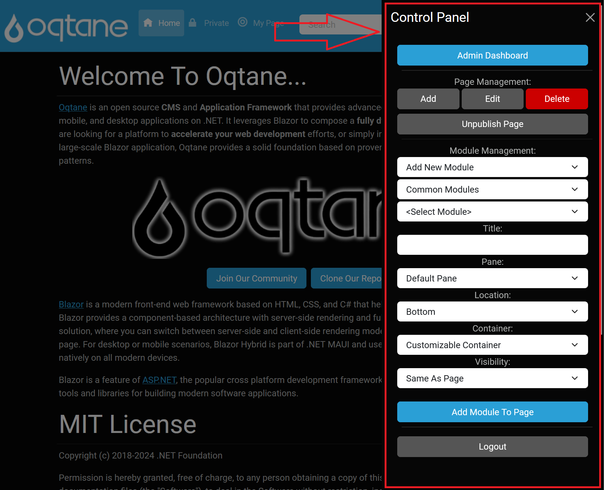

# Site Administration

Site administration in Oqtane is the processes, tasks, and features that it takes to effectively run a website in Oqtane.
This includes things like managing users, security, site settings, configurations, and content using the features available to them, in both the [control panel](../control-panel/index.md) and the [admin dashboard](../admin-dashboard/index.md).

Site administration can take on many forms, but there are two use cases that you should be familiar with. First, there's site administration as defined by Oqtane.You enable this by adding the Administrators security role as one of the assigned roles for the account. That way, all “admin” features will be available for that user across that specific site.

Site administration can take on a hybrid of another sort as well, where you as the site administrator can define a different kind of administration for your site. This would be a kind of administration where you define a subset of administration capabilities and assign them to more privileged users to avoid having to make them an actual administrator.

As an example, there may be times when you want to create a security role in the [role manager](/admin/admin-dashboard/role-management.md) that might be named something like Site Admin. You would then create a page or pages on the site that contain some of the Admin modules, assigning permission to the newly created Site Admin security role so that only participants of that security role can see them. In these areas, you can also add references or links to features that normally require Administrator permissions, provided you set up your permissions properly in those other areas and that the chosen feature(s) allows this.

In summary, you can perform all of the configuration and content management tasks that you need to in order to run your own site.
