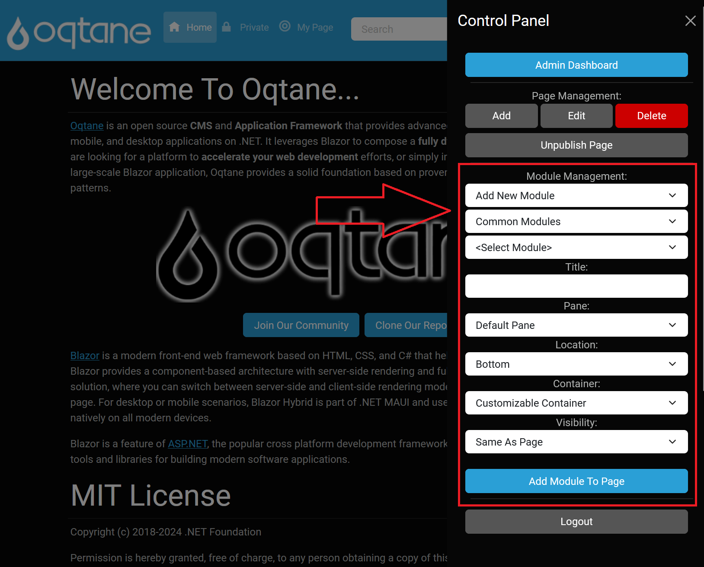
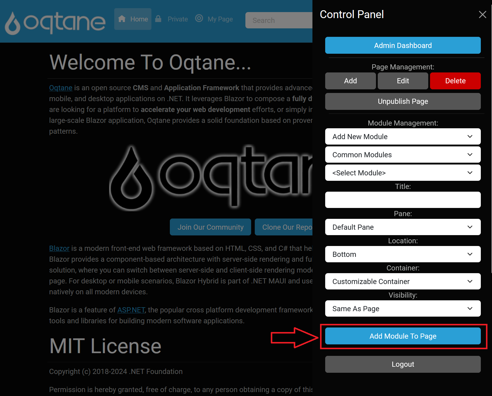

# Module Management

Modules are a key feature of Oqtane, allowing you to insert a diverse array of components into your web pages. With a variety of modules available, you can customize your site extensively. Administrators have the ability to download new modules or upload custom modules to the marketplace, which can be accessed via the admin dashboard's [Module Management feature](../modules/index.md).

## Accessing Module Management

To access the Module Management feature in the Control Panel:
1. **Log in to Oqtane** with an account assigned to the Administrators role.
2. **Click the Control Panel Icon**: Once logged in, click the Control Panel icon to open the Control Panel menu.
3. **Select Module Management**: Click on the **Module Management** option in the Control Panel.

---

## Module Management Options

In the Control Panel’s Module Management section, you have the following options:

### Add New Module

This option allows you to place a new module of your choice onto the page:

1. **Select Category**:
   - **Admin Modules**: Modules available only to users with the Administrator role.
   - **Common Modules**: Modules accessible to both Administrators and registered users.

2. **Select Module**: Choose a module from the selected category.

3. **Enter Module Details**:
   - **Title**: The title displayed above the module. If left blank, the module’s name will serve as the title.
   - **Pane**: Select the content pane where the module will be placed, organized by modules in the pane.
   - **Location**: Set the location of the module as "Top" or "Bottom" inside the pane .
   - **Container**: Choose a theme container for the pane.
   - **Visibility**: Options to set visibility as "Same As Page" or "Page Editors Only."

### Add Existing Module

This option allows you to select modules that are already present on other pages of your website:

1. **Select Page**: A dropdown list of your other web pages from which you can select a page containing the desired module.
2. **Select Module**: A list of modules available on the selected page for you to choose from.

### Copy Existing Module

This option allows you to copy a module from another page:

1. **Select Page**: A dropdown list of your other web pages from which you can select a page containing the desired module.
2. **Select Module**: A list of modules available on the selected page for you to choose from, allowing you to replicate functionality on your current page.

When a module is selected, its description will appear in a purple box, providing clarity on its purpose.

---
