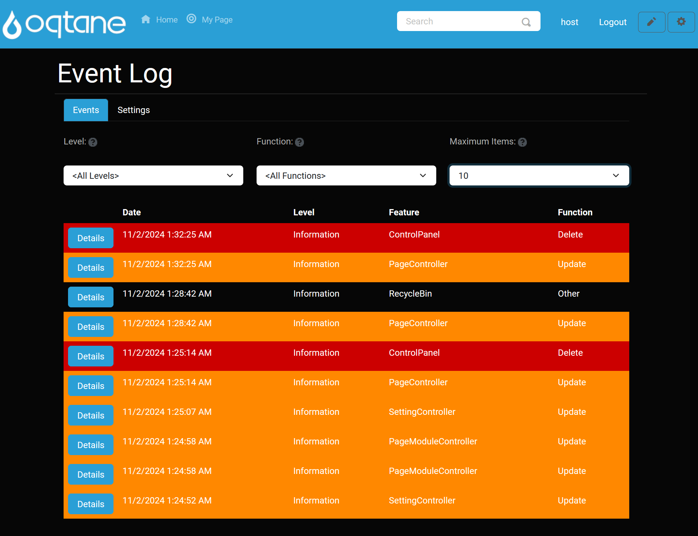
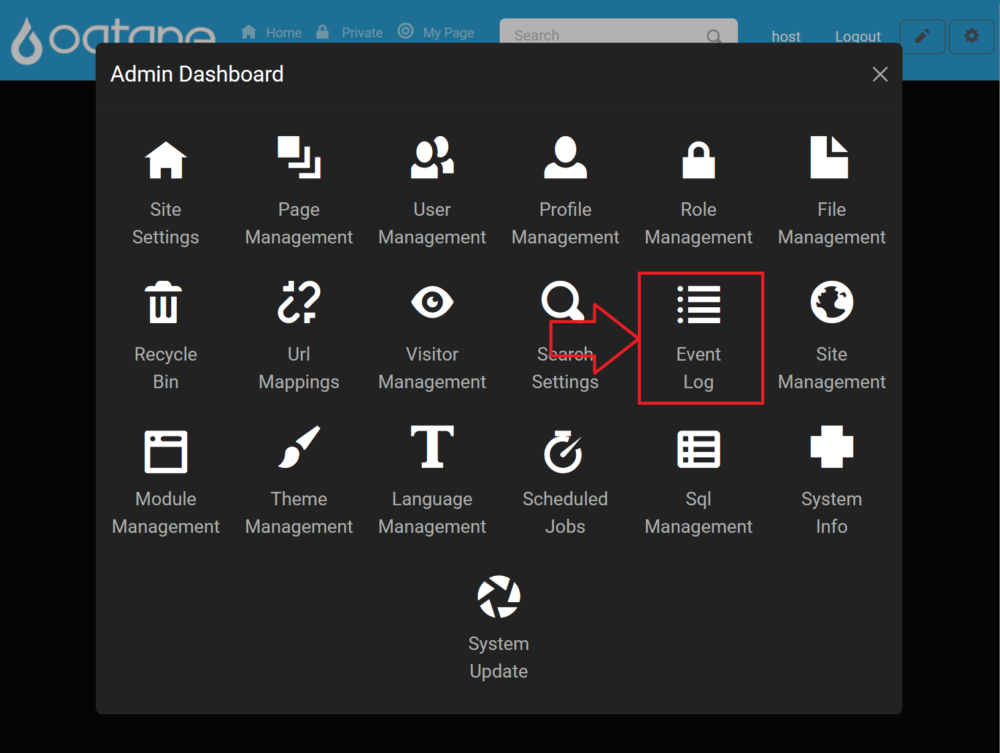
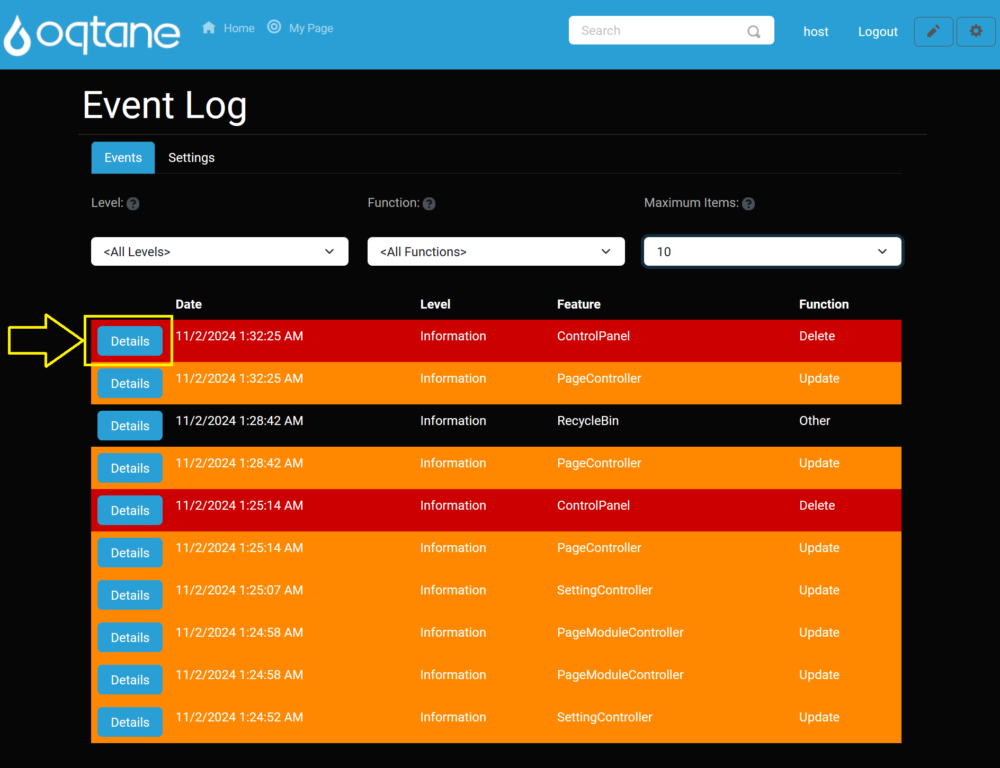
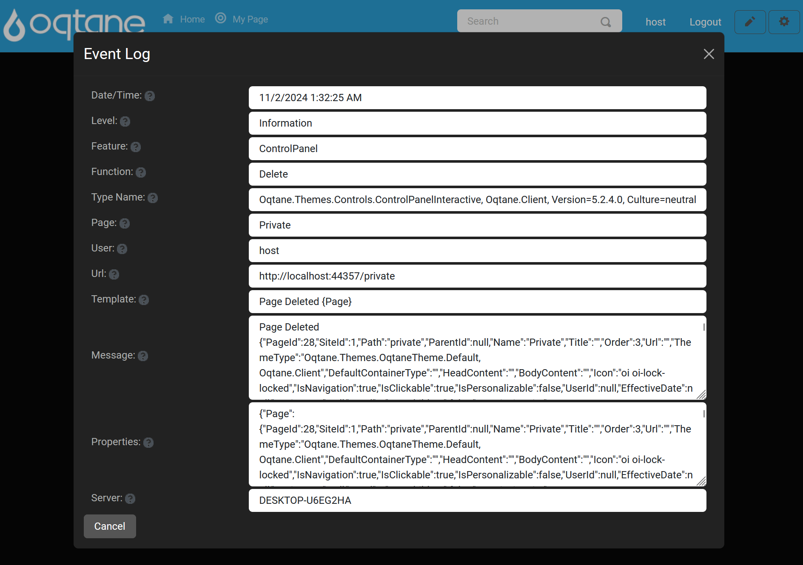
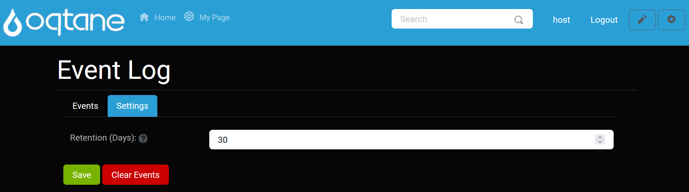
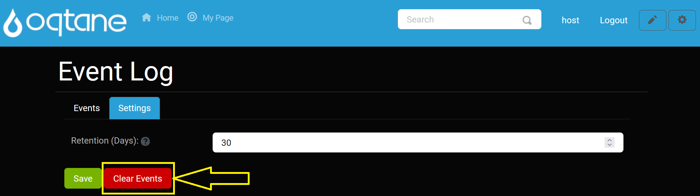
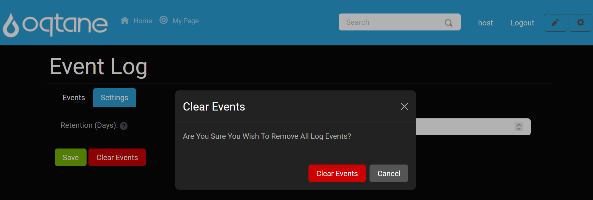

# Event Log

## Overview

The Event Log provides a centralized record of events occurring on your website, allowing you to monitor site activity and troubleshoot as needed. It is designed to be both simple and effective for viewing and managing events.

## Control Panel Walk-through

### Accessing the Event Log Feature

1. **Open the Control Panel**: Click the **control panel icon** to access additional settings.

   

2. **Open the Admin Dashboard**: In the control panel, select the **Admin Dashboard** button.

   

3. **Select the Event Log**: In the Admin Dashboard, click on the **Event Log** icon to view and configure event logging.

   

---

## Event Log Features

Upon opening the Event Log, you’ll see a list of recent events by default, displayed in pages with 10 entries per page. You can adjust the page size to view more events at a time.

### Filtering Events

At the top of the Event Log, three main filters help refine the log view:

* **Level**: Filter events by severity level, including:
    * **Trace**
    * **Debug**
    * **Information**
    * **Warning**
    * **Error**
    * **Critical**

* **Function**: Filter events by action type, which is color-coded for easier tracking:
    * **Create**
    * **Read**
    * **Update**
    * **Delete**
    * **Security**
    * **Other**

* **Maximum Items**: Choose how many rows you would like displayed per page.

For example, to view login attempts only, set **Function** to **Security**. For broader viewing, increase **Maximum Items** to display up to 100 events on a single page.

### Event Log Pagination

Use the paging feature at the bottom of the list to navigate between pages if there are more events than can fit in one view.

### Viewing Event Details

For a closer look at any event, click the **Details** button next to it.

This opens a detailed view of the event, including where it occurred and a description of the action.

To exit, click the **Cancel** button or the **X** in the top right corner.

---

## Event Log Settings

The Event Log has configurable settings to manage data retention.

### Settings

- **Retention (days)**: Specify how many days events should be stored.

After configuring, click **Save** to apply your settings.

### Clearing The Event Log

To clear all events from the log:

1. Click the **Clear Events** button in the settings.

   

2. Confirm by selecting **Clear Events** in the confirmation window.

   

---

## Summary

The Event Log feature enables efficient monitoring of your site’s events. Utilize filters, pagination, and detail views to gain insights, troubleshoot issues, and keep your site secure. Configure settings as needed for optimal event data retention and manage the log by clearing old events when necessary.
