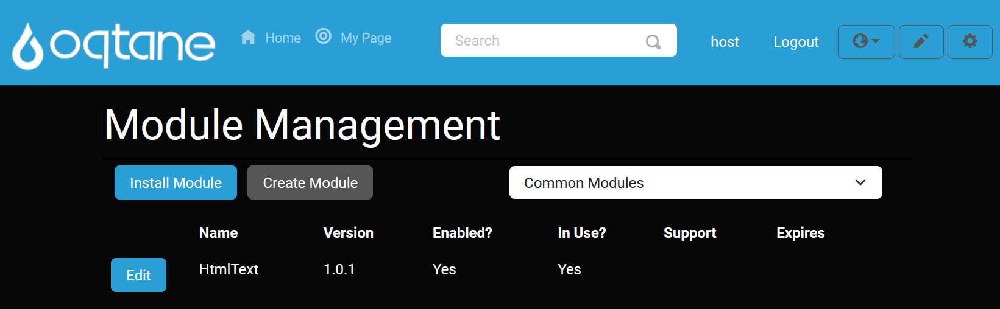
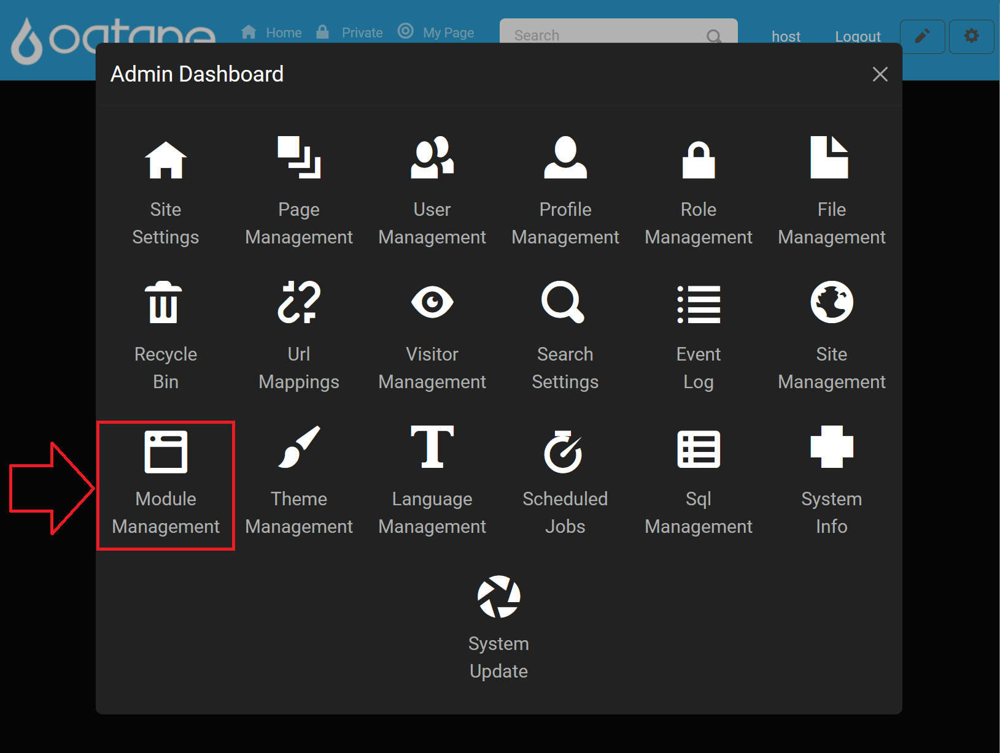
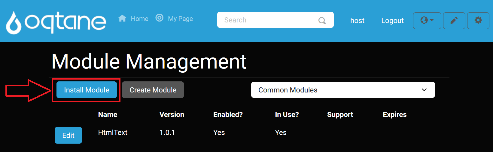
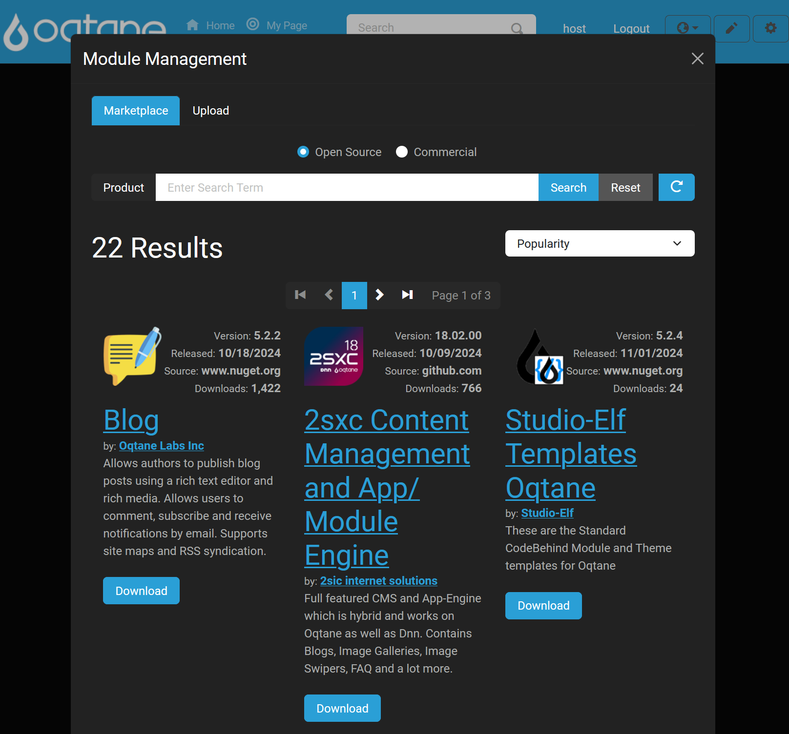
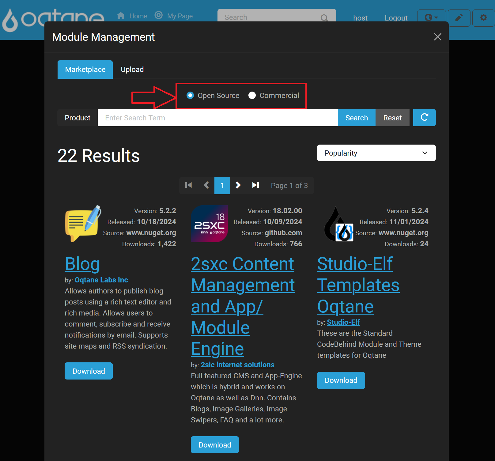
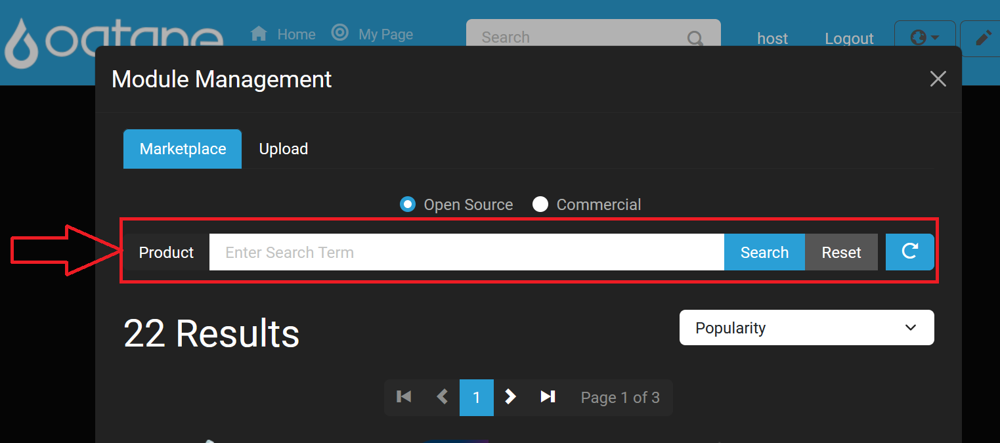
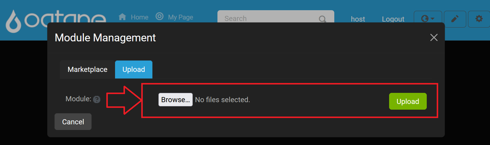
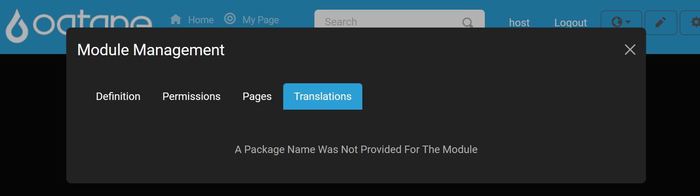
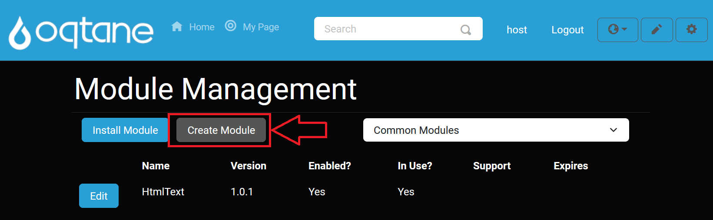

# Module Management

## Overview

The Module Management feature lists all the modules currently installed in your Oqtane framework. Modules provide essential functionality and allow various features to be added to your pages.

At the top of the Module Management page, there is an **Install** button that lets you add new modules. Modules can be installed either from a pre-configured list or by uploading a NuGet package, allowing it to be included among the available modules for your site.

Within the list of modules, you’ll find options to **Edit** modules, which displays module details and provides options to delete non-default Oqtane modules.

---

## Accessing the Module Management Feature

1. **Open the Control Panel**: Click the **control panel icon** to access additional settings.

   

2. **Open the Admin Dashboard**: In the control panel, select the **Admin Dashboard** button.

   

3. **Select Module Management**: In the Admin Dashboard, click on the **Module Management** icon.

   

---

## Installing Modules

### Using the Marketplace

Click the **Install Module** button to open the module installation options.

1. **Browse Marketplace**: Select the **Marketplace** tab to explore available modules, which may include both open-source and commercial options.

   

2. **Choose Open Source or Commercial Modules**: The marketplace allows you to filter between **Open Source** and **Commercial** modules, streamlining your search.

   

3. **Search Feature**: Use the search box to quickly locate specific modules by name.

   

4. **Sort Feature**: Sort available modules by various options to find exactly what you need.

   

### Uploading a Module

Alternatively, upload a module directly by using the **Upload** tab. This option allows you to add a NuGet package as a new module to your site.

---

## Module Management Filter List

You can filter the list of modules by category to simplify navigation.

---

## Editing Modules

To modify a module’s settings, click the **Edit** button next to the module you want to adjust.

### Definition Tab

The **Definition** tab shows the module’s core details, including its description and version information.

### Permissions Tab

The **Permissions** tab lets you configure user access for the module, including options to add users with specific permissions.

- **Add User Permission**: Assign roles and permissions for accessing or managing the module.

   

- **View/Edit Permissions**: Adjust existing permissions as needed for your module.

   

### Pages Tab

Use the **Pages** tab to view and link to a specific page on your site with the module using the **Browse** button .

### Translations Tab

The **Translations** tab allows you to manage localization for the module, ensuring it’s accessible in multiple languages if necessary.

---

## Creating a Module

Click the **Create Module** button to develop a new custom module for your site.

### **Warning**: Module Creation in Production Environments

**Module creation** should be performed in a **development environment** only. Creating or developing modules directly in a **production environment** can lead to performance issues, instability, or security risks. It's best to develop and test your modules in a safe environment before deploying them to your live site. This ensures that the module functions as expected without affecting the user experience on your production site.

---

## Conclusion

The **Module Management** feature provides a straightforward way to manage, install, and create modules to enhance your Oqtane site's functionality. Whether you're installing modules from the marketplace, uploading custom modules, or creating your own, this feature helps you add powerful tools and features to your site. Use the editing tools to fine-tune existing modules or start from scratch with a new module to meet your needs.
