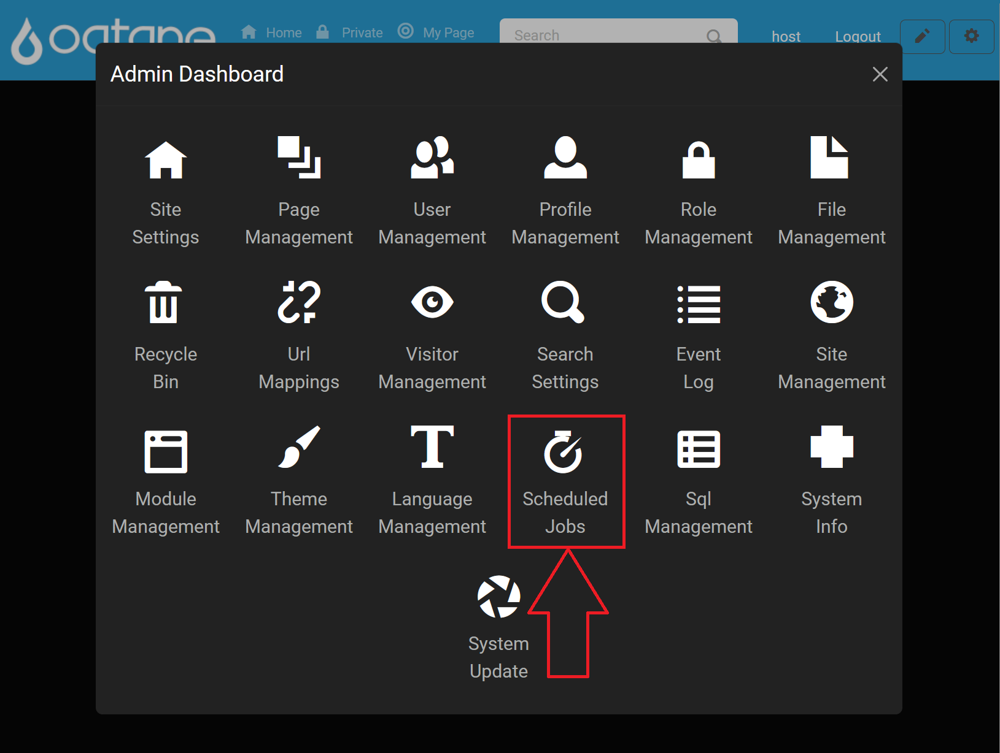
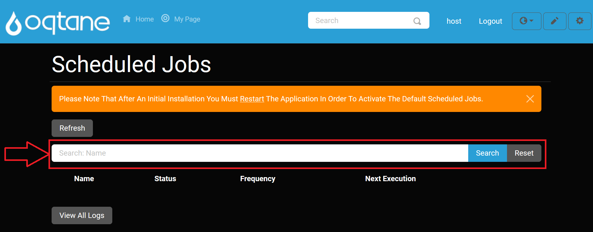

# Scheduled Jobs

## Overview

The **Scheduled Jobs** feature in Oqtane allows you to manage recurring, scheduled tasks that are automatically executed at specified intervals. This is useful for automating tasks such as sending notifications to users or any other batch processing task that should occur on a schedule.

---

## Accessing the Scheduled Jobs Feature

1. **Open the Control Panel**: Click the **control panel icon** to access additional settings.

   

2. **Open the Admin Dashboard**: In the control panel, select the **Admin Dashboard** button.

   

3. **Select Scheduled Jobs**: In the Admin Dashboard, click on the **Scheduled Jobs** icon to access the configuration settings.

   

---

## Scheduled Jobs Options

On the Scheduled Jobs page, you have the option to configure and manage jobs with the following fields:

### Add Job

1. **Name**: Enter a name for the scheduled job.
2. **Type**: Select the type of the job. You can use the pre-configured `NotificationJob` or create a custom job by specifying the location of your job method, for example, `Oqtane.Infrastructure.NotificationJob, Oqtane.Server` for a notification job.
3. **Enabled**: Set this to **Yes** to activate the job or **No** to deactivate it.
4. **Runs Every**: Choose how often the job should run (e.g., daily, weekly, etc.).
5. **Starting**: Enter the date and time when the job should begin executing.
6. **Ending**: Enter the date and time when the job should stop executing.
7. **Retention Log**: Specify the number of logs to retain for the job. Older logs will be discarded once the retention limit is reached.

---

## View Logs

You can view the logs of all scheduled jobs.

1. **View Logs**: Click on **View Logs** to see the logs generated by your jobs. The logs are retained according to the specified retention number.

   

   

### Refresh

To refresh the page and get the latest logs:

1. **Refresh**: Click the **Refresh** button to reload the page and display any new logs that have been generated.

   

---

## Options for Existing Jobs

The scheduled jobs are listed below, with options to manage them:

1. **Edit**: Modify job settings, including the next execution date.
   - The fields available when editing are the same as those when adding a new job, but with an additional field for **Next Execution**.
   - **Next Execution**: Specify the date and time for the next job run after stopping the job.

2. **Delete**: Remove the job, preventing it from executing again.

3. **Log**: View the logs generated by a specific job.

4. **Stop**: Temporarily stop a job. It will not run again until the **Next Execution** date is specified in the **Edit** window.

---

## Search Jobs

You can search for a specific job by name using the search feature.

---

## Restart After Installation to Activate

After installing or modifying jobs, a notification may appear prompting you to restart the application to activate changes.

