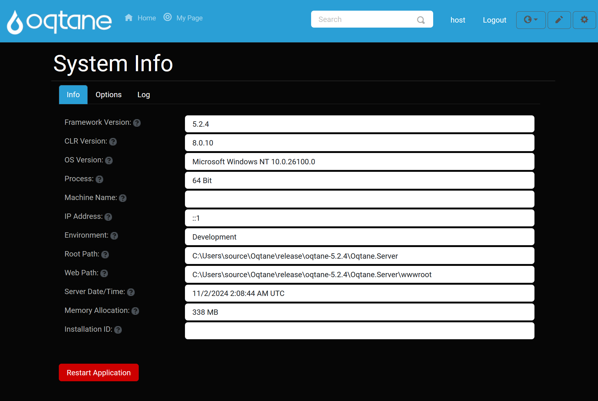

# System Info

## Overview

The **System Info** feature provides a comprehensive overview of critical system details for Oqtane, including the framework version, Blazor runtime, server path, CLR (Common Language Runtime) version, operating system version, and the current server time. This feature is essential for administrators to quickly access and verify system configurations and statuses.

In addition to basic system information, the **System Info** page offers access to the Oqtane API. This includes a Swagger interface that allows you to test various Oqtane methods and interact with the system programmatically.

If significant changes are made to the system—such as installing or deleting themes and modules—the **System Info** page provides the option to restart the Oqtane framework to apply those changes.

---

## Accessing the System Info Feature

To access the **System Info** feature:

1. **Open the Control Panel**: Click the **Control Panel** icon to access additional settings.

   

2. **Navigate to Admin Dashboard**: In the Control Panel, click the button to open the **Admin Dashboard**.

   

3. **Select System Info**: In the Admin Dashboard, click on the **System Info** icon to open the feature and view system details.

   

---

## System Info Features

### Info Tab

The **Info Tab** displays detailed system information, including:

- **Oqtane Framework Version**: The current version of the Oqtane framework running on the system.
- **Blazor Runtime**: The version of Blazor currently in use for the application.
- **Server Path**: The directory path of the Oqtane server on the host system.
- **CLR Version**: The version of the .NET runtime (CLR) being used.
- **OS Version**: The version of the operating system running the application.
- **Current Time**: The server's current time to help ensure time-based functionality is accurate.

You can restart the Oqtane framework directly from the **Info Tab**:

- To restart the application, click the **Restart Application** button.

   

   > **Note**: A system restart may be necessary after installing or uninstalling themes, modules, or making other significant changes to the system configuration.

---

### Options Tab

The **Options Tab** provides additional configuration options for the **System Info** feature:

- **Swagger API Access**: You can interact with Oqtane's API via the Swagger interface, which allows you to explore and test available Oqtane methods and endpoints.

   

   

- **Save Settings**: After configuring any options in the **Options Tab**, be sure to click the **Save** button to apply your changes.

   

   > **Tip**: Ensure that any changes made here are properly saved, as failure to save may cause settings to revert to their defaults.

---

### Log Tab

The **Log Tab** provides detailed logging information from the application, specifically logs created when the system is not fully operational or experiencing issues. These logs can help troubleshoot and identify problems affecting the application’s performance or availability.

- **Log Display**: The **Log Tab** shows logs from the `content/logs` directory. These logs may indicate issues such as server startup problems, missing dependencies, or unexpected errors that could affect the application's functionality.

   

   > **Note**: The error displayed in the image of the system log above can generally be ignored, as it is not critical to the operation of the Oqtane framework.

- **Clear Log**: You can clear the logs by clicking the **Clear** button. This is useful for clearing old logs or resetting the log view for new issues.

   

   Once cleared, a confirmation message will appear to let you know the log was successfully cleared.

   

---

## Troubleshooting

- **Logs**: If you see unexpected errors or issues in the **Log Tab**, review the log entries for potential clues on the source of the issue. Common errors may involve missing files, incorrect paths, or configuration errors.
  
- **Restarting Oqtane**: After making changes to themes, modules, or other significant configuration adjustments, always restart the application using the **Restart Application** button to ensure that the changes take effect.

---

## Conclusion

The **System Info** feature in Oqtane offers a critical set of tools for managing and troubleshooting the framework. It provides key system information and access to advanced functionality like the Swagger API, as well as the ability to restart the application and clear logs to ensure smooth operation. Always monitor the **Log Tab** for errors and take appropriate actions to maintain the health of your Oqtane installation.
