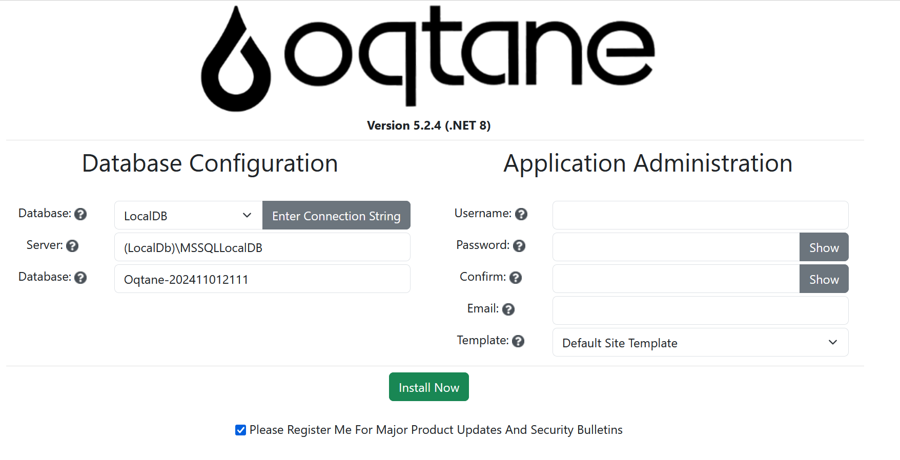
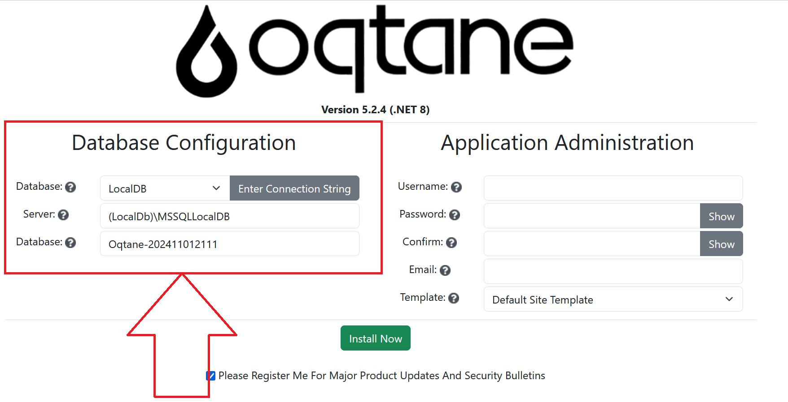
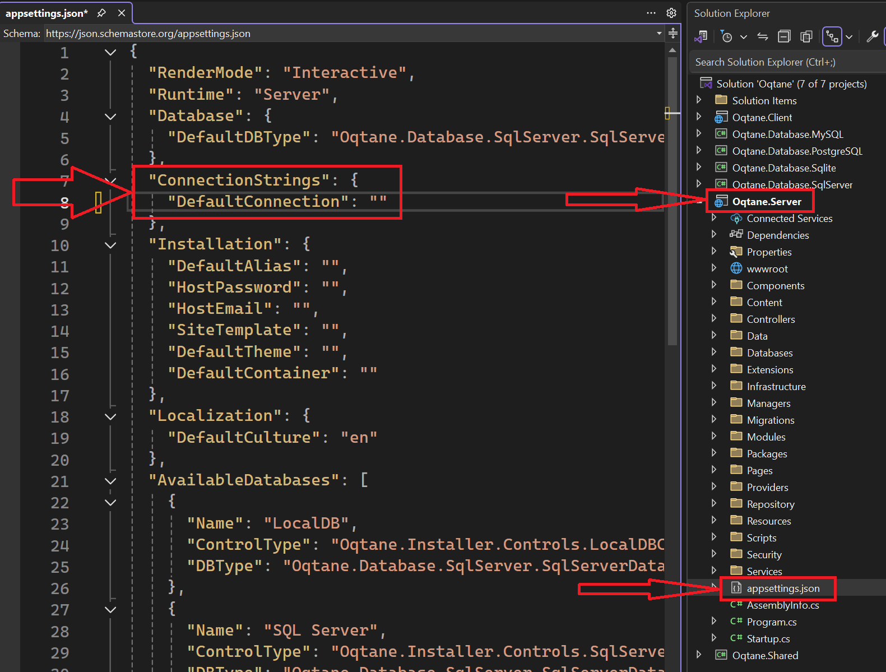

# Installation Wizard

The Oqtane Installation Wizard simplifies the setup process, guiding you through essential steps to configure and deploy your Oqtane instance. Follow the instructions in each step to ensure a smooth installation.

## Getting Started with the Installation Wizard

1. **Access the Installation Wizard**: 
   - Open your browser and navigate to the Oqtane application URL. If Oqtane is not yet configured, the wizard should load automatically.
   - You should see a welcome screen prompting you to begin the setup process.

   

2. **Database Configuration**: 
   - Select your preferred database type. Oqtane supports several database providers, such as SQL Server and SQLite.
   - Enter the required database connection information, including the server, database name, and login credentials.
   - The wizard will attempt to connect to your database to validate the information entered.

   

   **Database Configuration Examples**:
   - **SQL Server**: 
     - Server: `localhost`
     - Database: `OqtaneDB`
     - Authentication: SQL Server Authentication with a valid username and password
   - **SQLite**: 
     - File Path: Specify a file path on the server where SQLite can create a new database file if it doesn’t exist.

3. **Application Settings**:
   - Define key site settings, including:
     - Host Administrator Account: Specify a username, password, and email for the main site administrator. This user will be added to the "Host" permissions role, granting full access to [Content Management](../content-management/index.md), [Admin Management](../admin-management/index.md), and [Host Management](../host-management/index.md) features.
     - Template: Select a site template. Oqtane provides options such as the "Default Site Template" or "Blank Template," and any additional site templates included with your setup will also be available.

    > **Note:** The current web address used to access the install wizard will be set as the default base URL or alias for your Oqtane site.

   

4. **Complete Installation**:
   - Review your configuration and click **Install**. The wizard will apply your settings, configure the database, and prepare your Oqtane instance for use. (Optionally, you can select a checkbox to receive product updates and security bulletins.)

    

   - Upon completion, you’ll be redirected to the Oqtane homepage, where you can log in with the admin account created during setup.

   
   
   - Click the login button to access your site.

   

   - Log in using the host account credentials you created.

    

    You now have full access to [Content Management](../content-management/index.md), [Admin Management](../admin-management/index.md), and [Host Management](../host-management/index.md) features.

## Additional Tips

- **Database Connection Issues**: If the wizard cannot connect to your database, double-check the server address, database name, and credentials.
- **File Permissions**: Ensure that your server has adequate permissions to write to necessary directories, such as for SQLite files or configuration files.
- **Re-running the Wizard**: To re-run the wizard after installation, delete the database connection string in the `appsettings.json` file located in the website's root folder or in the `Oqtane.Server` project. This will prompt Oqtane to load the installation wizard again upon your next visit to the application URL.

   - The `appsettings.json` file with an empty database connection string, as seen in Visual Studio:

      

   - The `appsettings.json` file location in the IIS root site folder:

    

## Additional Resources

For further insights on installation and troubleshooting, consider these resources:

- [GitHub Discussions](https://github.com/oqtane/oqtane.framework/discussions): Find community support for common installation questions.
- [Oqtane Blog - Installation Tips](https://www.oqtane.org/blog): Read best practices and insights for a smooth installation.

## See Also

- [Installation Guides](../../../guides/installation/index.md): Comprehensive setup guidance and environment-specific tips.
- [Troubleshooting Installation Issues](troubleshooting.md): Solutions for common installation errors and setup challenges.
