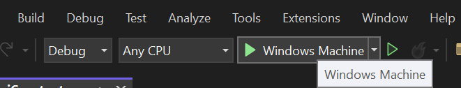

# Setting Up Oqtane.Maui for Development with Visual Studio

## Introduction

Oqtane.Maui is a hybrid .NET MAUI application that integrates with the Oqtane framework, allowing developers to create cross-platform applications with ease. This guide provides a step-by-step process to set up Oqtane.Maui for development using Visual Studio and .NET 8, specifically for Oqtane version 5.1.

## Prerequisites

- Visual Studio installed and updated on your machine.
- Latest .NET 8 SDK installed.
- A [database server](databases.md) installed on your machine or accessible from your network. You can use MySQL, PostgreSQL, SQLite, or SQL Server.

## Step-by-Step Setup Guide

### 1. Install Oqtane

1. Follow the official Oqtane getting started guide [here](index.md).
2. Ensure you have the required dependencies installed.

### 2. Configure Oqtane for Hybrid .NET MAUI

1. Open the Oqtane Admin Dashboard. 
2. Navigate to **Site Settings** 
3. Navigate to **UI Component Settings**
4. Set the option for **Hybrid?** to **Yes**.


### 3. Edit the `MauiConstants.cs` File (Option #1)

1. Open your Oqtane.Maui project in Visual Studio. 
2. Locate the `MauiConstants.cs` file in your project directory. 
3. Modify the file to point to your Oqtane web application:

```csharp
namespace Oqtane.Maui;

public static class MauiConstants
{
    // the API service url (used as fallback if not set in appsettings.json)
    public static string ApiUrl = ""; 
    // public static string ApiUrl = "http://localhost:44357/"; // for local development (Oqtane.Server must be already running for MAUI client to connect)
    //public static string apiurl = "http://localhost:44357/sitename/"; // local microsite example
    //public static string apiurl = "https://www.dnfprojects.com/"; // for testing remote site

    // specify if you wish to allow users to override the url via appsettings.json in the AppDataDirectory
    public static bool UseAppSettings = true;
}

```

For local development you may set this as shown in the image below by commenting/uncommenting lines.


### 4. Modify `appsettings.json` (Option #2 Preferred)

The preferred way to configure the URL is through the `appsettings.json` file. Note that the Oqtane.Maui app supports an `appsettings.json` file located in the `FileSystem.Current.AppDataDirectory`. The first time you run the Oqtane.Maui app, it will look in that location for the `appsettings.json` file, and if it does not exist, it will create one and display a message in the UI:


This option allows you to modify the `appsettings.json` without having to change the `MauiConstants.cs` file and recompile the app (although that approach works as well).

### 5. Build and Deploy the Application

1. Open the Oqtane.Maui project in Visual Studio.
2. Build the application:
   - Go to **Build** > **Build Solution** or press `Ctrl + Shift + B`.

3. Run/launch the application:
   - Set the Oqtane.Maui project as the startup project.
   - Press `F5` to start debugging or `Ctrl + F5` to run without debugging.
   - Alternatively, you can run the application by clicking on **Windows Machine** within Visual Studio.

  
  
   - If you prefer, you can also find the application deployed on your Windows machine and run it from your desktop.

## Additional Tips and Troubleshooting

- Ensure all dependencies are correctly installed.
- Oqtane Framework must be running on a seperate instance of Visual Studio or a web server.
- For further assistance, refer to the Oqtane community discussion forums.

## Conclusion

By following these steps, you should have a fully functional Oqtane.Maui setup for development with Visual Studio. If you encounter any issues or have suggestions for improving this guide, please contribute to the documentation.
