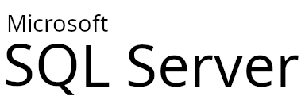

# Resources

This section provides a collection of links and resources that can help you with Oqtane installation, development, and usage. You can find information and guidance on various topics, such as Oqtane framework, IDE tools, IIS and .NET Core hosting, databases, modules, themes, localization, security, and more. You can also access the Oqtane blog and GitHub repository for the latest news, tips, and tutorials.

_Note: The links in this section are external and may lead to websites that are not affiliated with Oqtane. Please use them at your own discretion and follow their respective terms and policies._

## Oqtane Framework
- [Oqtane Framework Releases](https://github.com/oqtane/oqtane.framework/releases/latest): Download the latest Oqtane release for installation.
- [Oqtane GitHub Repository](https://github.com/oqtane/oqtane.framework): Contribute to the Oqtane project and report issues on GitHub.
- [Oqtane Blog](https://www.oqtane.org/blog/): Stay updated with the latest news, tips, and tutorials.

## IDE Tools

- [Visual Studio and VS Code Downloads](https://visualstudio.microsoft.com/downloads/): Download Visual Studio (Windows Only) and Visual Studio Code (Windows and Linux) IDEs for development.

## IIS & .NET Core Hosting

- [Microsoft .NET Downloads](https://dotnet.microsoft.com/download): Download the .NET Core Hosting Bundle for hosting .NET Core applications on Windows servers.
- [IIS URL Rewrite Module](https://www.iis.net/downloads/microsoft/url-rewrite): Download and install URL Rewrite Module for configuring URL rewriting rules in IIS.
- [WebSocket Support on IIS](https://learn.microsoft.com/en-us/aspnet/core/fundamentals/websockets?#enabling-websockets-on-iis): Instructions for enabling WebSockets on IIS.
- [Publish an ASP.NET Core app to IIS](https://learn.microsoft.com/en-us/aspnet/core/tutorials/publish-to-iis): This tutorial demonstrates how to host an ASP.NET Core app on an IIS server.
- [ASP.NET Core security topics](https://learn.microsoft.com/en-us/aspnet/core/security): This article provides an overview of ASP.NET Core security features, including authentication, authorization, data protection, HTTPS enforcement, safe storage of app secrets, XSRF/CSRF prevention, CORS, and XSS attack prevention.

## Databases
### SQL Server

- [SQL Server Downloads](https://www.microsoft.com/sql-server/sql-server-downloads): Download SQL Server.
- [Windows SQL Server 2022 Evaluation Download](https://www.microsoft.com/en-us/evalcenter/evaluate-sql-server-2022): A free trial version of SQL Server 2022, the latest release of the relational database management system from Microsoft.
- [SQL Server Management Studio (SSMS) Download](https://docs.microsoft.com/en-us/sql/ssms/download-sql-server-management-studio-ssms): Download SQL Server Management Studio for database management.
- [SQL Server Installation Guide for Linux Ubuntu](https://docs.microsoft.com/en-us/sql/linux/quickstart-install-connect-ubuntu): Detailed guide on installing SQL Server on Ubuntu.
- [Visual Studio Code mssql Extension](https://learn.microsoft.com/en-us/sql/tools/visual-studio-code/mssql-extensions): The mssql extension for Visual Studio Code (VS Code) to work with databases in SQL Server on Windows, macOS, and Linux, as well as Azure SQL Database and Azure SQL Managed Instance.
### MySQL

- [MySQL Downloads](https://dev.mysql.com/downloads/mysql/): Download MySQL Community Server.
- [MySQL Workbench Download](https://dev.mysql.com/downloads/workbench/): MySQL Workbench for database administration.
- [MySQL Documentation for Windows Installation](https://dev.mysql.com/doc/refman/8.3/en/windows-installation.html): Installing MySQL on Microsoft Windows.
- [MySQL Documentation for Ubuntu Installation](https://dev.mysql.com/doc/mysql-apt-repo-quick-guide/en/): Quick guide for installing MySQL on Ubuntu using APT repository.
- 
### PostgreSQL

- [PostgreSQL Downloads](https://www.postgresql.org/download/): Download the latest version of PostgreSQL.
- [pgAdmin Download](https://www.pgadmin.org/download/): Tool for PostgreSQL administration.
- [PostgreSQL Documentation Tutorial](https://www.postgresql.org/docs/current/tutorial-install.html): Tutorial to help with installing, configuring and using PostgreSQL database server.
- [PostgreSQL Documentation for Ubuntu Installation](https://www.postgresql.org/download/linux/ubuntu/): Installation guide specific to Ubuntu environment.
### SQLite

- [SQLite Downloads](https://www.sqlite.org/download.html): Download SQLite for Ubuntu.
- [SQLite Documentation](https://www.sqlite.org/docs.html): Official documentation for SQLite.

## Windows OS

- [Windows Server 2022 Evaluation Download](https://www.microsoft.com/en-us/evalcenter/evaluate-windows-server-2022): A free trial version of Windows Server 2022, the latest release of the server operating system from Microsoft.application platform, and storage.
- [Windows 11 Enterprise Evaluation Download](https://www.microsoft.com/en-us/evalcenter/evaluate-windows-11-enterprise): A free trial version of Windows 11 Enterprise, the most advanced and secure edition of Windows 11, the latest operating system from Microsoft.

## Linux Ubuntu OS

- **Downloads:** 
  - [Ubuntu Downloads](https://ubuntu.com/download): Download the latest version of Ubuntu.
- **Installation Guide**
  - [Ubuntu Installation Guide](https://ubuntu.com/tutorials/install-ubuntu-desktop): Step-by-step guide for installing Ubuntu Desktop edition.
  - [Ubuntu Server Installation Guide](https://ubuntu.com/server/docs/installation): Installation guide for Ubuntu Server edition.
- **Nano Editor**
  - [Online Manual](https://www.nano-editor.org/dist/latest/nano.html): This is the online manual for the Nano text editor, providing detailed documentation on its usage and features.
  - [GNU Nano Official Website](https://www.nano-editor.org/): Visit the official website of GNU Nano to find additional resources, downloads, and community support.
  - [GNU Nano Documentation](https://www.nano-editor.org/docs.php): Access the comprehensive documentation for GNU Nano, including guides, FAQs, and release notes.

## Apache HTTP Server

  
  - [Apache HTTP Server Documentation](https://httpd.apache.org/docs/): Official documentation for the Apache HTTP Server, providing comprehensive guides, configuration references, and troubleshooting tips.
  - [Apache Foundation](https://www.apache.org/): The official website of the Apache Software Foundation, where you can find information about all Apache projects, including the HTTP Server.
  - [Ubuntu: Install and Configure Apache](https://ubuntu.com/tutorials/install-and-configure-apache): Tutorial going through the steps of setting up an Apache server on Ubuntu.
  - [Host ASP.NET Core on Linux with Apache](https://learn.microsoft.com/en-us/aspnet/core/host-and-deploy/linux-apache): This article explains how to set up Apache as a reverse proxy server on CentOS 7 to redirect HTTP traffic to an ASP.NET Core web app running on the Kestrel server.

## Additional Resources
- [Mozilla Developer Network (MDN)](https://developer.mozilla.org): Visit MDN for comprehensive documentation and resources on web development, including HTML, CSS, JavaScript, and more.
- [Mozilla Server Side TLS Guidelines](https://wiki.mozilla.org/Security/Server_Side_TLS): Mozilla provides guidelines for configuring server-side TLS to enhance security. These guidelines cover various aspects of TLS configuration, including cipher suites, protocols, and certificate management.
- [Mozilla SSL Configuration Generator](https://ssl-config.mozilla.org/): This tool helps generate secure SSL configurations for popular web servers, including Apache, Nginx, and others. It provides recommended configurations based on Mozilla's SSL/TLS best practices.
- [Let's Encrypt](https://letsencrypt.org/): Let's Encrypt is a free, automated, and open certificate authority (CA) that provides SSL/TLS certificates to enable HTTPS on websites. Their website offers detailed documentation and resources for setting up HTTPS on web servers.
